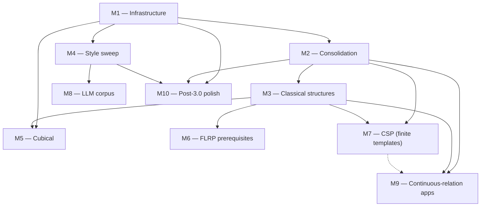
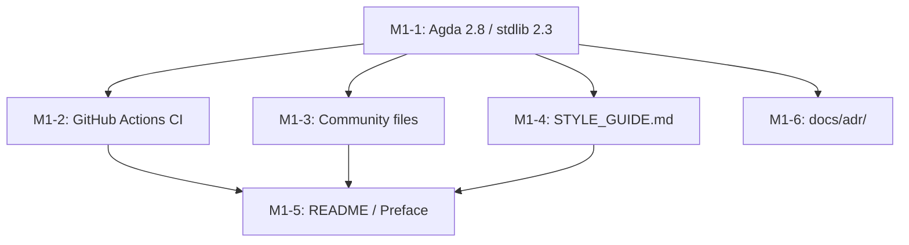
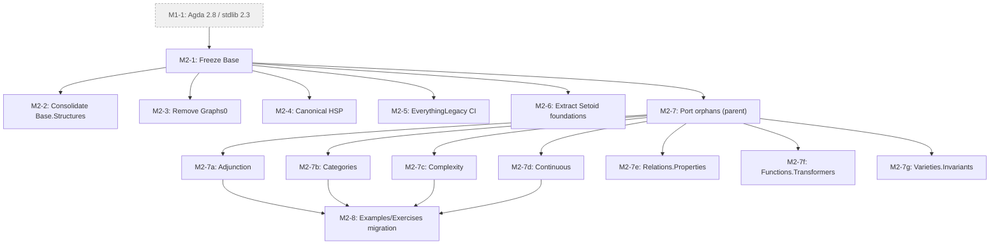
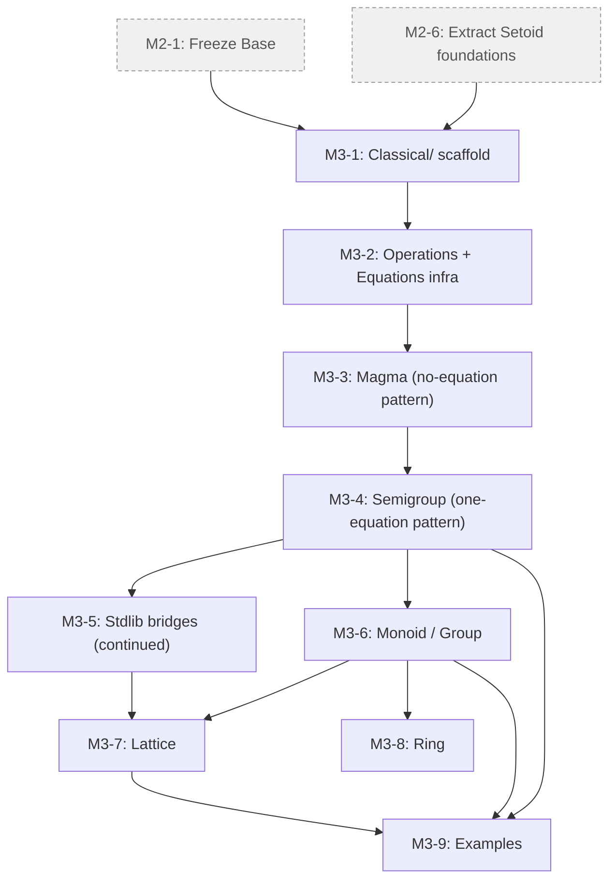
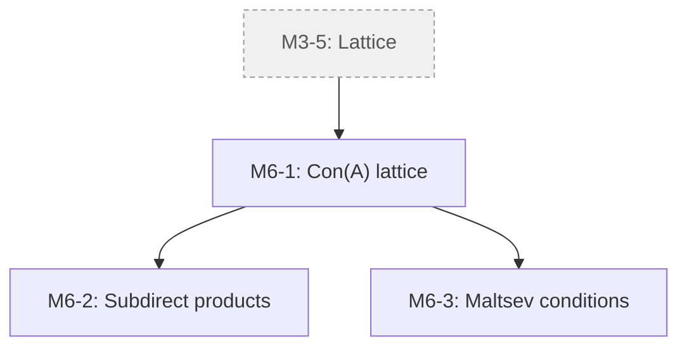
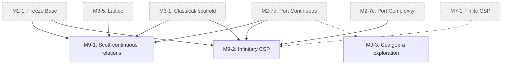
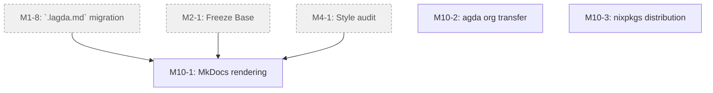

<!--
File: docs/GITHUB_PROJECT.md

This file is partially generated by scripts/python/gh_project_render.py.
Manual prose (milestone descriptions, exit criteria, mermaid graphs)
is hand-edited.  Issue listings between

    BEGIN GENERATED: milestone-N
    ...
    END GENERATED: milestone-N

markers are regenerated from GitHub state by `make project-plan`;
edits to those regions will be overwritten on the next render.
-->

# agda-algebras — GitHub Project Roadmap

**Project Title**:  agda-algebras 3.0 — Infrastructure, Consolidation, Classical Structures, Applications

**Repository**:  `ualib/agda-algebras`

**Date**:  2026-04-19

---

## Summary

Modernization of agda-algebras in 10 milestones: tooling upgrade/infra (M1), consolidate Base/Setoid (M2), classical structures (M3), style/naming uniformity (M4), Cubical Agda (M5), FLRP (M6), complexity/CSP module (M7), training corpus/LLM (M8), novel-research apps of `Continuous` relation API (M9), and post-3.0 polish — rendering pipeline, organization transfer, and Nix packaging (M10).

---

## Description

A structured plan to modernize the agda-algebras library.  The work is organized into ten milestones: tooling upgrade and infrastructure (M1), consolidation of the Base/Setoid fork (M2), introduction of the long-missing classical structures layer (M3), style and naming uniformity (M4), a Cubical Agda proof-of-concept as the canonical long-term target (M5), prerequisites for work on the Finite Lattice Representation Problem (M6), an extension of the existing algebraic complexity / CSP module for finite templates (M7), publication of a training corpus for language-model work (M8), novel-research applications of the `Continuous` relation API (M9), and a post-3.0 polish layer — rendering-pipeline modernization, transfer to the official `agda` GitHub organization, and first-class distribution through nixpkgs (M10).  After M1 lands, the remaining milestones run largely in parallel; M10 in particular requires only M1, M2, and M4 to be complete and runs alongside M5–M9 rather than after them.

---

## Note on version numbering

agda-algebras was released as v2.0.1 in December 2021 ([Zenodo DOI 10.5281/zenodo.5765793](https://doi.org/10.5281/zenodo.5765793)) as an archival artifact for the TYPES 2021 submission.  The current reconstruction is a major version bump past that release and is planned as v3.0.  The planned Cubical-canonical successor, in which `src/Cubical/` becomes the default development tree, is planned as v4.0.

---

## Labels

- `milestone-1-infra` (0075ca) — Milestone 1: Infrastructure health.
- `milestone-2-consolidation` (0075ca) — Milestone 2: Consolidation.
- `milestone-3-classical` (0075ca) — Milestone 3: Classical structures layer.
- `milestone-4-style` (0075ca) — Milestone 4: Style and naming uniformity.
- `milestone-5-cubical` (5319e7) — Milestone 5: Cubical track.
- `milestone-6-flrp` (5319e7) — Milestone 6: FLRP prerequisites.
- `milestone-7-csp` (5319e7) — Milestone 7: Algebraic complexity / CSP.
- `milestone-8-llm` (5319e7) — Milestone 8: LLM readiness.
- `milestone-9-apps` (5319e7) — Milestone 9: Applications of continuous relations.
- `milestone-10-polish` (5319e7) — Milestone 10: Post-3.0 polish (rendering, organization transfer, packaging).
- `stdlib-bridge` (fbca04) — Bridges to the Agda standard library.
- `breaking-change` (d93f0b) — Breaking change to the public API.
- `good first issue` (7057ff) — Good for newcomers.
- `help-wanted` (0e8a16) — Community help wanted.
- `design-discussion` (c5def5) — Needs design discussion before implementation.
- `documentation` (0e8a16) — Documentation changes.
- `governance` (8aea29) — Administration and governance
- `agda-community` (945ca0) — Topics relevant to the Agda community.
---

## Milestones

### Milestone 1 — Infrastructure health (BLOCKING)

**Description**.  Modernize the library's tooling, establish baseline project hygiene, and unblock every subsequent milestone.  The library is currently pinned to Agda 2.6.2 / stdlib 1.7; it must move to Agda 2.8.0 / stdlib v2.3 with `--cubical-compatible` replacing `--without-K`.  Standard community-health files (CONTRIBUTING, CHANGELOG, CODE_OF_CONDUCT, STYLE) must land.  GitHub Actions CI must stand up.  README and installation docs must be rewritten for the 3.0 line.

**Exit criterion**.  `make check` passes under GitHub Actions CI against Agda 2.8.0 / stdlib v2.3; CONTRIBUTING.md, docs/STYLE_GUIDE.md, ROADMAP.md, CHANGELOG.md are merged; README documents the new install path.

---

### Milestone 2 — Consolidation

**Description**.  Resolve the parallel Base/Setoid fork by freezing `Base/` and moving it to `Legacy/Base/`.  `Setoid/` is the canonical development tree for 3.0.  Within Legacy, consolidate redundant `Base.Structures` implementations and remove abandoned experimental modules.  Designate a single canonical proof of Birkhoff's HSP theorem while preserving the pedagogical demonstration variants.

**Exit criterion**.  `src/Base/` is in `src/Legacy/Base/` with a deprecation note; `Setoid.Varieties.HSP.Birkhoff` is designated canonical; ADR-001 (Setoid as canonical) is merged; no duplicate implementations of the same concept remain in `Setoid/` or `Legacy/Base/`.

---

### Milestone 3 — Classical structures layer

**Description**.  Introduce the long-missing tower of classical algebraic structures as Σ-typed specific theories over the universal-algebra framework, with record-typed bundle views matching the stdlib `Algebra.Bundles` idiom.  Each structure ships as a Signatures / Theories / Structures / Bundles / Small quintuple.  Designed so that the underlying equivalence used in the Setoid-based 3.0 line can be mechanically replaced by a Cubical path type when the 4.0 Cubical track becomes canonical.

Phase 1: Magma, Semigroup, CommutativeSemigroup, Monoid, CommutativeMonoid, Group, AbelianGroup, Semilattice, Lattice.

Phase 2: Ring, CommutativeRing, Field, Module, DistributiveLattice, BooleanAlgebra.

**Exit criterion**.  Phase 1 classical structures are implemented, documented, bridged to stdlib, and exercised by at least one worked example each (e.g. `(ℕ, +, 0)` as a CommutativeMonoid; `(ℤ, +, -, 0)` as an AbelianGroup).

---

### Milestone 4 — Style and naming uniformity sweep

**Description**.  Apply `docs/STYLE_GUIDE.md` consistently across `Setoid/` and `Classical/`.  Audit naming (one preferred name per concept; synonyms deprecated); audit notation (one canonical symbol table); audit module structure (one concept per module where feasible); ensure every user-facing definition has a prose comment block.

**Exit criterion**.  No undocumented public definitions remain in `Setoid/` or `Classical/`; no synonym pairs (e.g. `is-homomorphism` + `IsHom`) exist in the public API; the canonical symbol table in `docs/STYLE_GUIDE.md` matches the notation actually used in the library.

---

### Milestone 5 — Cubical track (canonical long-term target)

**Description**.  Prepare the path for `Cubical/` to become the canonical development tree in version 3.0.  Port `Algebra` to cubical Agda, prove the structure identity principle (SIP), prove equivalence of `≅` with path equality, and demonstrate end-to-end workflow by porting at least one classical structure (Monoid is the natural choice).

**Exit criterion**.  `Cubical/Algebras/Basic.agda` compiles; SIP is proven for the cubical Algebra record; Monoid has a working cubical port that is essentially a mechanical substitution from its Setoid analog; ADR-003 (Cubical as canonical target) is merged.

---

### Milestone 6 — Toward the Finite Lattice Representation Problem

**Description**.  Build the specialized universal-algebraic infrastructure needed to tackle the Finite Lattice Representation Problem: "Does every finite lattice occur as the congruence lattice of a finite algebra?"  Near-term prerequisites include `Con 𝑨` and `Sub 𝑨` as complete lattices, subdirect products, subdirectly irreducible algebras, and basic Maltsev conditions relevant to lattice representations.  *Medium-term*.  Jónsson's theorem, Day's theorem.  Long-term (out of scope for 3.0): tame congruence theory, commutator theory, explicit representations of small lattices.

**Exit criterion**.  `Con 𝑨` is a complete lattice; subdirect products and subdirectly irreducible algebras are defined with basic properties proven; at least one Maltsev condition (congruence permutability via the Maltsev term characterization) is proven.

---

### Milestone 7 — Algebraic complexity / CSP extensions (finite templates)

**Description**.  Extend the existing `Base.Complexity` / `Exercises.Complexity.FiniteCSP` work into a proper algebraic-complexity development of **finite-template** constraint satisfaction.  This is a separate research program from Milestone 6 (the FLRP is about lattice representation theory; finite CSP is about the complexity of constraint satisfaction with a fixed finite template over the algebraic approach of Bulatov, Zhuk, Barto, and others).  Candidate content includes polymorphism clones, the Jeavons Galois connection, Post's lattice, and a statement of the Bulatov–Zhuk algebraic dichotomy.  The infinite-template / ω-categorical extension is covered separately under Milestone 9.

**Exit criterion**.  At least one substantial algebraic-CSP theorem is formalized (e.g. the Jeavons Galois connection for a fixed finite domain); polymorphism clones are available as a first-class type.

---

### Milestone 8 — LLM readiness and corpus artifacts

**Description**.  Make the library maximally useful as a training and retrieval corpus for language models.  Extract (theorem statement, proof term) pairs with metadata; publish as a Hugging Face dataset; explore agda-native-air integration; publish a short paper or blog post describing the corpus and its intended uses.

**Exit criterion**.  Initial corpus artifact is published with at least 500 (theorem, proof) pairs; a CI job regenerates the corpus on each release; a public-facing write-up describing the dataset is available.

---

### Milestone 9 — Applications of continuous relations

**Description**.  Explore substantive mathematical applications of the `Continuous` relation API — the generalization of classical relations to arbitrary arity types, developed in `Base.Relations.Continuous` and carried forward into `Setoid/`.  Three directions are in scope, each intrinsically interesting and independent of the FLRP and finite-CSP programs.  M9-1 formalizes Scott-continuous relations on directed-complete partial orders (DCPOs), connecting to domain theory and Escardó's work on searchable sets in the constructive-mathematics tradition.  M9-2 formalizes infinitary CSP over ω-categorical templates in the Bodirsky–Pinsker program, where relations of countably infinite arity arise naturally.  M9-3 is exploratory rather than deliverable-oriented: a reading-and-writing investigation into whether coalgebraic bisimulation has an under-exploited angle at the intersection with universal algebra in the Birkhoff sense.

**Exit criterion**.  At least one of M9-1 or M9-2 produces a formalized non-trivial example accompanied by a short public write-up (blog post, arXiv note, or similar); M9-3 produces a design-discussion document summarizing what was learned from the reading, with a concrete verdict ("pursue" or "saturated") regardless of whether formalization work follows.

---

### Milestone 10 — Post-3.0 polish (community packaging and presentation)

**Description**.  Independent polish items that finalize agda-algebras' presentation as a community-grade library, separated out from the body of the 3.0 modernization work because each is most valuable applied to a library already in production-grade shape, but none of them depends on M5–M9, and M10-1 in particular can begin as soon as M1, M2, and M4 are complete and run in parallel with the rest.

+  **M10-1**: modernize the rendering pipeline by replacing the Jekyll-based `admin/generate-html` machinery with a MkDocs site consumed directly from `.lagda.md` sources.
+  **M10-2**: transfer the repository to the official `agda` GitHub organization to align governance with the rest of the Agda ecosystem.
+  **M10-3**: promote the library to a first-class entry under `nixpkgs.agdaPackages` so downstream Nix users can depend on it without vendoring a flake input.

M10-2 and M10-3 are governance/packaging tasks with no hard structural prerequisites inside the milestone tree; they sit in M10 for thematic grouping (post-3.0 community polish) rather than for dependency reasons.  Pursuing them prematurely, before the library itself is in 3.0-ready shape, undermines the goals these tasks aim to achieve, which is why they're tagged with this milestone rather than M1 or M2.

**Exit criterion**.  MkDocs site live at https://ualib.org with `make site` building cleanly under `nix develop`; the repository is hosted at `agda/agda-algebras` with HTTP redirects from the old `ualib/` URL working transparently; `nix-shell -p 'agdaPackages.agda-algebras'` produces a working environment in which `agda --library agda-algebras` resolves correctly.

---

### Milestone Dependencies



---

## Issues

Below, each issue is tagged with its milestone (**M1**, **M2**, etc.), suggested labels, and a full issue body ready for GitHub.  Cross-milestone dependencies are noted in the body; see the Mermaid graph at the end of this file for a visual summary.

---
---

## Milestone 1 — Infrastructure health

<!-- BEGIN GENERATED: milestone-1 -->

### Issue M1-1: Upgrade to Agda 2.8.0 and stdlib v2.3; replace `--without-K` with `--cubical-compatible` (#250, closed)

**Labels**: `milestone-1-infra`, `breaking-change`

## Description

The library is currently pinned to Agda 2.6.2 / stdlib 1.7.  The Agda ecosystem has moved on: the current stable is Agda 2.8.0 (July 2025) and stdlib v2.3.  `--without-K` has been superseded by `--cubical-compatible` since Agda 2.6.3.  This issue tracks the full upgrade.  Blocks essentially every other issue in this project.

## Tasks

- [x] Update `agda-algebras.agda-lib` to `depend: standard-library-2.3` and document the minimum Agda version as 2.8.0.
- [x] Replace every `{-# OPTIONS --without-K --exact-split --safe #-}` with `{-# OPTIONS --cubical-compatible --exact-split --safe #-}`.
- [x] Fix any regressions from the flag change.
- [x] Update import paths for anything that moved between stdlib 1.7 and 2.3 (expected hotspots: `Function.Bundles`, `Relation.Binary.*` renamings, `Data.*` reorganizations).
- [x] Update CI config to test against Agda 2.8.0 / stdlib 2.3.
- [x] Update `README.md` and `INSTALL.md` to reflect the new requirements.
- [x] Update the Nix flake.

## Acceptance criteria

- [x] Library type-checks under Agda 2.8.0 / stdlib v2.3.
- [x] `make check` succeeds locally.
- [ ] No file still declares `--without-K`.
- [x] Once 2.0 is stable, consider adding a CI job against Agda 2.9/dev to catch forward-compatibility issues early.

---

### Issue M1-2: Add GitHub Actions CI to type-check the library (#251, closed)

**Labels**: `milestone-1-infra`, `nix`, `ci`

## Description

The library has no CI.  Contributors can break type-checking without maintainers noticing.  Add a GitHub Actions workflow that type-checks the library on each push and pull request.  Reference workflows: `agda-categories` and the stdlib itself both have well-maintained CI that can be adapted.

## Tasks

- [x] Add `.github/workflows/ci.yml`.
- [x] Install Agda at the pinned version (Agda 2.8.0; see M1-1).
- [x] Install stdlib v2.3.
- [x] Run `make check` (or equivalent) on every push to `main` and on PRs.
- [x] Cache the Agda binary and `.agdai` files between runs.
- [x] Display a CI badge in the README.

## Acceptance criteria

- [x] CI runs green on `main`.
- [x] CI triggers on every pull request.
- [x] Average job time < 10 min after caching.
- [x] README shows a green CI badge.

---

### Issue M1-3: Add CONTRIBUTING.md, CHANGELOG.md, CODE_OF_CONDUCT.md (#252, closed)

**Labels**: `documentation`, `milestone-1-infra`

## Description

Standard community-health files are missing.  Drafts of `CONTRIBUTING.md` and `docs/STYLE_GUIDE.md` may exist from the 3.0 planning cycle and could be merged after review.

## Tasks

- [x] Add `CONTRIBUTING.md` (draft from planning cycle).
- [x] Add `CHANGELOG.md` seeded with the 3.0 milestone entry.
- [x] Add `CODE_OF_CONDUCT.md` (Contributor Covenant 2.1).
- [x] Add `.github/ISSUE_TEMPLATE/` with bug-report, feature-request, and design-discussion templates.
- [x] Add `.github/PULL_REQUEST_TEMPLATE.md`.

## Acceptance criteria

- [x] All four files exist at the repo root (or in `.github/`).
- [x] GitHub recognizes the community-health files (green checkmarks on the "Insights → Community standards" page).

---

### Issue M1-4: Adopt docs/STYLE_GUIDE.md as the project style guide (#253, closed)

**Labels**: `documentation`, `milestone-1-infra`

## Description

Create `docs/STYLE_GUIDE.md` documenting file format, module structure, naming conventions, notation, universe-polymorphism practices, record vs Σ guidance, proof style, and library-as-training-corpus considerations.  A draft from the planning cycle is ready for review.  Applying the style guide across `Setoid/` and `Classical/` is tracked in M4-1.

## Tasks

- [x] Merge `docs/STYLE_GUIDE.md` (draft from planning cycle).
- [x] Link `docs/STYLE_GUIDE.md` from `README.md` and `CONTRIBUTING.md`.

## Acceptance criteria

- [x] `docs/STYLE_GUIDE.md` is merged.
- [x] Links from README and CONTRIBUTING work.

---

### Issue M1-5: Rewrite README and Preface for the 3.0 release (#254, closed)

**Labels**: `documentation`, `milestone-1-infra`

## Description

The current `README.md` and `docs/lagda/Overture/Preface.lagda` are 1.x-era: wrong Agda versions, obsolete installation paths, pre-consolidation library structure.  They need a rewrite aligned with the 3.0 release.  Depends on M1-1 through M1-4 and M2-1.

## Tasks

- [x] Pin Agda 2.8.0 / stdlib 2.3 in install instructions.
- [ ] Describe the Setoid-as-canonical structure and point to `Classical/`.
- [x] Link `CONTRIBUTING.md`, `GITHUB_PROJECT.md`, `docs/STYLE_GUIDE.md`.
- [x] Concrete quickstart for new users (5-command install → `make check`).
- [x] Add CI badge (from M1-2) and documentation site link.
- [ ] Consider whether to merge `docs/lagda/Overture/Preface.lagda` and `src/Overture/Preface.agda` into new **Markdown-based literate Agda** file called `src/Overture/Preface.lagda.md` at this stage or put this off to a later milestone/issue/release.


## Acceptance criteria

- [x] A reviewer can follow the README on a clean machine to a working `make check` without asking questions.
- [x] All links resolve.
- [x] ~~No references to Agda 2.6.x or stdlib 1.x remain.~~ Current installation/setup guidance no longer instructs users to use Agda 2.6.x or stdlib 1.x; any remaining references are clearly historical or archival rather than normative.
- [x] A decision is made to either merge Preface{.lagda,.agda} files into one Markdown-based literate Agda file, or make a new issue for applying the `.lagda` + `.agda` => `.lagda.md` transformation across entire code base (e.g., using a script like the one we developed at IO for converting LaTeX-based to Markdown-based literate Agda).

---

### Issue M1-6: Establish docs/adr/ for Architecture Decision Records (#255, closed)

**Labels**: `documentation`, `milestone-1-infra`

## Description

As the library evolves, design decisions (Setoid vs Base canonicality, record vs Σ for classical structures, Cubical track planning) should be recorded so future contributors understand the rationale.  Use Michael Nygard's lightweight ADR format (one page per decision).

## Tasks

- [x] Create `docs/adr/` directory.
- [x] Add `docs/adr/README.md` explaining the ADR format.
- [x] Add `docs/adr/000-template.md`.
- [x] Seed with decisions ratified in 2.0:
  - `001-setoid-as-canonical.md` (from M2-1);
  - `002-classical-layer-design.md` (from M3-1);
  - `003-cubical-canonical-target.md` (from M5-1).

## Acceptance criteria

- [x] `docs/adr/` exists with README and template.
- [x] All three seeded ADRs are drafted (full content can land with the associated implementation issues).

---

### Issue M1-8: Consolidate literate and bare-Agda sources into `.lagda.md` (#280, closed)

**Labels**: `documentation`, `milestone-1-infra`, `breaking-change`

## Problem

The repository currently maintains literate Agda sources in two formats and two locations.

+  **`src/X/Y/Z.agda`** — minimal module skeletons that the type checker sees (typically just the OPTIONS pragma and `module ... where`).
+  **`docs/lagda/X/Y/Z.lagda`** — the corresponding LaTeX-literate Agda content used by `make html` to generate the rendered documentation at [https://ualib.org](https://ualib.org).

This is a maintenance hazard and directly undermines the library-as-corpus pillar, since prose and proof in two files must be held in sync by hand.

The fix is to migrate to **Markdown-literate Agda** (`.lagda.md`), consolidating each module into a single `src/X/Y/Z.lagda.md` file that is both type-checked by `make check` and rendered by `make html`.  An existing LaTeX-literate-to-Markdown-literate conversion script developed by @williamdemeo at IOHK is available and could be useful here.

## Open design questions

A short design discussion is needed before code is written; the resolutions should be recorded in `docs/adr/004-lagda-md-canonical.md`.

+  **What happens to `docs/lagda/` after migration**?  Recommend: delete; everything moves to `src/`.  Implication: external bookmarks pointing to specific `docs/lagda/X.lagda` paths will break — audit and document the breakage.
+  **Are there files we should keep in LaTeX-literate form**?  Paper companions under `docs/papers/` may be co-built with a LaTeX paper PDF and arguably should stay.  Itemize and decide individually.
+  **How does Jekyll site generation change**?  The current `admin/generate-html` pipeline type-checks `.lagda` files and post-processes the resulting `.tex` and `.html` for Jekyll consumption.  The replacement runs `agda --html` on `.lagda.md` files (which produces Markdown with fenced code blocks, suitable for direct Jekyll consumption) and may obviate `admin/generate-tex` entirely.

## Proposal


### Pre-work and design

- [x] Extract and generalize the IOHK conversion script; done (see [agda-lagda-migrator](https://github.com/williamdemeo/agda-lagda-migrator)).
- [x] Confirm agda-lagda-migrator produces well-formed `.lagda.md` on a representative sample (suggested: `Overture/Preface`, `Setoid/Algebras/Basic`, `Demos/HSP`).
- [x] Audit current state: count of `.lagda` files, count of `.agda` skeletons paired with `.lagda` content, count of `.agda` files with substantive content.
- [x] Confirm Agda 2.8.0's `.lagda.md` support is fully functional under `--cubical-compatible --exact-split --safe`.
- [x] Inventory hard-coded paths to specific `.lagda` files across the repository (commit messages, BibTeX notes, paper PDFs, README links, internal cross-references, Jekyll templates).
- [x] Write ADR `docs/adr/004-lagda-md-canonical.md` resolving the open design questions above.

### Build-system changes

- [x] Update the Nix flake's `shellHook` and the `.agda-lib` include-path rules as needed (they should Just Work; `.lagda.md` is treated as Agda source by the compiler).
- [x] Update `Makefile`'s Everything.agda generation pattern to pick up `*.lagda.md` files alongside `*.agda` (currently `find $(SRCDIR) -name '*.agda'` matches neither `.lagda` nor `.lagda.md`; change to `find src -name '*.lagda.md' -o -name '*.agda'`; Agda will handle either, though going forward everything should be `.lagda.md`).
- [x] ~~Consider adding a `make corpus` target that extracts (prose, code-block) pairs into JSONL — first piece of M8 (LLM readiness) landing early.~~ (deferred)
- [x] ~~Update `admin/generate-html` to operate on `.lagda.md` files; remove or deprecate `admin/generate-tex` if no longer needed.~~ (deferred)
- [x] ~~Update Jekyll configuration to consume the Markdown output of `agda --html` directly.~~ (deferred)
- [x] Update CI workflow if the new pipeline introduces new dependencies.

### File migration

- [x] Run the conversion script across `docs/lagda/` (excluding any items the ADR earmarks to remain LaTeX-literate).
- [x] Move output to the matching `src/` path with `.lagda.md` extension.
- [x] Delete the corresponding `src/X/Y/Z.agda` skeleton files.
- [x] ~~Update internal cross-references — link definitions, `[Module.Name][]`-style references, BibTeX `Source code` notes in module headers.~~ (deferred)
- [x] ~~Update `_includes/UALib.Links.md` (or equivalent) to reflect new paths.~~ (deferred)

### Documentation

- [x] Update `docs/STYLE_GUIDE.md` to specify `.lagda.md` as the canonical literate-Agda format and document the migration outcome.
- [x] Update `CONTRIBUTING.md` examples that reference `.lagda` files.
- [x] Update `README.md`'s BibTeX notes if any reference `.lagda` paths (specifically the `DeMeo:2021` entry's `Source code` URL).
- [x] Add a `CHANGELOG.md` entry under [Unreleased] flagging the file-format change as breaking for external links.

### Verification

- [x] `make check` passes after migration.
- [x] ~~`make html` produces equivalent or improved HTML output; spot-check at least 10 rendered pages against a pre-migration archive.~~ (deferred)
- [x] ~~All internal cross-references resolve in the rendered HTML.~~ (deferred)
- [x] Round-trip sanity: a representative sample of converted Agda code blocks type-check identically to their pre-migration `.lagda` originals.

## Acceptance criteria

- [x] No `.lagda` files remain under `src/` or `docs/lagda/` outside of any items the ADR explicitly preserves.
- [x] No `src/X/Y/Z.agda` skeleton files remain (those that previously paired with a `docs/lagda/X/Y/Z.lagda` content file).
- [x] `make check` ~~and `make html`~~ succeeds under the new pipeline.
- [x] ~~Rendered HTML output at [https://ualib.org](https://ualib.org) is equivalent or improved.~~ (deferred)
- [x] `docs/STYLE_GUIDE.md` specifies `.lagda.md` as canonical.
- [x] ADR `docs/adr/004-lagda-md-canonical.md` is merged.

## Non-goals

- Changing the mathematical content of any module.
- Reorganizing the module hierarchy.
- Re-litigating the choice of literate Agda as the default presentation format.

## Why now

Several converging considerations make this worth doing in the 3.0 cycle rather than deferring to 4.0.

+  **Single source of truth**.  The dual-file split is a structural source of drift between formal content and prose.  Consolidation eliminates the drift class entirely.
+  **Tooling alignment**.  Markdown is the universal lingua franca; GitHub renders `.lagda.md` natively, VSCode previews them, and the modern Agda ecosystem (1Lab being the most visible example) has standardized on the format.
+  **Corpus extraction (M8-1)**.  The training-corpus extractor walks the library to emit `(theorem, prose, proof)` records.  A uniform format with prose and code in one file is materially easier to extract from than a dual-file split where pairing depends on path correspondence.
+  **Onboarding**.  New contributors find Markdown easier to author than LaTeX-literate Agda; the friction reduction is real.
+  **Efficiency**.  Doing this now saves conversion of new Agda modules later.

## Relation to other milestones

+  Sequenced before: **M4-2** (docstring pass) — operates on the new file format directly.
+  Benefits: **M8-1** (LLM corpus) — uniform format simplifies extraction.
+  Independent of: M3, M5, M6, M7, M9.

## References

+  [1Lab](https://github.com/plt-amy/1lab) — large-scale Agda library written in `.lagda.md`.
+  [Agda's literate-programming documentation](https://agda.readthedocs.io/en/latest/tools/literate-programming.html) — language reference for `.lagda.md` and other literate formats.

---

### Issue M1-9: Simplify Nix agda wrapper: drop defensive flags and rely on auto-discovery (#285)

**Labels**: `milestone-1-infra`, `design-discussion`, `nix`

## Context

The current `flake.nix` generates a wrapper script at `$AGDA_DIR/bin/agda` that invokes the Nix-provided Agda with four defensive flags:

```bash
exec "$NIX_AGDA" \
  --no-default-libraries \
  --library-file "$AGDA_DIR/libraries" \
  --library standard-library \
  --library agda-algebras \
  "$@"
```

Each flag was added to address a specific concern at the time it was introduced:

+  `--no-default-libraries` suppresses any entries in the user's `~/.config/agda/defaults` that might otherwise leak in (e.g. a globally-registered stdlib 2.2).
+  `--library-file` registers our project-local stdlib + agda-algebras entries.
+  `--library standard-library` ensures stdlib is on the include path.
+  `--library agda-algebras` ensures our library's `src/` is on the include path (added in #251 after CI revealed that `--no-default-libraries` suppresses auto-discovery walk-up).

The defensive posture solves real problems, but it also suppresses Agda's normal library-resolution machinery — which exists for good reasons and is what most Agda users rely on.

## Hypothesis

With the project-local `AGDA_DIR` already shadowing the user's `~/.config/agda/`, the need for defensive flags is largely obviated.  Specifically:

+  The user's `~/.config/agda/defaults` cannot leak in because `AGDA_DIR` points to `./agda/` (a gitignored project-local directory), not `~/.config/agda/`.  The project-local `defaults` is what Agda reads, and we control its contents.
+  The walk-up-from-file auto-discovery can find the repo-root `agda-algebras.agda-lib` on its own if we let it.

## Proposal

Investigate whether the wrapper can be simplified to just:

```bash
exec "$NIX_AGDA" \
  --library-file "$AGDA_DIR/libraries" \
  "$@"
```

Combined with a project-local `$AGDA_DIR/defaults` that lists `standard-library`.  This would:

+  Restore standard Agda library-resolution behavior (filename walk-up, include-root inference, etc.).
+  Make the wrapper match what a developer would expect from having read the Agda docs.
+  Reduce the surface area for future bugs of the kind #251 revealed.

## Tasks

- [ ] Write a minimal test case: a file that imports from stdlib and from agda-algebras, check it with only `--library-file` set.  Confirm that auto-discovery works as expected.
- [ ] Verify that no `~/.config/agda/` leakage occurs with the simplified wrapper on a developer machine with a globally-registered stdlib of a different version than the pinned one.
- [ ] If the simpler wrapper works, update `flake.nix` to emit it.
- [ ] Verify the simplification doesn't break Emacs `agda-mode` interactive use (the mode invokes `agda` via `agda --emacs-mode`, inheriting our wrapper).
- [ ] Verify `make check` still passes in CI.
- [ ] Document the resolution behavior in a `docs/adr/` entry (see M1-6).

## Non-goals

+  Breaking CI to prove a point.  If any step above reveals a real need for the defensive flags, document it and keep them.
+  Reintroducing the flags one at a time incrementally.  The point of this issue is to test the "remove all defensive flags" hypothesis; partial regressions aren't informative.

## Acceptance criteria

+  Decision is recorded: either the wrapper is simplified and the simpler version passes `make check` locally and in CI, or an ADR documents why each defensive flag is load-bearing.

## Relation to other milestones

+  Depends on: #251 (M1-2), which establishes the CI baseline this issue would test against.
+  Independent of everything else.

---

### Issue M1-10: Script to generate `GITHUB_PROJECT.md` from GitHub API (#289, closed)

**Labels**: `documentation`, `milestone-1-infra`

## Problem

`docs/GITHUB_PROJECT.md` is the single-file master plan of the 3.0 upgrade: milestone prose, exit criteria, dependency graphs, and the full set of issue bodies.  It was authored by hand during the initial project-planning cycle and then used as input to `scripts/gh_project_populate.py` to materialize the GitHub milestones, labels, and issues.

After the initial population, GitHub became the authoritative source for issue state — we edit issues on the web, close them as they complete, file new ones.  But the markdown file has no mechanism to follow along.  Issues added since the initial cycle are not reflected, and this drift will compound as the project progresses.

The file is too useful to abandon — external readers link to it, `gh_project_populate.py` consumes it, and a single-file view of the entire plan is the most efficient way to share the project state with collaborators (human and AI).  The problem is purely that it isn't regenerated.

## Proposal

Add `scripts/gh_project_render.py`, a generator that produces `docs/GITHUB_PROJECT.md` from two inputs:

+  **GitHub API** — issue bodies, milestone assignments (inferred from `milestone-N-*` labels), issue state (open/closed); queried via the `gh` CLI in the same style as `gh_project_populate.py`.
+  ~~**`docs/project_meta.yml`** — authored-by-hand narrative content that has no home on GitHub: ordered milestone list with description / exit criterion / mermaid dependency graph per milestone; label palette with hex colors and descriptions; file-level preamble and epilogue.~~ Alternative design ratified: all content in one file with markdown comment markers delimiting what should be regenerated.

The generator is sort of inverse to `gh_project_populate.py`: the latter pushes markdown to GitHub, the former pulls GitHub state back into markdown.  Shared data classes (`Milestone`, `Label`, `Issue`) and the `GitHubClient` wrapper are factored into a small `scripts/_gh_project_lib.py` module used by both scripts.

## Design decisions to ratify

+  **Issue membership is label-inferred**, not listed in a separate outline file.  The `milestone-N-*` labels already used by `gh_project_populate.py` determine which milestone an issue belongs to; within-milestone ordering comes from the `[MN-k]` prefix in the issue title.  Rationale: adding a new issue requires one human action (label it) instead of two (label it + edit an outline).
+  **Dependency graphs** are authored by hand as per-milestone mermaid strings.  Machine-generation would require a "Depends on #N" convention nobody has committed to and a parser that doesn't exist; manual mermaid is typically less than ten lines per milestone and changes rarely.
+  **`GITHUB_PROJECT.md` remains committed**, with a generated-file banner at the top, because external links, issue templates, and the library's documentation page all point at it, and because a textual diff on project-structure changes is a useful PR review aid.
+  **Maintenance is initially manual via `make project-plan`**; a CI staleness check is a follow-up once CI lands in M1-2.

## Tasks

+  [x] Factor shared data classes and the `GitHubClient` wrapper out of `gh_project_populate.py` into `scripts/_gh_project_lib.py`.
+  [x] Add `scripts/gh_project_render.py` that queries the GitHub API and emits `docs/GITHUB_PROJECT.md`.
+  [x] Add a `project-plan` target to the `Makefile`.
+  [x] Add a top-of-file banner to `docs/GITHUB_PROJECT.md` noting that it is generated.
+  [x] Regenerate `docs/GITHUB_PROJECT.md` and commit the (now byte-reproducible) version.
+  [x] Update `scripts/README.md` with usage for the new generator.

## Follow-up (not part of this issue)

+  Once CI exists (M1-2), add a job that re-runs `gh_project_render.py` in a scratch directory, diffs against the committed file, and fails the PR if they differ.  Prevents drift at zero ongoing cost.

## Acceptance criteria

+  [x] Running `make project-plan` on a clean checkout with a valid `gh` auth token produces a `docs/GITHUB_PROJECT.md` that matches the committed file byte-for-byte.
+  [x] All currently-open issues are listed in their correct milestone sections.
+  [x] The mermaid dependency graphs render identically to the current hand-authored versions.
+  [x] `scripts/README.md` documents the new workflow.

---

### Issue M1-11: Add Claude Code agent config for Agda type-checking (#349, closed)

**Labels**: `milestone-1-infra`, `nix`

## Description

Add a `.claude/` configuration directory so Claude Code on the web can provision the pinned Agda toolchain and type-check the library exactly as CI does (`nix develop --command make check`).  The web container is ephemeral and ships with neither Nix nor Agda, so a `SessionStart` hook re-provisions the toolchain at the start of every session.

This adds two files:

+  `.claude/settings.json` — registers the `SessionStart` hook.
+  `.claude/hooks/session-start.sh` — an idempotent, web-only hook that installs single-user Nix, enables flakes, and pre-warms the dev shell so Agda 2.8.0 + standard-library 2.3 (pinned by `flake.lock`) are realized from the binary cache before the agent runs.

Toolchain pinning stays entirely in `flake.nix` / `flake.lock`; the hook only makes `nix` available and then drives Agda through the existing flake wrapper.

## Motivation

The library is intended to support AI-assisted formal development (the `agda-native-air` tooling track) and to serve as a high-quality Agda corpus for ML training and retrieval (M8).  An agent that can type-check its own proposed revisions is a prerequisite for both: it closes the loop between suggestion and verification, and it keeps any agent-authored proof terms honest before they enter the corpus.  Committing the configuration makes agent onboarding reproducible and reviewable rather than ad hoc per session.

## Tasks

+  [ ] Add `.claude/settings.json`.
+  [ ] Add `.claude/hooks/session-start.sh` (mode `0755`).
+  [ ] Confirm generated artifacts stay untracked (`/.agda/`, `src/**/*.agdai`, the generated `Everything*.agda`).
+  [ ] (Optional) Add the `formalverification` Cachix substituter to the hook for CI parity and faster warm-ups.
+  [ ] (Optional) Add or update `CLAUDE.md` so the agent inherits the canonical-path conventions (`Setoid/` canonical, `Legacy/Base/` frozen, Σ-type core with record bundle views, deprecation discipline).

## Acceptance criteria

+  [ ] In a fresh web session the hook provisions Nix and reports Agda 2.8.0 / standard-library 2.3.
+  [ ] The agent type-checks at least one representative module through the flake wrapper with exit 0 (e.g. `nix develop --command agda src/Overture.lagda.md`).
+  [ ] `make` regenerates the module aggregator and `make check` invokes `agda` unchanged.
+  [ ] No generated interface files or aggregator modules are committed.
+  [ ] CI behaviour is unaffected; the hook is web-only and local `nix develop` is untouched.

## Notes

+  The hook is synchronous: the session waits until provisioning finishes, which prevents the agent from invoking `agda` before it exists.  The cost is ~30–80 s on a cold container and near-instant once cached.
+  Network discovery: the web container uses a host allowlist in which `nixos.org` and `install.determinate.systems` are unreachable but `releases.nixos.org` and `cache.nixos.org` are reachable; the hook fetches the installer from `releases.nixos.org` accordingly.
+  Chicken-and-egg: the hook only takes effect once it is on the checked-out branch, so the first session after merge — and any session on a branch that contains it — is provisioned automatically.
+  Project-specific Claude Code skills (an Agda type-check skill, a `docs/STYLE.md`-mirroring style skill) are deferred to a follow-up issue to keep this change focused on the environment.

---

### Issue M1-12: Reorganize docs/: resolve the docs/notes vs docs/Notes case collision (#396, closed)

**Labels**: 

## Problem

`docs/` holds two sibling directories whose names differ only in case — `docs/notes/` and `docs/Notes/`.  On a case-insensitive filesystem (default macOS APFS, default Windows NTFS) these two paths collide: git tracks them as distinct, but a checkout folds them into one directory, producing phantom modify/delete churn in `git status` and risking file clobbering on checkout.  This is a portability bug, not merely a cosmetic one; it will bite any collaborator or CI runner on a case-insensitive filesystem.

The two directories are also unrelated in content:

+  `docs/notes/` holds Markdown working and design notes — currently `milestone-signature-functors.md` and `m4-5d-handoff.md`.  This is the correct home for prose notes and should keep its lowercase name.
+  `docs/Notes/` is not notes at all: it is a LIPIcs LaTeX paper draft, *"The design space of generalizing universal algebra"* (Jacques Carette), together with its build assets (`lipics-v2021.cls`, `cc-by.pdf`, `orcid.pdf`, `lipics-logo-bw.pdf`).  It is paper material misfiled under a "Notes" name.

## Proposed structure

Move the LaTeX draft under `docs/papers/` (where the arXiv paper and `TYPES2021/` already live) and keep `docs/notes/` for Markdown notes:

```
docs/
├── adr/            # architecture decision records (unchanged)
├── audits/         # style / quality audits (unchanged)
├── notes/          # Markdown working & design notes (unchanged; canonical home for prose notes)
├── papers/         # all LaTeX papers and their assets
│   ├── designspace/   # ← moved from docs/Notes/ (Carette "design space" LIPIcs draft + assets)
│   ├── TYPES2021/
│   └── …              # arXiv paper, shared .cls / .sty / .bib / pdf
├── GITHUB_PROJECT.md
└── STYLE_GUIDE.md
```

The core move eliminates the `docs/Notes` path entirely, so the collision is resolved without a case-only rename (which would itself need a two-step `git mv` on a case-insensitive filesystem).

## Tasks

+  [ ] `git mv docs/Notes docs/papers/designspace` (moves `designspace.tex` and its four assets).
+  [ ] Grep the repo for references to `docs/Notes` (any makefile target, link, or build script) and update them.
+  [ ] Record the convention in `docs/STYLE_GUIDE.md`: `docs/notes/` is the home for Markdown notes; LaTeX papers and their assets live under `docs/papers/`.

## Non-goals

+  Deduplicating the three `lipics-v2021.cls` copies (under `docs/Notes/`, `docs/papers/`, and `docs/papers/TYPES2021/`).  They have **different** contents (distinct md5sums), so consolidating them is a separate, careful task and not part of this cleanup.
+  Any change to `src/`, or to the `adr/` and `audits/` trees.

## Labeling

This is repo-infrastructure and docs-governance hygiene, so it belongs in milestone **M1** (home of CI, the STYLE_GUIDE, `docs/adr/`, and the GITHUB_PROJECT tooling), as **M1-12** — the next free M1 number (M1-11 / #349 is the highest used).

<!-- END GENERATED: milestone-1 -->

### Milestone 1 Dependencies

M1-5 is the integration node: the new README / Preface needs all the other M1 deliverables to exist before it can refer to them.  M1-6 (docs/adr/) is structurally independent but is gated on M1-1 because it references the 3.0 release.



---
---

## Milestone 2 — Consolidation

<!-- BEGIN GENERATED: milestone-2 -->

### Issue M2-1: Freeze Base/, adopt Setoid/ as canonical (#256, closed)

**Labels**: `milestone-2-consolidation`, `breaking-change`

## Description

The decision is ratified: `Setoid/` is the canonical development tree for 2.0; `Base/` is frozen and moved to `Legacy/Base/`.  Rationale: `Setoid/` is fully constructive (no extensionality postulates); it matches the stdlib `Algebra.Bundles` idiom which simplifies bridges; maintaining two trees indefinitely doubles every theorem's cost; `Setoid/` already contains the definitive HSP proof.

Note: `Base/` remains in the repo — frozen, not deleted — for posterity and as a reference.  Parts may be ported back to `Setoid/` or `Cubical/` as needed.

This is a breaking change for downstream users of `Base/`.  Announce prominently in the 2.0 CHANGELOG.

## Tasks

- [ ] Move `src/Base/` → `src/Legacy/Base/`.
- [ ] Update `src/agda-algebras.agda` to re-export `Legacy.Base` with a deprecation note.
- [ ] Add `DEPRECATED.md` in `Legacy/Base/` explaining the status and pointing users to `Setoid/`.
- [ ] Write ADR `docs/adr/001-setoid-as-canonical.md`.
- [ ] Announce in CHANGELOG.

## Acceptance criteria

- [ ] `src/Base/` no longer exists at the old path.
- [ ] `src/Legacy/Base/` exists and type-checks.
- [ ] ADR-001 is merged.
- [ ] CHANGELOG entry documents the move prominently.

---

### Issue M2-2: Consolidate parallel implementations within Legacy/Base/Structures (#257, closed)

**Labels**: `milestone-2-consolidation`

## Description

`Base.Structures.Basic` defines multi-sorted structures as records; `Base.Structures.Sigma.*` does the same thing as Σ-types.  They are parallel implementations of the same concept, each with its own `Products`, `Congruences`, `Homs`, `Isos`.  Since `Base/` is frozen (see M2-1), scope is limited to Legacy cleanup, but worth doing for clarity.

## Tasks

- [ ] Pick one formulation (record or Σ) as canonical within Legacy.
- [ ] Add conversion functions where they don't already exist.
- [ ] Update internal uses to the canonical form.
- [ ] Keep the non-canonical form under a distinct namespace with a deprecation note.

## Acceptance criteria

- [ ] `Legacy/Base/Structures/` has a single canonical implementation of each concept.
- [ ] The non-canonical namespace is clearly marked deprecated.

---

### Issue M2-3: Remove Base.Structures.Graphs0 (unused experimental duplicate) (#258, closed)

**Labels**: `milestone-2-consolidation`

## Description

`src/Base/Structures/Graphs0.agda` is not exported `public` from `Base/Structures.agda` and appears to be an abandoned experimental earlier version of `Base/Structures/Graphs.agda`.

## Tasks

- [ ] Investigate for any downstream dependency on `Graphs0`.
- [ ] If none, delete the file.
- [ ] If still referenced, rename to `Graphs.Alternative` with a comment explaining the distinction.

## Acceptance criteria

- [ ] `Graphs0` is either deleted or clearly renamed with documentation.
- [ ] Library still type-checks.

---

### Issue M2-4: Designate a canonical HSP proof; consolidate the others (#259, closed)

**Labels**: `documentation`, `milestone-2-consolidation`

## Description

The library contains three proofs of Birkhoff's HSP theorem:

1. `Base.Varieties.FreeAlgebras.Birkhoff` (original Base-tree proof).
2. `Setoid.Varieties.HSP.Birkhoff` (definitive setoid proof).
3. `Demos.HSP.Birkhoff` (self-contained pedagogical version for TYPES 2021).

## Tasks

- [ ] Designate `Setoid.Varieties.HSP.Birkhoff` as canonical.
- [ ] Keep `Demos.HSP` as the self-contained pedagogical presentation (it was created for TYPES 2021 and remains valuable as a teaching artifact).
- [ ] Move `Base.Varieties.FreeAlgebras.Birkhoff` into Legacy (implicit via M2-1, but cross-reference explicitly).
- [ ] Add cross-references among the three so a reader starting at any of them can find the canonical statement.
- [ ] Update paper citations in `docs/papers/`.

## Acceptance criteria

- [ ] `Setoid.Varieties.HSP.Birkhoff` is marked canonical in its module header.
- [ ] `Demos.HSP` contains a reference to the canonical version.
- [ ] The paper citation table is up to date.

---

### Issue M2-5: CI gap: `Legacy.Base` tree is not type-checked by make check (#301, closed)

**Labels**: `milestone-2-consolidation`, `ci`

## Description

The current `Everything.agda` target in the Makefile excludes `$(SRCDIR)/Legacy/*` from the generated `Everything.agda` file.  Consequence: `make check` does not type-check the `Legacy/Base/*` tree.  This was discovered while reviewing PR #300 (M2-1, freeze `Base/` as `Legacy/Base/`); the freeze itself does not introduce the gap, but it makes the gap operationally significant for the first time, since several `Setoid/*` modules now import from `Legacy.Base/*` (per [ADR-001 §Consequences](docs/adr/001-setoid-as-canonical.md) and the partial-replacement note in [DEPRECATED.md](src/Legacy/Base/DEPRECATED.md)).

The exclusion is correct in spirit: `Everything` is the canonical library, and `Legacy/` is by definition not canonical.  Including Legacy modules in `Everything` would (i) clutter the rendered HTML with `import Legacy.Base.Structures.Sigma.Congruences` next to `import Setoid.Varieties.HSP` as if they were peers, and (ii) bind the canonical aggregator's import list to content scheduled for eventual removal.

The fix is a second aggregator, `EverythingLegacy.lagda.md`, that exists purely as a CI gate over `src/Legacy/`.  It is not part of the canonical library and is not rendered to HTML.  This pattern generalizes correctly: when `Setoid/` itself becomes Legacy in 4.0 (per [ADR-003](docs/adr/003-cubical-canonical-target.md), to be ratified at M5-1), `EverythingLegacy.lagda.md` will pick up the demoted Setoid tree without any change to `Everything.lagda.md` semantics.

## Tasks

+  [ ] Add an `EverythingLegacy.lagda.md` target to the Makefile that generates an aggregator over `$(SRCDIR)/Legacy/`.
+  [ ] Wire `EverythingLegacy.lagda.md` into `make check` so that both `Everything` and `EverythingLegacy` are type-checked on every invocation.
+  [ ] Update `.gitignore` if `Everything.lagda.md` is gitignored (treat the legacy aggregator the same way).
+  [ ] Update `.github/workflows/ci.yml` to ensure CI invokes the same target (likely no change needed if CI already calls `make check`, but verify).
+  [ ] Add a header comment to the generated `EverythingLegacy.lagda.md` explaining why it exists and that it is not part of the canonical library.
+  [ ] Add `! -name 'EverythingLegacy.lagda.md'` to the `Everything.lagda.md` target's `find` exclusions (preempts the bootstrap loop where each aggregator tries to import the other).
+  [ ] Document the split in `docs/STYLE_GUIDE.md` (one paragraph: "what does Everything mean?") so future contributors understand the convention.

## Acceptance criteria

+  [ ] `make check` on a clean `nix develop` shell type-checks every `.lagda.md` and `.agda` file under `src/`, including `src/Legacy/`.
+  [ ] CI on a fresh PR fails if any `Legacy/Base/*` module fails to type-check.
+  [ ] The rendered HTML at https://ualib.org continues to advertise `Everything` as the canonical library, with no `Legacy.Base.*` entries cluttering its module list.
+  [ ] STYLE_GUIDE.md documents the convention.

---

### Issue M2-6: Extract Setoid-canonical foundations from Legacy.Base (#303, closed)

**Labels**: `milestone-2-consolidation`

## Description

The M2-1 freeze (#256, PR #300) surfaced an unaesthetic structural fact: several `Setoid/*` modules import basic definitions from what is now `Legacy.Base.*`.  After the freeze these imports are type-correct but contradict the framing of `Setoid/` as canonical — the canonical tree should not depend on the legacy tree.

This issue extracts the affected definitions into a self-sufficient location.  Should land before M3-1 (#260, Classical/ scaffold) so the new layer builds on a clean `Setoid/`.

## Affected imports (audit at M2-1 merge)

From `grep -rn 'open import Legacy.Base' src/Setoid` after the freeze:

+  `Setoid.Algebras.Congruences` ← `Legacy.Base.Relations` (`0[_]`, `_|:_`, `Equivalence`)
+  `Setoid.Algebras.Products` ← `Legacy.Base.Functions` (`proj`, `projIsOnto`, `IsSurjective` renamed `onto`)
+  `Setoid.Homomorphisms.Factor` ← `Legacy.Base.Relations` (`kernelRel`)
+  `Setoid.Homomorphisms.Kernels` ← `Legacy.Base.Relations` (`kerRel`, `kerRelOfEquiv`)
+  `Setoid.Relations.Quotients` ← `Legacy.Base.Relations` (`[_]`, `Equivalence`)
+  `Setoid.Subalgebras.Subuniverses` ← `Legacy.Base.Relations` (`Im_⊆_`), `Legacy.Base.Terms` (`Term`, `ℊ`, `node`)
+  `Setoid.Terms.Basic`, `Setoid.Terms.Operations`, `Setoid.Terms.Properties` ← `Legacy.Base.Terms` (`Term`)
+  `Setoid.Varieties.EquationalLogic`, `Setoid.Varieties.FreeAlgebras`, `Setoid.Varieties.Preservation`, `Setoid.Varieties.Properties`, `Setoid.Varieties.SoundAndComplete` ← `Legacy.Base.Terms` (`Term`, `ℊ`)

## Tasks

+  [ ] For each imported definition (`Term`, `Equivalence`, `kernelRel`, `kerRel`, `kerRelOfEquiv`, `Im_⊆_`, `[_]`, `0[_]`, `_|:_`, `proj`, `projIsOnto`, `IsSurjective`), decide its canonical destination: `Overture/` (if it's foundational and shared across `Setoid/` and `Classical/`), or a new `Setoid/` module (if it's setoid-specific and was simply mis-located in `Base/` historically).  `Term` is the most consequential decision point: it likely belongs in `Overture/` because both `Setoid/` and `Classical/` will need it.
+  [ ] Move each definition to its canonical destination.  Preserve prose comments.
+  [ ] Update the affected `Setoid/*` imports.
+  [ ] Add a `{-# WARNING_ON_USAGE #-}` pragma to the legacy definition pointing at the new home.
+  [ ] Update `Legacy/Base/DEPRECATED.md` to record the relocation under Category A with the new canonical path.
+  [ ] `make check` passes.

## Acceptance criteria

+  [ ] `grep -rn 'open import Legacy.Base' src/Setoid` returns no matches.
+  [ ] `grep -rn 'open import Legacy.Base' src/Classical` (when M3-1 lands) returns no matches.
+  [ ] `make check` passes including `EverythingLegacy.lagda.md`.
+  [ ] DEPRECATED.md reflects the relocations.

## Why now

+  M3-1 (#260) introduces `Classical/`, which will exercise `Setoid/`'s self-sufficiency aggressively.  Landing this work first means `Classical/` doesn't inherit the Legacy.Base dependency.
+  Definitions that need to live in `Overture/` are easier to relocate before they have many call sites; `Term` in particular is referenced widely already.

## Non-goals

+  Porting Category-B legacy modules (tracked in #TBD parent).
+  Reorganizing `Setoid/` more broadly.

## References

+  ADR-001 — `docs/adr/001-setoid-as-canonical.md` (Consequences section, "Setoid/ is not yet self-sufficient")
+  M2-1 — #256
+  M3-1 — #260 (depends on this)

---

### Issue M2-7: Port orphan Base modules to canonical paths (#302, closed)

**Labels**: `milestone-2-consolidation`

# Description

The M2-1 freeze (#256, PR #300) moved `src/Base/` to `src/Legacy/Base/` and partitioned the legacy modules into three categories in [DEPRECATED.md](https://github.com/ualib/agda-algebras/blob/master/src/Legacy/Base/DEPRECATED.md).  This issue was the parent tracking the **Category-B** ports — modules without a canonical replacement at the freeze point.

## Scope (as filed)

Only orphans whose canonical destination is a port to `Setoid/`, `Overture/`, or `Examples/`.  The two large groups of Category-B content explicitly out of scope:

+  `Legacy.Base.Structures.*` (16 modules) — superseded wholesale by the `Classical/` tree (#260, M3-1).  Closed by M3 deliverables; no child issue here.
+  `Legacy.Base.Equality.*` (4 modules, Category C) — retired by construction in `Setoid/`, no replacement planned.  No child issue.

## Resolution

All seven children closed.  Final dispositions:

+  **M2-7a (#305)** — `Legacy.Base.Adjunction.*` (4 modules) → `Overture.Adjunction.*`.  Promoted to `Overture/` rather than `Setoid/` because the abstract order-theoretic content is needed identically across `Setoid/`, `Classical/`, and `Cubical/`.
+  **M2-7b (#306)** — `Legacy.Base.Categories.*` (2 modules) → `Examples.PolynomialFunctors.*`.  Relocated to `Examples/` rather than ported into the canonical universal-algebra core; established the precedent now documented in DEPRECATED.md for Category-A relocations to `Examples/`.
+  **M2-7c (#307)** — `Legacy.Base.Complexity.*` (3 modules) → `Setoid.Complexity.*`.  Landed in M2 rather than deferred to M9; M9-2 (#281) and M7-1 (#274) now consume the canonical path directly.
+  **M2-7d (#308)** — `Legacy.Base.Relations.Continuous` → `Setoid.Relations.Continuous`, with the arity-many indexed-setoid `cong` design documented in the module header.  Landed in M2; M9-1 (#282) and M9-2 (#281) now consume the canonical path directly.
+  **M2-7e (#309)** — `Legacy.Base.Relations.Properties` → `Setoid.Relations.Properties`.
+  **M2-7f (#310)** — `Legacy.Base.Functions.Transformers` → `Examples.FunctionTypeBijections`.  Audit against stdlib's `Function.*` confirmed the content was illustrative bijection-construction material rather than a load-bearing API; same `Examples/` precedent as M2-7b.
+  **M2-7g (#311)** — `Legacy.Base.Varieties.Invariants` → `Setoid.Varieties.Invariants`.

For each port, the legacy module was retained with a `{-# WARNING_ON_USAGE #-}` pragma naming the canonical home and the closing-issue number; removal is scheduled for v3.1, giving downstream users one full minor cycle to migrate.

## Acceptance criteria

+  [x] Every orphan listed above has a closed child issue (port complete).
+  [x] DEPRECATED.md's Category B table contains no row whose `Tracking issue` column reads `#TBD`.
+  [x] The only Category-B residual content is the `Structures.*` subtree (handled by M3); the `Equality.*` subtree is Category C (no replacement planned).

## References

+  ADR-001 — `docs/adr/001-setoid-as-canonical.md`
+  DEPRECATED.md — `src/Legacy/Base/DEPRECATED.md`
+  M2-1 — #256
+  Children — #305, #306, #307, #308, #309, #310, #311

---

### Issue M2-7a: Port Legacy.Base.Adjunction.* to canonical paths (#305, closed)

**Labels**: `milestone-2-consolidation`, `design-discussion`

## Description

Port the four-module `Legacy.Base.Adjunction.*` subtree (aggregator + `Closure` + `Galois` + `Residuation`) to canonical paths.  Child of #302.

The destination is not yet decided — adjunction / Galois-connection / residuation content sits at an awkward intersection of universal algebra (where it is consumed: closure operators induce algebraic closure systems, congruence-extending Galois connections appear in clone theory) and pure order theory (where the abstract definitions naturally belong).  The destination decision is part of this issue.

## Destination options

+  **`Setoid.Adjunction/`** — keeps the content next to its universal-algebra consumers.  Disadvantage: adjunctions are not specifically setoid-flavored; if `Classical/` ever grows order-theoretic content (lattices, posets) the same definitions will want to live there too, and we'd have duplication.
+  **`Classical.Order.Adjunction/`** — fits if M3-5 (#264, Lattice) and any planned `Classical.Order.*` infrastructure absorb the abstract order-theoretic content.  Disadvantage: requires `Classical/` order infrastructure to land first.
+  **`Overture/Adjunction/`** — fits if the content is genuinely foundational and used across `Setoid/`, `Classical/`, and (eventually) `Cubical/`.  Disadvantage: `Overture/` is small and intentionally narrow; expanding its scope deserves its own design discussion.

The third option is probably premature; the first two are both defensible.  Recommend deciding `Setoid.Adjunction/` for v3.0 and reconsidering the location for v4.0 alongside any `Classical.Order/` work.

## Tasks

+  [ ] Decide the destination.  Record briefly in this issue.
+  [ ] Port `Legacy.Base.Adjunction.Closure` to `<Destination>.Closure`.
+  [ ] Port `Legacy.Base.Adjunction.Galois` to `<Destination>.Galois`.
+  [ ] Port `Legacy.Base.Adjunction.Residuation` to `<Destination>.Residuation`.
+  [ ] Port the aggregator `Legacy.Base.Adjunction` to `<Destination>`.
+  [ ] Add `{-# WARNING_ON_USAGE #-}` pragmas to each legacy module pointing at the canonical home.
+  [ ] Update `Legacy/Base/DEPRECATED.md`: move all four rows from Category B to Category A.
+  [ ] Confirm `make check` and `EverythingLegacy` both pass.

## Acceptance criteria

+  [ ] Four canonical-path modules exist and type-check.
+  [ ] Four `Legacy.Base.Adjunction.*` modules carry `WARNING_ON_USAGE` pragmas.
+  [ ] DEPRECATED.md reflects the move; no `#TBD` cells remain for the Adjunction rows.

## References

+  Parent — #302
+  ADR-001 — `docs/adr/001-setoid-as-canonical.md`
+  DEPRECATED.md — `src/Legacy/Base/DEPRECATED.md`
+  Possible future consumer — #282 (M9-1, Scott-continuous DCPOs).  Not a blocker; flagged because the destination decision should keep M9-1's plausible needs in mind (Galois connections between predicates and operations on DCPOs are natural M9-1 territory).

---

### Issue M2-7b: Port Legacy.Base.Categories.* to canonical paths (#306, closed)

**Labels**: `milestone-2-consolidation`, `design-discussion`

## Description

Port the two-module `Legacy.Base.Categories.*` subtree (aggregator + `Functors`) to canonical paths.  Child of #302.

The destination is not obvious.  agda-algebras is a universal-algebra library, not a category-theory library; the Agda ecosystem already has `agda-categories` as a comprehensive category-theory development.  Two questions:

+  Do we *need* this content in agda-algebras, or should it be redirected to `agda-categories` with a thin shim re-exporting whatever agda-algebras code presently consumes?  `src/Examples/Categories/Functors.lagda.md` is the only known consumer in this repo.
+  If kept, where: `Setoid.Categories/`, a new top-level `Categories/` tree (probably wrong; we don't want to be a category-theory library), or pulled into `Overture/` (probably wrong; too narrow there)?

This issue's first deliverable is the **destination decision**, not the port.

## Tasks

+  [ ] Audit the content of `Legacy.Base.Categories.*` against `agda-categories` to determine whether equivalent functionality already exists upstream.
+  [ ] If equivalent functionality exists upstream: file a follow-up to remove `Legacy.Base.Categories.*` outright, redirecting `src/Examples/Categories/Functors.lagda.md` (#304) to `agda-categories` instead of porting.  Close this issue with the redirection decision recorded.
+  [ ] If equivalent functionality does *not* exist upstream: decide on a destination (`Setoid.Categories/`, or kept in `Legacy.Base.Categories/` indefinitely with the Category B rationale clarified to "stays in Legacy because no canonical home exists in the universal-algebra scope of this library").  Port if `Setoid.Categories/`; document if "stays in Legacy."
+  [ ] Update `Legacy/Base/DEPRECATED.md` accordingly: either move both rows to Category A (port landed), or reword the Category B rows to reflect "stays in Legacy" status (no port planned), or move to a new "Category D — relocated upstream" if redirected.
+  [ ] Confirm `make check` and `EverythingLegacy` both pass.

## Acceptance criteria

+  [ ] A destination decision is recorded in this issue.
+  [ ] DEPRECATED.md reflects the resolution; no `#TBD` cells remain for the Categories rows.
+  [ ] If a port lands, the canonical-path modules type-check; if relocated upstream, `Examples/Categories/Functors.lagda.md` is updated accordingly.

## References

+  Parent — #302
+  Examples migration — #304
+  `agda-categories` — https://github.com/agda/agda-categories
+  Adjacent — #283 (M9-3, exploratory coalgebra).  M9-3's reading may surface a need for some categorical infrastructure; if so, this issue's destination decision should be reconsidered with M9-3's findings in mind.  Not a current blocker — M9-3 is exploratory and may conclude no formalization is warranted.

---

### Issue M2-7c: Port Legacy.Base.Complexity.* to canonical paths (#307, closed)

**Labels**: `milestone-2-consolidation`, `milestone-9-apps`

## Description

Port the three-module `Legacy.Base.Complexity.*` subtree (aggregator + `Basic` + `CSP`) to canonical paths.  Child of #302.

Scheduled with M9.  Issue #274 (M7-1, "Extend Complexity module beyond Basic and CSP") is the substantive sequel that *grows* this content significantly; this issue's scope is the canonical-path migration only, not the extension.  Order: this issue first, then #274 builds on the canonical-path version.

## Destination

The natural destination is `Setoid.Complexity/`, mirroring the existing `Legacy.Base.Complexity/` shape.  Open question — to be settled in this issue — is whether the eventual home should be `Setoid.Complexity/` (consistent with current naming) or a top-level `Complexity/` tree (parallel to `Classical/`, since complexity is a domain rather than a flavor of universal algebra).  Recommendation: `Setoid.Complexity/` for v3.0 to minimize churn; revisit at the v4.0 Cubical canonicalization moment.

## Tasks

+  [ ] Confirm the destination — recommended `Setoid.Complexity/`.
+  [ ] Port `Legacy.Base.Complexity.Basic` to `Setoid.Complexity.Basic`.
+  [ ] Port `Legacy.Base.Complexity.CSP` to `Setoid.Complexity.CSP`.
+  [ ] Port the aggregator `Legacy.Base.Complexity` to `Setoid.Complexity`.
+  [ ] Add `{-# WARNING_ON_USAGE #-}` pragmas to each legacy module pointing at the canonical home.
+  [ ] Update `Legacy/Base/DEPRECATED.md`: move all three rows from Category B to Category A; correct the destination column to the agreed canonical name.
+  [ ] Confirm `make check` and `EverythingLegacy` both pass.

## Acceptance criteria

+  [ ] Three canonical-path modules exist and type-check.
+  [ ] Three `Legacy.Base.Complexity.*` modules carry `WARNING_ON_USAGE` pragmas.
+  [ ] DEPRECATED.md reflects the move; no `#TBD` cells remain for the Complexity rows.

## Why M9 milestone?

`Setoid.Complexity/` is the foundation for M9-2 (#281, infinitary CSP), which is squarely complexity content built on the existing `Base.Complexity` development.  M7-1 (#274) is the *extension* of the same content for finite-template CSP; that issue depends on the canonical-path version landing first.  M9-1 (#282, Scott-continuous DCPOs) does *not* depend on this port — its dependencies are on `Relations.Continuous` (#308) and on the order/lattice infrastructure flowing from M3-5 (#264) — and is listed below only as a sibling M9 issue, not as a consumer.

## References

+  Parent — #302
+  M7-1 (extend Complexity) — #274
+  M9-2 (infinitary CSP) — #281
+  Exercises migration — #304 (depends on this for `FiniteCSP.lagda.md`)

---

### Issue M2-7d: Port Legacy.Base.Relations.Continuous to canonical paths (#308, closed)

**Labels**: `milestone-2-consolidation`, `milestone-9-apps`

## Description

Port `Legacy.Base.Relations.Continuous` to a canonical path.  Child of #302.

The `Continuous` relation API — relations of arbitrary arity type rather than fixed natural-number arity, with arity-many indexed-setoid families — is the foundation of three M9 issues (#281, #282, #283).  Until this port lands, M9 work depends on `Legacy.Base/`, contradicting the framing of `Setoid/` as canonical.

## Destination question

Two options:

+  **`Setoid.Relations.Continuous`** — fits the current `Setoid.Relations.{Discrete,Quotients}` naming.  Disadvantage: continuous relations are not specifically setoid-flavored; the abstract definition is at the order-theoretic / domain-theoretic level.
+  **`Overture.Relations.Continuous`** (or new `Overture.Continuous/`) — fits if continuous relations are foundational across `Setoid/`, `Classical/`, and `Cubical/`.  Likely the right long-term home, but expanding `Overture/` deserves its own design moment.

Recommendation: port to `Setoid.Relations.Continuous` for v3.0 (mechanical, low-friction); revisit `Overture/` placement during v4.0 Cubical canonicalization when the same definitions will have to be expressible there too.

The destination decision should harmonize with #303 (M2-6, Extract Setoid-canonical foundations from Legacy.Base), which makes parallel decisions for `Term`, `kerRel`, and other foundational definitions.  If #303 lands first and routes those to `Overture/`, this issue should follow suit; if #303 keeps them in `Setoid/`, the same logic applies here.

## Why this is a non-trivial port

Unlike most of Category A, where the propositional-equality version maps mechanically onto the setoid version by passing `≡-setoid A`, the `Continuous` API has substantive subtlety: the "respects-the-setoid-equivalence" condition for arity-many arguments needs careful design.  The natural setoid version of `f : (i : I) → A i → B` has a `cong` that takes a proof of `(i : I) → A i ≈ A' i` and produces `f A ≈ f A'`, but the indexing makes the standard setoid-function shape not quite right.  The port should consult the design used by the underlying stdlib `Function.Indexed.*` machinery (if any) and harmonize.

## Tasks

+  [ ] Decide the destination.  Recommended `Setoid.Relations.Continuous` for v3.0.
+  [ ] Design the setoid-respecting interface for indexed continuous relations.  Document briefly in the module header.
+  [ ] Port `Legacy.Base.Relations.Continuous` to the chosen destination, with the indexed-setoid design in place.
+  [ ] Add a `{-# WARNING_ON_USAGE #-}` pragma to the legacy module.
+  [ ] Update `Legacy/Base/DEPRECATED.md`: move the row to Category A.
+  [ ] Confirm `make check` and `EverythingLegacy` both pass.

## Acceptance criteria

+  [ ] Canonical-path module exists, type-checks, and has a prose comment block documenting the indexed-setoid-respecting design.
+  [ ] `Legacy.Base.Relations.Continuous` carries a `WARNING_ON_USAGE` pragma.
+  [ ] DEPRECATED.md reflects the move; no `#TBD` cell remains for the Continuous row.
+  [ ] M9-1 (#282) and M9-2 (#281) can import from the canonical path without changes.

## References

+  Parent — #302
+  M2-6 (Setoid foundations extraction) — #303.  Sibling issue setting precedent for `Overture/` vs. `Setoid/` placement of foundational definitions.
+  M9-1 — #282
+  M9-2 — #281
+  M9-3 — #283
+  Exercises migration — #304 (depends on this for `FiniteCSP.lagda.md`)

---

### Issue M2-7e: Port Legacy.Base.Relations.Properties to Setoid.Relations.Properties (#309, closed)

**Labels**: `milestone-2-consolidation`

## Description

Port `Legacy.Base.Relations.Properties` to `Setoid.Relations.Properties`.  Child of #302.

Smallest of the M2-7 children — a single module port whose canonical destination is unambiguous (the `Setoid.Relations.*` subtree exists and has matching `Discrete` / `Quotients` siblings).  Scheduled as an M2 follow-up.

The M2-1 inventory found no consumers of `Base.Relations.Properties` outside `src/Base/` itself — no `src/Setoid/`, `src/Examples/`, or `src/Exercises/` module imports it.  The migration is therefore localized: porting the module and updating the `Setoid.Relations` aggregator covers it.

## Tasks

+  [ ] Port `Legacy.Base.Relations.Properties` to `Setoid.Relations.Properties`.  Migration is mechanical when content is propositional-equality-based; replace `_≡_` arguments with the algebra's setoid equivalence as needed.
+  [ ] Update `Setoid.Relations` (the aggregator) to re-export `Setoid.Relations.Properties` `public`.
+  [ ] Add a `{-# WARNING_ON_USAGE #-}` pragma to `Legacy.Base.Relations.Properties`.
+  [ ] Update `Legacy/Base/DEPRECATED.md`: move the row from Category B to Category A; remove the partial-replacement note from the `Legacy.Base.Relations` aggregator row in Category A (now covered).
+  [ ] Confirm `make check` and `EverythingLegacy` both pass.

## Acceptance criteria

+  [ ] `Setoid.Relations.Properties` exists and type-checks.
+  [ ] `Legacy.Base.Relations.Properties` carries a `WARNING_ON_USAGE` pragma.
+  [ ] DEPRECATED.md no longer flags `Setoid.Relations` as a partial replacement (assuming `Continuous` is also resolved per #308; otherwise, the partial-replacement note is updated to reference only `Continuous`).
+  [ ] No `#TBD` cell remains for the Relations.Properties row.

## References

+  Parent — #302
+  Companion — #308 (Relations.Continuous; the other half of why `Setoid.Relations` is currently partial)

---

### Issue M2-7f: Port Legacy.Base.Functions.Transformers to canonical paths (#310, closed)

**Labels**: `milestone-2-consolidation`, `design-discussion`

## Description

Port `Legacy.Base.Functions.Transformers` to a canonical path.  Child of #302.

Single-module port; destination is the design-discussion piece.

Like #309, the M2-1 inventory found no consumers of `Base.Functions.Transformers` outside `src/Base/` itself.  This makes the "drop entirely if all definitions have stdlib equivalents" path cheap — no internal call sites need migration.

## Destination question

`Legacy.Base.Functions.Transformers` contains function-transformer combinators (currying, uncurrying, point-free composition variants, possibly others — to be confirmed by audit).  Two destinations:

+  **`Setoid.Functions.Transformers`** — fits the current `Setoid.Functions.{Injective,Surjective,Inverses}` naming.  Disadvantage: function transformers are propositional (not setoid-flavored) by nature; the canonical home is probably stdlib's `Function.Base` / `Function.Definitions`.
+  **Redirect to stdlib** — audit the content; if stdlib already provides equivalent combinators, remove the module rather than porting it, and update any consumers to import from stdlib.

Recommendation: audit first; the right answer is likely "stdlib redirect" for most of the module, with `Setoid.Functions.Transformers` covering whatever residual content has no stdlib analog.

## Tasks

+  [ ] Audit `Legacy.Base.Functions.Transformers` content against stdlib's `Function.Base` and `Function.Construct.*`.
+  [ ] For each definition, decide: stdlib redirect, port to `Setoid.Functions.Transformers`, or drop entirely (if an unused experimental).
+  [ ] If any content survives the audit: port to `Setoid.Functions.Transformers`; update `Setoid.Functions` aggregator to re-export.
+  [ ] If no content survives: remove `Legacy.Base.Functions.Transformers` from `Legacy/Base/DEPRECATED.md` and from the Legacy build (or move to a new "Category D — removed in 3.x" section if the deletion deserves a record).
+  [ ] Add a `{-# WARNING_ON_USAGE #-}` pragma to the legacy module pointing at the new home (or at the appropriate stdlib module per definition).
+  [ ] Confirm `make check` and `EverythingLegacy` both pass.

## Acceptance criteria

+  [ ] Audit results recorded in this issue (per-definition disposition).
+  [ ] DEPRECATED.md reflects the resolution; no `#TBD` cell remains for the Functions.Transformers row.
+  [ ] `make check` passes.

## References

+  Parent — #302
+  stdlib `Function.*` — https://agda.github.io/agda-stdlib/master/Function.html

---

### Issue M2-7g: Port Legacy.Base.Varieties.Invariants to Setoid.Varieties.Invariants (#311, closed)

**Labels**: `milestone-2-consolidation`

## Description

Port `Legacy.Base.Varieties.Invariants` to `Setoid.Varieties.Invariants`.  Child of #302.

Single-module port; destination is unambiguous (the `Setoid.Varieties.*` subtree is already canonical and contains the HSP development).

The M2-1 inventory found no consumers of `Base.Varieties.Invariants` outside `src/Base/` itself.  Plausible future consumer: M3-7 (#266, expand Examples/), where varieties-as-invariants results characterizing classical structure classes are natural worked examples.

## Tasks

+  [ ] Port `Legacy.Base.Varieties.Invariants` to `Setoid.Varieties.Invariants`.  Migration is mechanical when content reasons up to propositional equality on the algebra carrier; replace with the algebra's setoid equivalence as needed.
+  [ ] Update `Setoid.Varieties` (the aggregator) to re-export `Setoid.Varieties.Invariants` `public`.
+  [ ] Add a `{-# WARNING_ON_USAGE #-}` pragma to `Legacy.Base.Varieties.Invariants`.
+  [ ] Update `Legacy/Base/DEPRECATED.md`: move the row from Category B to Category A.
+  [ ] Confirm `make check` and `EverythingLegacy` both pass.

## Acceptance criteria

+  [ ] `Setoid.Varieties.Invariants` exists and type-checks.
+  [ ] `Legacy.Base.Varieties.Invariants` carries a `WARNING_ON_USAGE` pragma.
+  [ ] DEPRECATED.md reflects the move; no `#TBD` cell remains for the Varieties.Invariants row.

## References

+  Parent — #302
+  Possible future consumer — #266 (M3-7, expand Examples/ with classical structures).  Not a current dependency.

---

### Issue M2-8: Migrate src/Examples and src/Exercises imports to canonical paths (#304, closed)

**Labels**: `milestone-2-consolidation`

## Description

After the M2-1 freeze (#256, PR #300), three files outside `src/Legacy/` still import from `Legacy.Base.*`:

+  `src/Examples/Structures/Basic.lagda.md` — imports `Legacy.Base.Structures` and `Legacy.Base.Structures.Basic`.
+  `src/Examples/Structures/Signatures.lagda.md` — imports `Legacy.Base.Structures.Basic`.
+  `src/Exercises/Complexity/FiniteCSP.lagda.md` — imports `Legacy.Base.Structures.Basic`, `Legacy.Base.Structures.Homs` (and, until this PR, `Legacy.Base.Relations.Continuous`).

These imports are technically correct after the rename, but the example/exercise should exercise the **canonical** library, not the legacy one.  Each needs to migrate to whichever destination its content lands at.

## Status

+  **Categories.Functors**.  Resolved under #306 (M2-7b) by relocation to `Examples.PolynomialFunctors.Functors`; the old `src/Examples/Categories/` directory was removed.  The stale `\input{../latex/Examples.Categories.Functors}` in `docs/papers/EverythingFunc.tex` is fixed by this PR.
+  **`Setoid.Relations.Continuous` import in `FiniteCSP`**.  Landed in this PR (the canonical Continuous destination was finalized under #308 / M2-7d).
+  **`Legacy.Base.Structures.*` imports**.  Blocked on M3-1 (#260, `Classical/` scaffold).  Tracked in follow-ups M2-8b (Structures examples) and M2-8c (FiniteCSP structures + homs).

## Tasks

+  [x] Migrate the `Continuous` import in `Exercises/Complexity/FiniteCSP.lagda.md`.
+  [x] Fix the stale `Examples.Categories.Functors` LaTeX `\input`.
+  [ ] Decide the fate of `Examples/Structures/{Basic,Signatures}.lagda.md` once M3-1 lands — migrate to `Classical/` or fold into the M3-7 (#266) examples.  Tracked in M2-8b.
+  [ ] Migrate the two `Legacy.Base.Structures.*` imports in `Exercises/Complexity/FiniteCSP.lagda.md` once M3-1 lands.  Tracked in M2-8c.

## Acceptance criteria

+  [x] `grep -rn 'Examples\.Categories' src/ docs/` returns no matches.
+  [ ] `grep -rn 'open import Legacy.Base' src/Examples src/Exercises` returns no matches (deferred to M2-8b + M2-8c after M3-1).
+  [x] `make check` passes.

## References

+  M2-1 — #256
+  M2-7b (Categories port) — #306
+  M2-7d (Continuous port) — #308
+  M3-1 — #260
+  M3-7 — #266
+  Parent port-tracking issue — #302

---

### Issue M2-8b: Update imports in submodules of `Examples.Structures` (#322)

**Labels**: `milestone-2-consolidation`, `blocked-upstream`

## Description

The two example modules `src/Examples/Structures/Basic.lagda.md` and `src/Examples/Structures/Signatures.lagda.md` still import `signature` and `structure` from `Legacy.Base.Structures.{Basic,...}`.  Their canonical home depends on M3-1 (#260, `Classical/` scaffold), which has not yet landed.

The pedagogical content here is heterogeneous:

+  **Finite signatures `S∅`, `S1`, `S001`, `S021`, ... in `Signatures.lagda.md`**.  These are foundational examples consumed by `Exercises.Complexity.FiniteCSP`.  Natural canonical home: `Classical.Signatures.*` once M3-1 lands.  Migration is mechanical.
+  **`SL` (3-element meet-semilattice) in `Basic.lagda.md`**.  Naturally re-expressed against `Classical.Structures.Semilattice` (M3-5 #264) once that lands.  Could fold into the M3-7 (#266) examples program.
+  **`NAE3SAT` (2-element ternary NAE-3-SAT relational structure) in `Basic.lagda.md`**.  Genuinely *relational* — the current M3 plan is algebraic (operations only) — so this content has no natural destination in the planned `Classical/` tree.  Two options: (a) keep a bare-types relational-structures example, perhaps under `Examples/RelationalStructures/`; (b) defer to a future `Classical.Relational/` extension.

## Tasks

+  [ ] Decide the per-example destination once M3-1 lands.
+  [ ] Migrate signatures examples to `Classical.Signatures.*` if M3-1's signature API supports it directly.
+  [ ] Migrate or rewrite `SL` against `Classical.Structures.Semilattice` (depends on M3-5).
+  [ ] Resolve `NAE3SAT`: relocate, rewrite, or delete.
+  [ ] Update `Exercises/Complexity/FiniteCSP.lagda.md`'s `Examples.Structures.Signatures` consumer accordingly (M2-8c is the immediate downstream).

## Dependencies

+  Blocked by M3-1 (#260).
+  Benefits from M3-5 (#264) for the semilattice example.
+  M3-7 (#266) may subsume the `SL` example.

## References

+  Parent — #304 (M2-8)
+  M3-1 — #260
+  M3-5 — #264
+  M3-7 — #266

---

### Issue M2-8c: Fix imports in `Exercises.Complexity.FiniteCSP` (#323)

**Labels**: `milestone-2-consolidation`, `blocked-upstream`

## Description

`src/Exercises/Complexity/FiniteCSP.lagda.md` still imports `signature`, `structure`, and `hom` from `Legacy.Base.Structures.{Basic,Homs}` after the M2-8a partial closure (#304).  These imports are gated on M3-1 (#260, `Classical/` scaffold) for the same reasons as M2-8b.

The exercise uses the bare-types relational-structures API (relational signatures `S021`, the `structure 𝐹 𝑅` record with non-trivial `rel` field, and `hom` for the resulting relational structures).  As noted in M2-8b, the planned `Classical/` tree is currently algebraic-only, so this migration depends on either:

+  M2-8b resolving the relational-structures destination question, or
+  M3 being extended to cover relational structures (a `Classical.Relational/` subtree).

## Tasks

+  [ ] Coordinate with M2-8b on the destination of relational-structures content.
+  [ ] Migrate the `signature`, `structure`, `hom` imports in `FiniteCSP.lagda.md` to the chosen destination.
+  [ ] Remove the `TODO(#M2-8c)` marker added in M2-8a.

## Acceptance criteria

+  [ ] `grep -rn 'open import Legacy.Base' src/Exercises` returns no matches.
+  [ ] `make check` passes.

## References

+  Parent — #304 (M2-8)
+  Sibling — M2-8b
+  M3-1 — #260

<!-- END GENERATED: milestone-2 -->

### Milestone 2 Dependencies

M2-1 (freeze Base/) is the fork point: everything else in this milestone is internal cleanup within what becomes `Legacy/Base/`, and all three depend on the move happening first.  M1-1 is shown dashed to indicate it's an upstream dependency from a different milestone.



---
---

## Milestone 3 — Classical structures layer

<!-- BEGIN GENERATED: milestone-3 -->

### Issue M3-1: Introduce the Classical/ tree — Signatures, Theories, Structures, Bundles, Small (#260, closed)

**Labels**: `milestone-3-classical`, `design-discussion`

## Description

The library has no formalized classical algebraic structures despite this being a long-stated vision.  This issue creates the scaffold; subsequent issues add specific structures.

Ratified design decisions (to be recorded in `docs/adr/002-classical-layer.md`):

1. Each classical structure `X` is Σ-typed at the core: `X α ρ = Σ[ 𝑨 ∈ Algebra 𝑆ₓ α ρ ] 𝑨 ⊨ Eₓ`.  The mathematical reading "X *is* an algebra equipped with a proof it satisfies the X-theory" motivates Σ over record for classical structures.  The core `Algebra` type stays a record.
2. A parallel record-typed "bundle view" in `Classical/Bundles/X` matches the stdlib `Algebra.Bundles` idiom for interop.
3. Built on `Setoid/` (not `Base/`).  A helper `fromPropEq : Type α → ... → X α α` lets users build classical structures from propositional-equality-based definitions without explicit Setoid wrapping.
4. Designed for Cubical portability.  Equations stated purely in terms of `Algebra.Domain`'s equivalence — never reaching for Setoid-specific features without a Cubical analog.  When `Cubical/` becomes canonical in 3.0, the port should be mechanical.
5. Two levels of specificity per structure: polymorphic core (`Classical.Structures.X`) and level-fixed veneer (`Classical.Small.Structures.X`) for the common `ℓ₀` case.

## Tasks

- [ ] Create the directory skeleton:

   ```
   src/Classical/
     Classical.agda
     Signatures/
     Theories/
     Structures/
     Bundles/
     Small/Structures/
   ```

- [ ] Add placeholder modules that type-check.
- [ ] Write `Classical.agda` that re-exports everything.
- [ ] Write `docs/adr/002-classical-layer.md` recording the design decisions.

## Acceptance criteria

- [ ] Scaffold type-checks.
- [ ] `Classical.agda` re-exports the empty scaffold cleanly.
- [ ] ADR-002 is merged.

---

### Issue M3-1a: Scaffold the Classical/ tree — umbrella files for all five subtrees (#326, closed)

**Labels**: `documentation`, `milestone-3-classical`

**Parent**: #260 (M3-1)

## Description

This issue introduces the directory layout and umbrella files for the `Classical/` tree, per the design committed in [ADR-002](https://github.com/ualib/agda-algebras/blob/master/docs/adr/002-classical-layer-design.md).  It is scaffolding only: no concrete structure (Magma, Semigroup, Monoid, …) lands here.  Concrete structures are tracked under separate M3-2…N issues, each shipping the five-file quintuple (Signatures + Theories + Structures + Bundles + Small) per ADR-002 for one structure.

Six umbrella files land:

+  `src/Classical.lagda.md` — top-level umbrella for the `Classical` tree
+  `src/Classical/Signatures.lagda.md` — umbrella for per-structure signatures
+  `src/Classical/Theories.lagda.md` — umbrella for per-structure equational theories
+  `src/Classical/Structures.lagda.md` — umbrella for per-structure Σ-typed cores
+  `src/Classical/Bundles.lagda.md` — umbrella for per-structure stdlib-shaped record bundles
+  `src/Classical/Small.lagda.md` — umbrella for per-structure level-fixed veneers

Each umbrella file gets a standard module header with the canonical "This is the [Classical.X][] module of the [Agda Universal Algebra Library][]" prose preamble, an ADR-002 cross-reference, a prose-schema explanation of what the subtree *will* contain (so a reader landing on `Classical/Signatures.lagda.md` knows it's the home of per-structure signature definitions, even before any concrete signature exists), and an empty `public` re-export block ready to grow as M3-2…N land structures.

The top-level `Classical.lagda.md` umbrella additionally cross-references the parallel structure of `Setoid/` (per ADR-001) so the relationship between the two trees is visible from the entry point.

The library aggregator `agda-algebras.lagda.md` already mentions `Classical/` as a planned tree under ADR-002; that reference is updated from "planned, M3" to active wording with a link to this scaffold, and the existing `open import Classical` line is uncommented (or added, if currently absent).

The `Everything.agda` and `EverythingFunc.agda` generators are updated to walk the new subtree.

## Non-goals

+  No concrete structure (`Magma`, `Semigroup`, `Monoid`, `Group`, `Lattice`, `Ring`, …) lands here; those are M3-2…N.
+  No shared infrastructure (`fromPropEq`, named projection helpers like `Domain` / `Signature` / `equations`, generic Classical-flavored equational reasoning) lands here.  The right shapes for those helpers emerge from M3-2 (Semigroup) and will be pulled up into shared locations only once they have at least one consumer.  Premature abstraction here is the failure mode this issue explicitly avoids.
+  No bundle-bridge infrastructure to stdlib lands here; that is M3-3.
+  No update to `Legacy.Base.Structures.*` deprecation notices; the structures-superseded-by-Classical relocation is per-structure and tracked on the M3-2…N issues.

## Tasks

+  [ ] Create `src/Classical.lagda.md` with the top-level module header, ADR-001/ADR-002 cross-references, a brief prose explanation of the five-subtree quintuple pattern, and an empty re-export block.
+  [ ] Create `src/Classical/Signatures.lagda.md`, `src/Classical/Theories.lagda.md`, `src/Classical/Structures.lagda.md`, `src/Classical/Bundles.lagda.md`, `src/Classical/Small.lagda.md`, each with module header + ADR-002 cross-reference + subtree-purpose prose + empty re-export block.
+  [ ] Update `src/agda-algebras.lagda.md` to activate the `Classical/` mention (replace "planned, M3" with active wording linking to ADR-002 and to this scaffold).
+  [ ] Update the `Everything.agda` / `EverythingFunc.agda` build target so the new files are walked by `make check`.
+  [ ] Update `README.md` library-structure section to drop "planned, M3" from the `Classical/` bullet.
+  [ ] Record under `CHANGELOG.md` `[Unreleased] / Added`.

## Acceptance criteria

+  [ ] All six umbrella files exist with proper module headers and ADR-002 cross-references.
+  [ ] `make check` passes (the empty re-export blocks should type-check trivially).
+  [ ] `agda-algebras.lagda.md`, `README.md`, and `CHANGELOG.md` reflect the activation.
+  [ ] No concrete structure or shared helper lands; the diff is pure scaffolding.

## References

+  Parent — #260 (M3-1).
+  Design — [ADR-002](https://github.com/ualib/agda-algebras/blob/master/docs/adr/002-classical-layer-design.md).
+  Foundation — [ADR-001](https://github.com/ualib/agda-algebras/blob/master/docs/adr/001-setoid-as-canonical.md).
+  Long-term portability target — [ADR-003](https://github.com/ualib/agda-algebras/blob/master/docs/adr/003-cubical-canonical-target.md).
+  Downstream — M3-2 (Semigroup, the first concrete structure landing under the scaffold), M3-3 (stdlib bundle bridges).

---

### Issue M3-2: Classical.Operations and Classical.Equations infrastructure (#330, closed)

**Labels**: `milestone-3-classical`, `design-discussion`

## Description

This issue introduces the two shared-infrastructure modules that every concrete `Classical/X` structure will depend on: [`Classical.Operations`](src/Classical/Operations.lagda.md), holding the per-arity `Curry`/`Uncurry` helpers that bridge the foundational tuple-indexed operation form `(I → A) → A` with the curried user-facing form `A → A → A`; and the seed of [`Classical.Equations`](src/Classical/Equations.lagda.md) (or `Classical.Identities.lagda.md` — name TBD in PR), holding generic equation builders parametric in a signature and operation symbols.

Per [ADR-002 v2 §1](docs/adr/002-classical-layer-design.md), tuple-indexed operations live in `Setoid.Algebras` and downstream meta-theory; curried operations are the user-facing form across `Classical/`.  Per [ADR-002 v2 §3](docs/adr/002-classical-layer-design.md), generic equation builders form the syntactic dual of stdlib's `Algebra.Definitions` and feed the equational-logic substrate (`Modᵗ`) for every concrete theory.

Landing this infrastructure before any concrete structure means M3-3 (Magma) is purely about signature mechanics, M3-4 (Semigroup) is purely about adding one equation, and so on.  Each per-structure issue is a small composition rather than a re-derivation.

This issue is the renumbered predecessor of what was originally M3-2 (Semigroup); the M3-2 issue body was reformulated to M3-4 after the v2 ADR.

## Design decisions

These are the conventions established here; the same applies to every per-structure file that consumes this infrastructure.

+  **`Curry`/`Uncurry` helpers**.  One pair per arity: `Curry₀`/`Uncurry₀` for nullary, `Curry₁`/`Uncurry₁` for unary, `Curry₂`/`Uncurry₂` for binary.  Higher arities added as needed (Lattice in M3-7 may want `Curry₃` for the absorption-law statement; defer the decision until then).  Each helper is a two-line definition; the file is short.
+  **Fin n η-bridge containment**.  The Fin 2 η-failure under `--cubical-compatible` is contained inside `Uncurry₂` and `Curry₂` — at the use site, an `(I → A) → A` operation appears as `A → A → A` and the wrapping/unwrapping is invisible.  Per-structure files never write `pair`-style helpers inline.
+  **Generic equation builders**.  Parametric in signature `S : Signature 𝓞 𝓥` (or `Signature ℓ₁ ℓ₂` if the abstract over levels is undesirable; finalize during PR) and in operation symbols within `S`, with arity-conformance evidence as a `≡ Fin n` argument.  Inventory for M3-2:
   +  `Associative : (f : OperationSymbolsOf S) → ArityOf f ≡ Fin 2 → ∀ {X} → X → X → X → Term X × Term X`
   +  `Commutative : (f : OperationSymbolsOf S) → ArityOf f ≡ Fin 2 → ∀ {X} → X → X → Term X × Term X`
   +  `LeftIdentity / RightIdentity : binary op + nullary op + their arity proofs → ∀ {X} → X → Term X × Term X`
   +  `LeftInverse / RightInverse : binary op + nullary identity op + unary inverse op + arity proofs → ∀ {X} → X → Term X × Term X`
   +  `Idempotent : (f : OperationSymbolsOf S) → ArityOf f ≡ Fin 2 → ∀ {X} → X → Term X × Term X`
   +  `DistributesOverˡ / DistributesOverʳ : two binary ops + their arity proofs → ∀ {X} → X → X → X → Term X × Term X`
   +  `Absorbs : two binary ops + their arity proofs → ∀ {X} → X → X → Term X × Term X`

   This inventory covers every equation in `Th-Magma`, `Th-Semigroup`, `Th-Monoid`, `Th-Group`, `Th-Semilattice`, `Th-Lattice`, `Th-Semiring`, `Th-Ring`.  Builders for less-uniform equations (e.g., the medial law) deferred until a structure needs them.
+  **Self-documenting signature projections**.  This file also seeds `OperationSymbolsOf` and `ArityOf` aliases in `Overture.Signatures` (per [ADR-002 v2 §1](docs/adr/002-classical-layer-design.md)).  Two-line addition; bracket notation remains everywhere it already appears.
+  **Notation rename `̂` → `^`** (per [ADR-002 v2 §7](docs/adr/002-classical-layer-design.md)).  Add `WARNING_ON_USAGE` to the existing `̂` definition in `Setoid.Algebras.Basic`; introduce `^` as the new canonical infix.  Per-tree policy: new `Classical/` code uses `^` exclusively; existing `Setoid/` code is not retroactively renamed.

## Tasks

### Core infrastructure files

+  [ ] `src/Classical/Operations.lagda.md` — `Curry₀`/`Uncurry₀`, `Curry₁`/`Uncurry₁`, `Curry₂`/`Uncurry₂` with prose explaining the design intent.
+  [ ] `src/Classical/Equations.lagda.md` — the generic equation builders above, with prose introducing the file as the syntactic dual of `Algebra.Definitions` and citing Bryant 1982 for the historical motivation that distinguishes syntactic from evaluated equation collections.
+  [ ] `src/Classical.lagda.md` umbrella — `open import Classical.Operations public` and `open import Classical.Equations public`.

### Signature-projection aliases

+  [ ] Update `src/Overture/Signatures.lagda.md` to export `OperationSymbolsOf` and `ArityOf`.  Definitionally identical to the existing `∣ 𝑆 ∣` and `∥ 𝑆 ∥` aliases; no behavioral change.

### Notation rename

+  [ ] Update `src/Setoid/Algebras/Basic.lagda.md` to introduce `_^_` alongside `_̂_`, with a `WARNING_ON_USAGE _̂_` pragma announcing v3.1 removal.  Add an ADR-002 §7 cross-reference in the module-header prose.

### Documentation

+  [ ] Module-header prose in `Classical.Operations` and `Classical.Equations` documenting the design intent normatively, so M3-3 / M3-4 / M3-5 / M3-6 authors have a single reference for the conventions they're consuming.
+  [ ] Cross-reference `Classical.Equations` in `docs/STYLE_GUIDE.md` under a new section on "Generic equation builders for classical structures."
+  [ ] `CHANGELOG.md` `[Unreleased] / Added` entry.

## Non-goals

+  No concrete structure (Magma, Semigroup, Monoid, …) lands here.  Those are M3-3 onward.
+  No bundle-bridge infrastructure beyond what `Curry`/`Uncurry` enables.  Per-structure bundle bridges land with their structures.
+  Higher-arity `Curry`/`Uncurry` helpers (Curry₃, Curry₄, …) are added only when a concrete structure requires them.
+  Generic equation builders beyond the inventory above are added per-need.

## Acceptance criteria

+  [ ] All three new files (`Classical.Operations`, `Classical.Equations`, and the `Classical.lagda.md` umbrella update) type-check under `make check`.
+  [ ] `OperationSymbolsOf` and `ArityOf` aliases reduce definitionally to the bracket forms — `OperationSymbolsOf S ≡ ∣ S ∣` and `ArityOf {S} f ≡ ∥ S ∥ f` both inhabited by `refl`.
+  [ ] The `WARNING_ON_USAGE _̂_` pragma fires in a test module that imports the old notation, and `^` is available as the new canonical notation.  Existing `Setoid/` code continues to type-check (the warning is non-fatal).
+  [ ] Module-header prose in `Classical.Operations` and `Classical.Equations` is normative enough that a contributor authoring `Classical.Magma` from scratch can do so without consulting this PR.
+  [ ] CHANGELOG entry under `[Unreleased] / Added`.

## References

+  Parent — #260 (M3-1).
+  Scaffold predecessor — #326 (M3-1a).
+  Design — [ADR-002 v2 §1, §3, §7](docs/adr/002-classical-layer-design.md).
+  Downstream — M3-3 (Magma, first consumer of this infrastructure), M3-4 (Semigroup, first equation-bearing consumer), M3-5 (stdlib bridges), M3-6/M3-7/M3-8 (Monoid/Group, Lattice, Ring).
+  Empirical motivation — the M3-2 (old) Semigroup load-test in branch `261-m3-2-classical-semigroup`, whose `cong (Interp 𝑨)` bridges and `assignment` plumbing live as evidence of what this infrastructure exists to remove.
+  Reference for the syntactic-vs-evaluated equation distinction — R. Bryant, *The laws of finite pointed groups*, Bull. London Math. Soc. 14 (1982), 119–123.

---

### Issue M3-3: Classical.Magma (#331, closed)

**Labels**: `enhancement`, `milestone-3-classical`

## Description

After [M3-2] (#330) lands, add Magma as the pattern-setting first concrete classical structure under [`Classical/`](src/Classical.lagda.md).  Magma is the right starting structure precisely because its equational theory is empty: this isolates the *signature mechanics* (operation-symbol naming, arity convention, signature assembly, signature-to-algebra interpretation) from the *equation mechanics* of subsequent structures.  Every signature convention established here propagates to Semigroup (M3-4), Monoid (M3-6), Group (M3-6), Lattice (M3-7), Ring (M3-8).

Per [ADR-002 v2 §5](docs/adr/002-classical-layer-design.md), a structure with empty equational theory is encoded as `Magma α ρ = Algebra α ρ` directly — no Σ-wrapping over a trivial `⊤`-typed proof obligation.  Subsequent structures with equations follow the `Σ[ 𝑨 ∈ Algebra α ρ ] 𝑨 ⊨ Th-X` pattern.

This issue is the renumbered analog of the *pattern-setting* role that the original M3-2 (Semigroup) was meant to play.  The original M3-2 conflated signature mechanics with equation mechanics; the v2 ADR splits them out.

## Design decisions

These are normative for every subsequent structure (Semigroup in M3-4, Monoid + Group in M3-6, Lattice in M3-7, Ring in M3-8).  Per [ADR-002 v2](docs/adr/002-classical-layer-design.md).

+  **Signature representation**.  Named operator via a one-constructor data type: `data Op-Magma : Type where ∙-Op : Op-Magma`.  Constructor-naming convention `<symbol>-Op` (hyphen-separated, capital O).  Reserves the bare symbol for use-site infix sugar over `Curry₂ (∙-Op ^ _)`.
+  **Arity function**.  `ar-Magma ∙-Op = Fin 2`.  Naming convention: `ar-<Structure>` for the arity function of `<Structure>`'s signature.
+  **Signature value**.  `Sig-Magma : Signature lzero lzero` defined as `Sig-Magma = Op-Magma , ar-Magma`.  Hyphenated long-form name per [ADR-002 v2 §7](docs/adr/002-classical-layer-design.md); the original draft's `𝑆ₘₐ` subscript form is not adopted.
+  **No theory file**.  Magma has no equations, so no `src/Classical/Theories/Magma.lagda.md` file is created.  The umbrella `Classical.Theories` does not import a Magma theory.  Subsequent structures with theories will introduce their own `Theories/X.lagda.md` files.
+  **Σ-typed core absent**.  `Magma α ρ = Algebra α ρ` (after opening `Setoid.Algebras {𝑆 = Sig-Magma}`).  No `⊨` obligation since the theory is empty.  This is the only structure in the hierarchy with this property; from Semigroup onward, structures are Σ-typed.
+  **Named accessors next to the core**.  `Domain`, `Carrier`, `_∙_` defined alongside `Magma α ρ` to offset Σ/record-projection ergonomic cost.  `_∙_ : (𝑴 : Magma α ρ) → Carrier 𝑴 → Carrier 𝑴 → Carrier 𝑴` defined as `𝑴 ∙ a b = Curry₂ (∙-Op ^ 𝑴) a b`.  Per [ADR-002 v2 §1](docs/adr/002-classical-layer-design.md), this surfaces the operation in user-facing curried form; the tuple-indexed `∙-Op ^ 𝑴` form lives below the user interface.
+  **`fromOp` shape**.  Per-structure: `fromOp : (A : Type α) (_·_ : A → A → A) → Magma α α`.  No equation arguments because Magma's theory is empty.  Subsequent structures' `fromOp`-family constructors add an equation argument per equation in their theory.
+  **Morphisms**.  No per-structure invariant required: a magma morphism is definitionally an algebra homomorphism between the underlying `Algebra Sig-Magma`-algebras.  Per [ADR-002 v2 §5](docs/adr/002-classical-layer-design.md), this applies uniformly across the hierarchy.
+  **Worked-example placement**.  In sibling `src/Examples/Classical/Magma.lagda.md`, paralleling [ADR-002 v2 §5](docs/adr/002-classical-layer-design.md)'s policy.

## Tasks

### Core four-file quintuple (no theory file — see design decisions)

+  [ ] `src/Classical/Signatures/Magma.lagda.md` — `Op-Magma`, `ar-Magma`, `Sig-Magma : Signature lzero lzero`.
+  [ ] `src/Classical/Structures/Magma.lagda.md`:
   +  the type-alias core `Magma α ρ = Algebra α ρ` inside `open Setoid.Algebras {𝑆 = Sig-Magma}`,
   +  named accessors `Domain`, `Carrier`, `_∙_`,
   +  the `fromOp` helper.
+  [ ] `src/Classical/Bundles/Magma.lagda.md` — record matching `Algebra.Bundles.Magma` from stdlib 2.3, conversion functions `⟨_⟩ₘₐ`, `⟪_⟫ₘₐ`, pointwise round-trip lemma per [ADR-002 v2 §6](docs/adr/002-classical-layer-design.md).
+  [ ] `src/Classical/Small/Structures/Magma.lagda.md` — level-fixed veneer `Magma = Classical.Structures.Magma.Magma lzero lzero`, plus the small-case `fromOp`.

### Worked example

+  [ ] `src/Examples/Classical/Magma.lagda.md` — `(ℕ, _+_)` as `Classical.Small.Structures.Magma.Magma`, constructed via `fromOp`.  File-header prose flags this as the home of all future magma-specific examples.  No further example demands beyond this one for M3-3.

### Umbrella updates

+  [ ] Update `src/Classical/Signatures.lagda.md` to `open import Classical.Signatures.Magma public`.
+  [ ] Update `src/Classical/Structures.lagda.md` to `open import Classical.Structures.Magma public`.
+  [ ] Update `src/Classical/Bundles.lagda.md` to `open import Classical.Bundles.Magma public`.
+  [ ] Update `src/Classical/Small/Structures.lagda.md` to `open import Classical.Small.Structures.Magma public`.  Create this aggregator if it does not exist.
+  [ ] Update `src/Examples/Classical.lagda.md` to `open import Examples.Classical.Magma`.  Create this umbrella if it does not exist.

### Documentation

+  [ ] Module-header prose in `Classical/Structures/Magma.lagda.md` documents the conventions established here normatively, so future structures (Semigroup in M3-4, Monoid in M3-6, …) have a single normative reference for signature mechanics.  Explicitly: hyphen-separated `<symbol>-Op` constructor convention, `ar-<Structure>` arity-function convention, `Sig-<Structure>` signature-value convention, `_∙_ = Curry₂ (∙-Op ^ _)` user-facing curried-accessor convention, `fromOp`-family constructor convention.
+  [ ] `CHANGELOG.md` `[Unreleased] / Added` entry.

## Non-goals

+  No equational theory.  Magma's defining feature is the empty theory; structures with equations are M3-4 onward.
+  No `Classical/Theories/Magma.lagda.md`.  The umbrella `Classical.Theories` remains empty after M3-3 lands; first concrete theory file is Semigroup's in M3-4.
+  No generic equation builders.  Those are M3-2.
+  No magma homomorphisms beyond the observation that they are definitionally algebra homomorphisms.
+  No free magma, magma varieties as a sub-class of varieties of `Sig-Magma`-algebras, presentations, term rewriting.  All later.
+  Additional worked examples beyond `(ℕ, +)`.  The `Examples.Classical.Magma` file is the right home for these as they accumulate.

## Acceptance criteria

+  [ ] All new files type-check under `make check`.
+  [ ] The worked example `ℕ-magma` in `Examples.Classical.Magma` type-checks.
+  [ ] The interpretation of `∙-Op` in `ℕ-magma` reduces definitionally to `_+_` — no opacity from the `fromOp` construction or from the `Curry₂` wrapping.  Discharged by `refl`.
+  [ ] The bridge to `Algebra.Bundles.Magma` round-trips on `ℕ-magma` *pointwise*: for all `a, b : ℕ`, the round-tripped operation applied to `a, b` equals `a + b`.  Discharged by `refl` on the curried form.  Pointwise round-trip per [ADR-002 v2 §6](docs/adr/002-classical-layer-design.md); not propositional `≡` on the Σ-type.
+  [ ] Module-header prose in `Classical/Structures/Magma.lagda.md` documents the design conventions clearly enough that a contributor writing `Classical/Structures/Semigroup.lagda.md` (M3-4) from scratch could do so without consulting this PR's discussion.
+  [ ] CHANGELOG entry under `[Unreleased] / Added`.

## References

+  Parent: [M3-1] #260 
+  Scaffold predecessor: [M3-1a] #326
+  Predecessor: [M3-2] #330
+  Successor: [M3-4] Semigroup #261 (first equation-bearing structure consuming this signature pattern).
+  Sibling: [M3-5] #262 (stdlib bundle bridges)
+  Design: [ADR-002 v2 §1, §5, §7, §8](docs/adr/002-classical-layer-design.md).
+  Stdlib target for the bundle bridge: `Algebra.Bundles.Magma` in standard-library 2.3.

---

### Issue M3-4: Classical.Semigroup (#261, closed)

**Labels**: `enhancement`, `milestone-3-classical`

## Description

After [M3-3] #331 (Magma) lands, add Semigroup as the first concrete classical structure with a non-empty equational theory.  Following [ADR-002 v2 §5](docs/adr/002-classical-layer-design.md), a semigroup is the Σ-typed structure `Semigroup α ρ = Σ[ 𝑨 ∈ Algebra α ρ ] 𝑨 ⊨ Th-Semigroup` over the same signature `Sig-Magma` introduced by Magma — semigroups and magmas share a signature; semigroups are precisely those magmas whose binary operation is associative.

This issue is the reformulated body of #261 (originally M3-2).  The original body — which positioned Semigroup as the pattern-setting first structure with per-structure `SemigroupVar` enums and Σ-typed cores — is superseded by the v2 ADR.  The original branch `261-m3-2-classical-semigroup` is retained in repository history as evidence of the load test that motivated the v2 revisions.

## Design decisions

These are normative for every subsequent equation-bearing structure (Monoid in M3-6, Group in M3-6, …) and consume the conventions established in M3-2 (infrastructure) and M3-3 (Magma).  Per [ADR-002 v2](docs/adr/002-classical-layer-design.md).

+  **Signature reuse**.  Semigroup uses the magma signature `Sig-Magma` directly — there is no `Sig-Semigroup`.  Subsequent structures that *add* operations (Monoid adds an identity element, Group adds an inverse) get their own signature; structures that *only add equations* over a predecessor's signature reuse the predecessor's signature.
+  **Equational theory representation**.  Indexed form per [`Setoid.Varieties.EquationalLogic.Modᵗ`](src/Setoid/Varieties/EquationalLogic.lagda.md): `data Eq-Semigroup : Type where assoc : Eq-Semigroup`, with `Th-Semigroup : Eq-Semigroup → Term (Fin 3) × Term (Fin 3)` mapping `assoc` to the associativity term-pair via the generic builder `Associative ∙-Op refl 0F 1F 2F` from [`Classical.Equations`](src/Classical/Equations.lagda.md) (introduced in M3-2). (Open `Classical.Equations` with the parameters fixed: `open Classical.Equations.??? {𝑆 = Sig-Magma} {X = Fin 3}` at the top of `Classical/Theories/Semigroup.lagda.md`.)
+  **Variable carrier `Fin 3`**.  Per [ADR-002 v2 §2](docs/adr/002-classical-layer-design.md).  No per-structure `SemigroupVar`-style enum.  Variable patterns at use sites are `0F`, `1F`, `2F` from `Data.Fin.Patterns`.
+  **Σ-typed core**.  `Semigroup α ρ = Σ[ 𝑨 ∈ Algebra α ρ ] Modᵗ Th-Semigroup 𝑨` inside `open Setoid.Algebras {𝑆 = Sig-Magma}`.  Local `_⊨_` alias for `Modᵗ Th-Semigroup` is permitted but should spell out the codomain type explicitly to avoid the meta-resolution pitfall identified in the original M3-2 load test (`(Eq-Semigroup → Term (Fin 3) × Term (Fin 3))`, not `_` — the underscore lets Agda's unifier wander into the equational-logic substrate and the resulting error message points at `Modᵗ` rather than at the alias).
+  **Named accessors in a `Semigroup-Op` module**.  Following the [M3-3] precedent (where `Magma-Op` houses magma's named accessors so that `open Magma-Op 𝑴` brings `a ∙ b` into scope at the use site), `Semigroup-Op {α ρ} (𝑺 : Semigroup α ρ)` is a named parametric module exposing `_∙_`, and `equations`.  The first is re-exported through the forgetful functor via `open Magma-Op (semigroup→magma 𝑺) public using (_∙_)`.  This pattern — *each `<Structure>-Op` module additively re-exports its predecessor's `<Weaker>-Op` accessors through the forgetful projection* — is the normative inheritance idiom for the whole hierarchy; subsequent `Monoid-Op`, `Group-Op`, `Lattice-Op`, `Ring-Op` follow the same template.  `equations : Modᵗ Th-Semigroup (semigroup→magma 𝑺)` is the new addition exposing the satisfaction proof. `Domain` and `Carrier` are *not* placed in `Semigroup-Op`; they remain accessible through the foundation's blackboard-bold accessors `𝔻[ semigroup→magma 𝑺 ]` and `𝕌[ semigroup→magma 𝑺 ]`, which makes name clashes with stdlib bundle fields less likely.
+  **`fromPropEq` shape**.  Per-structure: `fromPropEq : (A : Type α) (_·_ : A → A → A) (·-assoc : ∀ a b c → (a · b) · c ≡ a · (b · c)) → Semigroup α α`.  Pull-up to a shared location deferred until Monoid (M3-6) confirms the shape generalizes — premature shared abstraction is the failure mode #326's non-goals warn against.
+  **`fromPropEq` factors through `fromOp`**.  `fromPropEq A _·_ ·-assoc = fromOp A _·_ , <Th-Semigroup proof>`, reusing M3-3's `fromOp` rather than rebuilding the underlying algebra.  This makes the forgetful acceptance criterion discharge by `refl` and is the normative shape for every subsequent `fromPropEq`-family constructor (Monoid's factors through Semigroup's, etc.).
+  **`semigroup→magma` forgetful**.  `semigroup→magma : Semigroup α ρ → Magma α ρ` defined alongside the Σ-typed core, simply `proj₁`.  Per [ADR-002 v2 §5](docs/adr/002-classical-layer-design.md), forgetful projections are how the "a semigroup is a magma" inheritance manifests; subsequent structures define analogous forgetfuls (`monoid→semigroup`, `group→monoid`, etc.).
+  **Bundle bridge**.  Bidirectional `⟨_⟩ˢᵍ` / `⟪_⟫ˢᵍ` to `Algebra.Bundles.Semigroup` from stdlib 2.3, with a *pointwise* round-trip lemma per [ADR-002 v2 §6](docs/adr/002-classical-layer-design.md).  The Fin 2 η-bridge is contained in `Curry₂`/`Uncurry₂` from `Classical.Operations`; per-structure bridge files do not write inline `pair`-style wrappers.  The superscript subscript-mnemonic `ˢᵍ` replaces the `ₛₘ` form of the original draft; the analogous Magma bridge is renamed `⟨_⟩ᵐᵃ`/`⟪_⟫ᵐᵃ` (from `ₘₐ`) for hierarchy-wide uniformity, since the natural "sg" mnemonic for Semigroup has no subscript-`g`.
+  **Worked-example placement**.  `src/Examples/Classical/Semigroup.lagda.md`, alongside the Magma example from M3-3.

## Tasks

### Core four-file quintuple

+  [ ] `src/Classical/Theories/Semigroup.lagda.md` — `Eq-Semigroup`, `Th-Semigroup` (composes `Associative ∙-Op refl 0F 1F 2F`).
+  [ ] `src/Classical/Structures/Semigroup.lagda.md`:
   +  the Σ-typed core,
   +  the `semigroup→magma` forgetful projection,
   +  the `Semigroup-Op` named accessor module exposing `_∙_` (via the forgetful) and `equations`,
   +  the `fromPropEq` helper.
+  [ ] `src/Classical/Bundles/Semigroup.lagda.md` — bidirectional bridge to `Algebra.Bundles.Semigroup` with pointwise round-trip.
+  [ ] `src/Classical/Small/Structures/Semigroup.lagda.md` — level-fixed veneer.

### Worked example

+  [ ] `src/Examples/Classical/Semigroup.lagda.md` — `(ℕ, +)` as a `Classical.Small.Structures.Semigroup.Semigroup`, constructed via `fromPropEq` from stdlib's `+-assoc`.

### Umbrella updates

+  [ ] Update `src/Classical/Theories.lagda.md` to `open import Classical.Theories.Semigroup public`.  First concrete theory module.
+  [ ] Update `src/Classical/Structures.lagda.md` to `open import Classical.Structures.Semigroup public`.
+  [ ] Update `src/Classical/Bundles.lagda.md` to `open import Classical.Bundles.Semigroup public`.
+  [ ] Update `src/Classical/Small/Structures.lagda.md` to `open import Classical.Small.Structures.Semigroup public`.
+  [ ] Update `src/Examples/Classical.lagda.md` to `open import Examples.Classical.Semigroup`.

### Documentation

+  [ ] Module-header prose in `Classical/Structures/Semigroup.lagda.md` documents the equation-bearing-structure conventions established here normatively, complementing the signature-mechanics prose in `Classical/Structures/Magma.lagda.md` from M3-3.
+  [ ] `CHANGELOG.md` `[Unreleased] / Added` entry.

## Non-goals

+  Pull-up of `fromPropEq` to a shared location.  Deferred until at least Monoid (M3-6) confirms the shape generalizes.
+  Pull-up of named accessors and forgetful projections to a shared location.  Same policy.
+  Generic bundle-bridge infrastructure beyond the per-structure conversion functions.  M3-5.
+  Semigroup homomorphisms beyond `semigroup→magma`-via-`Setoid.Homomorphisms`.  Per [ADR-002 v2 §5](docs/adr/002-classical-layer-design.md).
+  Free semigroups, semigroup varieties as a sub-class of varieties of `Sig-Magma`-algebras, presentations, term rewriting, decidability of the word problem.  All later.
+  Additional worked examples beyond `(ℕ, +)`.

## Acceptance criteria

+  [ ] All new files type-check under `make check`.
+  [ ] The worked example `ℕ-semigroup` type-checks.
+  [ ] The interpretation of `∙-Op` in `ℕ-semigroup` reduces definitionally to `_+_`.  Discharged by `refl` on the curried form.
+  [ ] The bridge to `Algebra.Bundles.Semigroup` round-trips on `ℕ-semigroup` pointwise.  Discharged by `refl` on the curried form per [ADR-002 v2 §6](docs/adr/002-classical-layer-design.md).
+  [ ] The forgetful `semigroup→magma (ℕ-semigroup)` equals `ℕ-magma` (from M3-3) propositionally.  Discharged by `refl`.  This holds because `fromPropEq` is implemented as `(fromOp A _·_) , <proof of Th-Semigroup>`, factoring the underlying-algebra construction through M3-3's `fromOp` so that `semigroup→magma ∘ fromPropEq A _·_ _ ≡ fromOp A _·_` definitionally.
+  [ ] Module-header prose in `Classical/Structures/Semigroup.lagda.md` documents the equation-bearing-structure conventions normatively.
+  [ ] CHANGELOG entry under `[Unreleased] / Added`.

## References

+  Parent: [M3-1] #260.
+  Scaffold predecessor: [M3-1a] #326.
+  Predecessors: [M3-2] (infrastructure) #330, [M3-3] (Magma) #331.
+  Sibling:  [M3-5] (stdlib bundle bridges) #262.
+  Design: [ADR-002 v2 §2, §3, §4, §5, §6](docs/adr/002-classical-layer-design.md).
+  Empirical motivation: the original #261 branch `261-m3-2-classical-semigroup`, whose Σ-typed-with-`SemigroupVar` design surfaced the issues that the v2 ADR addresses.
+  Equational-logic substrate: [`src/Setoid/Varieties/EquationalLogic.lagda.md`](src/Setoid/Varieties/EquationalLogic.lagda.md) (`Modᵗ`).
+  Equation builder: `Associative` in [`src/Classical/Equations.lagda.md`](src/Classical/Equations.lagda.md) ([M3-2]).
+  Stdlib target for the bundle bridge: `Algebra.Bundles.Semigroup` in standard-library 2.3.

---

### Issue M3-5: Bridges between Classical.Structures and Algebra.Bundles (#262, closed)

**Labels**: `milestone-3-classical`, `stdlib-bridge`

## v3 amendment (2026-05-21)

Following the M3-4 precedent (Magma and Semigroup bridges landed inside #331 and #261), the Monoid, CommutativeMonoid, Group, and AbelianGroup bundle bridges move *into* [M3-6] #263 alongside their structures.  The bridge is a thin record-shuffle once each `-Op` module exposes its laws in curried form, so it belongs in the same PR as the structure that produces those laws.

Applying that rule uniformly, every remaining bundle bridge lands with its owning structure issue.  This issue is consequently reduced to a *tracking* issue: it records the cross-cutting round-trip policy and the per-structure ownership map, and holds no implementation tasks of its own.

## Round-trip policy (normative, applies to every bridge)

The pointwise round-trip policy from [ADR-002 v2 §6](docs/adr/002-classical-layer-design.md) applies uniformly.  No per-structure bundle bridge claims a propositional Σ-equality round-trip; the round-trip is stated pointwise on the carrier in the structure's underlying setoid equivalence.  Each bridge ships a `roundtrip-` lemma to that effect, and a stdlib concrete instance round-trips through the bridge in the owning issue's worked example.

## Bridge ownership map

+  Magma → `Algebra.Bundles.Magma` — landed in [M3-3] #331.
+  Semigroup → `Algebra.Bundles.Semigroup` — landed in [M3-4] #261.
+  CommutativeSemigroup → `Algebra.Bundles.CommutativeSemigroup` — **UNASSIGNED**; fold into [M3-6] #263.
+  Monoid, CommutativeMonoid, Group, AbelianGroup → `Algebra.Bundles.{Monoid,CommutativeMonoid,Group,AbelianGroup}` — [M3-6] #263.
+  Semilattice, Lattice → `Algebra.Bundles` / `Algebra.Lattice.Bundles` — [M3-7] #264.  Lattice bridges to *both* `Algebra.Bundles.Lattice` and `Algebra.Lattice.Bundles.Lattice`.
+  ~~Semiring~~, Ring, CommutativeRing → `Algebra.Bundles.{~~Semiring~~,Ring,CommutativeRing}` — [M3-8] #265.  (~~Semiring~~ was never in M3-8's scope and was not implemented; deferred to a later milestone.  Ring and CommutativeRing landed in #265.)

## Acceptance criteria

+  [x] This issue carries no code.  Each bridge's type-checking and round-trip acceptance is owned by the structure issue listed above.
+  [x] The round-trip policy text above is mirrored in [ADR-002 v2 §6](docs/adr/002-classical-layer-design.md) so the policy survives even if this tracker is later closed.

---

### Issue M3-6: Classical structures — Monoid, CommutativeMonoid, Group, AbelianGroup (#263, closed)

**Labels**: `milestone-3-classical`, `help-wanted`

## v2 amendment (2026-05-17)

Renumbered [M3-4] → [M3-6] following [revision of ADR-002 v2](https://github.com/ualib/agda-algebras/pull/332).

Scope adjustment per [ADR-002 v2 §5](docs/adr/002-classical-layer-design.md): each structure is self-contained over its own signature, with forgetful projections for inheritance.  Concretely:

+  `Sig-Monoid` adds a nullary identity-element symbol `ε-Op` (arity `Fin 0`) to `Sig-Magma`.  `Th-Monoid` includes `assoc`, `id-l`, `id-r`.  Forgetful `monoid→semigroup`.
+  `Sig-Group` adds a unary inverse symbol `⁻¹-Op` (arity `Fin 1`) to `Sig-Monoid`.  `Th-Group` includes `assoc`, `id-l`, `id-r`, `inv-l`, `inv-r`.  Forgetful `group→monoid` (composes downward to `group→semigroup`, `group→magma`).
+  `Sig-CommutativeMonoid` and `Sig-AbelianGroup` reuse `Sig-Monoid` and `Sig-Group` respectively; the only addition is `comm` to the theory.

All equations come from the generic builders in `Classical.Equations` [M3-2].  Distinguished elements (the identity, the inverse) are nullary/unary operation symbols of the signature, per [ADR-002 v2 §9](docs/adr/002-classical-layer-design.md).

---

## Description

Follow the pattern established in [M3-3]/[M3-4] to add the monoid-and-group family, with corresponding signatures, theories, bundle views, and level-fixed veneers.

## Tasks

- [ ] `Classical/Structures/Monoid.lagda.md`.
- [ ] `Classical/Structures/CommutativeMonoid.lagda.md`.
- [ ] `Classical/Structures/CommutativeSemigroup.lagda.md`.
- [ ] `Classical/Structures/Group.lagda.md`.
- [ ] `Classical/Structures/AbelianGroup.lagda.md`.
- [ ] Corresponding signatures, theories, bundles (per [M3-3]), Small veneers.
- [ ] Worked examples: `(ℕ, +, 0)` as CommutativeMonoid; `(ℤ, +, 0, -)` as AbelianGroup.

## Acceptance criteria

- [ ] All four structures type-check and round-trip through their bundles.
- [ ] Worked examples type-check.

---

### Issue M3-7: Classical.Semilattice and Classical.Lattice (#264, closed)

**Labels**: `milestone-3-classical`

## v2 amendment (2026-05-17)

Renumbered M3-5 → M3-7 following [revision of ADR-002 v2](https://github.com/ualib/agda-algebras/pull/332).

Scope is unchanged.  Conventions inherit from M3-2 / M3-3 / M3-4: hyphen-separated `∧-Op`, `∨-Op` constructors; `Sig-Semilattice` and `Sig-Lattice` signatures; equations composed from `Associative`, `Commutative`, `Idempotent`, `Absorbs` builders in `Classical.Equations`.

The "two binary ops" vs "one binary op with the other defined" representational question for Lattice — flagged in the original issue — is settled in favor of *two binary operation symbols* (`∧-Op` and `∨-Op`), consistent with the signature-extension policy: each operation that participates in the variety's equations gets its own signature symbol.

---

## Description

Lattices are centrally important because `Con 𝑨` and `Sub 𝑨` are naturally lattices, and the Finite Lattice Representation Problem (M6) is stated in terms of lattices.

## Tasks

- [ ] `Classical/Signatures/Lattice.agda`: two binary operations (`∧`, `∨`) or one (meet), depending on formulation.
- [ ] `Classical/Theories/Lattice.agda`: associativity, commutativity, idempotence, absorption.
- [ ] `Classical/Structures/Semilattice.agda`.
- [ ] `Classical/Structures/Lattice.agda`.
- [ ] Bridge to `Algebra.Lattice.Bundles`.
- [ ] Prove equivalence of algebraic (meet-join) and order-theoretic formulations.

## Acceptance criteria

- [ ] Both structures type-check.
- [ ] The meet-join / order-theoretic equivalence theorem is proved.
- [ ] Bridge to stdlib round-trips on `𝟚` as a Boolean lattice.

---

### Issue M3-8: Classical.Ring and Classical.CommutativeRing (#265, closed)

**Labels**: `milestone-3-classical`, `help-wanted`

## v2 amendment (2026-05-17)

Renumbered M3-6 → M3-8 following [this revision](https://github.com/ualib/agda-algebras/pull/332) of the [ADR-002 v2](https://github.com/ualib/agda-algebras/blob/master/docs/adr/002-classical-layer-design.md) document.

Scope is unchanged.  Conventions inherit from M3-6 (Monoid/Group/AbelianGroup) and from M3-7 (the precedent for multiple binary operations in one signature).

`Sig-Ring` has signature symbols `+-Op` (binary), `0-Op` (nullary, the additive identity), `-Op` (unary, the additive inverse), `·-Op` (binary), `1-Op` (nullary, the multiplicative identity).  `Th-Ring` composes the abelian-group equations on `(+-Op, 0-Op, -Op)`, the monoid equations on `(·-Op, 1-Op)`, and the distributivity equations from `DistributesOverˡ`/`DistributesOverʳ`.  Forgetful `ring→abelianGroup` (additive structure) and an additional forgetful `ring→monoid` (multiplicative structure) defined alongside the core.

---

## Description

Rings depend on AbelianGroup for the additive structure, so this issue comes after M3-4.

## Tasks

- [ ] `Classical/Signatures/Ring.agda`.
- [ ] `Classical/Theories/Ring.agda`.
- [ ] `Classical/Structures/Ring.agda`.
- [ ] `Classical/Structures/CommutativeRing.agda`.
- [ ] Bridge to stdlib.
- [ ] Worked example: `(ℤ, +, *, 0, 1, -)` as CommutativeRing.

## Acceptance criteria

- [ ] Both structures type-check.
- [ ] The worked example `ℤ-ring` type-checks.
- [ ] Bridge to stdlib `CommutativeRing` round-trips on `ℤ`.

---

### Issue M3-9: Expand Examples/ with worked classical-structure instances (#266, closed)

**Labels**: `documentation`, `milestone-3-classical`

## v2 amendment (2026-05-17)

Renumbered M3-7 → M3-9 following [revision of ADR-002 v2](https://github.com/ualib/agda-algebras/pull/332).

Scope is unchanged.  Per-structure worked examples land *with their structure issues* (M3-3 ships `ℕ-magma`; M3-4 ships `ℕ-semigroup`; M3-6 ships `ℕ-monoid` and `ℤ-group`; etc.).  This issue is therefore reduced to *cross-structure and richer examples*: free magmas, free semigroups, term-rewriting demonstrations, presentations, finite-quotient examples for use as Demos/ companion material, etc.

The reduction in scope reflects the M3-3-onward convention that one canonical worked example per structure ships with the structure itself; this issue exists for the *additional* examples that wouldn&#39;t fit cleanly in any one structure&#39;s file.

---

## Description

The `Examples/` directory is thin.  Add worked examples that exercise the Classical/ layer.

## Tasks

### Update (20260531)

**Missed ask**. We forgot to address the following: "Richer examples: free magmas, free semigroups, term-rewriting demonstrations, presentations, finite-quotient examples for use as Demos/ companion material, etc."  Let's reopen and add these in a new PR attached to this issue.

- [ ] `(ℕ, +, 0)` as a `CommutativeMonoid`, with HSP specialized to it.
- [x] `(ℤ, +, 0, -)` as an `AbelianGroup`.
- [x] `𝟚` with two operations as a `DistributiveLattice`.
- [x] A small finite group (`ℤ/3ℤ`) with its congruence lattice computed.
- [x] A finite Heyting algebra as a Lattice example.
- [x] An example of a nonabelian group.  (I believe the only example of the `Group` type in `Examples.Classical` is the integers.  We should add an example of a nonabelian group that does not happen to be abelian as well.)
- [x] An example of a "commutative idempotent binar" (that is, a magma with an idempotent commutative binary operation); the operation should be defined by its Cayley table.  (I'm not sure how to implement a Cayley table to describe an operation in Agda yet, so this task will be an excellent opportunity for us to figure out the best way to do that.)

## Acceptance criteria

- [ ] At least five new example files in `Examples/Classical/`.
- [ ] Each example type-checks and is documented in a prose header.

<!-- END GENERATED: milestone-3 -->

### Milestone 3 Dependencies

The pattern-setters are M3-2 (infrastructure), M3-3 (no-equation pattern), M3-4 (one-equation pattern) — the design choices made there propagate to every other structure.  M3-6 (Monoid/Group) and M3-7 (Lattice) are the mid-level hubs; M3-8 (Ring) needs M3-6 because rings are abelian groups with extra structure, and M3-9 (Examples) aggregates from several of the structure issues.



---
---

## Milestone 4 — Style and naming uniformity sweep

<!-- BEGIN GENERATED: milestone-4 -->

### Issue M4-1: Mechanical style & notation sweep (umbrella) (#267, closed)

**Labels**: `documentation`, `milestone-4-style`

## Description
Umbrella for the mechanical half of Milestone 4: bring the live trees (`Overture/`, `Setoid/`, `Classical/`, `Demos/`, `Examples/`) into `docs/STYLE_GUIDE.md` conformance for everything that changes *compiled code* — notation and imports — and reconcile the guide with itself.  All prose work (rich module headers, per-definition docstrings, anchor removal) is tracked under M4-2 (#268) and its per-subtree children.

The naming audit is already discharged.  `grep -rnE 'is-homomorphism|\bHom\b' src/Setoid/` is empty; the only `is-hom`/`is-epi` hits are descriptive lemma names (`⊙-is-hom`, `lift-of-epi-is-epi`, `hom𝔽[_]-is-epic`), not synonyms of the `IsHom`/`IsEpi` predicates.  The Setoid public API is already on `IsHom`/`hom`, `IsMon`/`mon`, `IsEpi`/`epi`.  What remains is notation, imports, and the guide.

## Children
+  #367
+  #368
+  #369
+  #370
+  #372
+  #384 — `fst` / `snd` → `proj₁` / `proj₂`, split out of #367 task 4 (the rename turned out to be a deliberate library-wide convention across ~17 modules, not a dead rename).

Residual import hygiene rides along with #368/#369 (which rewrite every import block touching projections/interpretation) and the M4-2 per-subtree PRs; no separate issue.

## Exit criterion
+  [x] All sub-issues closed.
+  [x] `make check` passes; `EverythingLegacy.agda` still compiles (warnings from `Legacy/` expected).
+  [x] `grep -rE 'is-homomorphism|\bHom\b' src/Setoid/ src/Classical/` is empty.
+  [x] The Projections and Interpretation tables in `docs/STYLE_GUIDE.md` match the live trees.

---

### Issue M4-1a: Migrate `∣_∣` / `∥_∥` → `proj₁` / `proj₂` (#367, closed)

**Labels**: 

## Description
Remove the bracket projections from the live trees.  Generic Σ-projections become stdlib `proj₁` / `proj₂`; signature components become the existing `OperationSymbolsOf` / `ArityOf` from `Overture.Signatures` (already canonical in `Classical/`).  The `∣_∣` / `∥_∥` definitions stay in `Overture.Basic` with `WARNING_ON_USAGE` so `Legacy/Base/` still compiles.  Mechanical but verified by recompilation — execute in Claude Code.

## Tasks
+  [ ] `Overture.Basic`: decouple `∥_∥`'s type from `∣_∣`; add `WARNING_ON_USAGE` to both.
+  [ ] `Overture.Signatures`: rewrite `OperationSymbolsOf` / `ArityOf` to use `proj₁` / `proj₂`; drop the `Overture.Basic` bracket import; fix the stale `Base.Functions` reference and the per-tree prose.
+  [ ] Sweep all non-`Legacy/` callsites: `∣ 𝑆 ∣`→`OperationSymbolsOf 𝑆`, `∥ 𝑆 ∥`→`ArityOf 𝑆`, all other `∣ e ∣`/`∥ e ∥`→`proj₁ e`/`proj₂ e` (code fences and inline prose).
+  [ ] Per-file import surgery; collapse the dead `proj₁ to fst ; proj₂ to snd` rename in `Setoid/Homomorphisms/Properties`.
+  [ ] Amend ADR-002 §1 (the unified policy) — or fold into #CCC.
+  [ ] `make check`.

## Acceptance criteria
+  [ ] `rg '∣' src --glob '!src/Legacy/**'` matches only the `∣_∣`/`∥_∥` definitions in `Overture.Basic`.
+  [ ] `make check` passes; `Legacy/` compiles.

---

### Issue M4-1b: Complete the `_̂_` → `_^_` migration (#368, closed)

**Labels**: 

## Description
`_̂_` was deprecated in v3.0 in favour of the ASCII `_^_`, with a `WARNING_ON_USAGE` pragma already at the definition site in `Setoid.Algebras.Basic` (ADR-002 §7).  The callsite migration is partial: `Setoid.Algebras.Products` is on `_^_`, but `Setoid.Algebras.Congruences` still imports and uses `_̂_` and trips the warning.  Finish it across the live trees.

## Tasks
+  [ ] Rewrite every non-`Legacy/` `_̂_` callsite and import to `_^_` (code fences and inline prose).
+  [ ] Update the `### Interpretation` table in `docs/STYLE_GUIDE.md` (folds into #CCC if landing together).
+  [ ] `make check` with no `_̂_` deprecation warnings outside `Legacy/`.

## Acceptance criteria
+  [ ] `grep -rn '̂' src/ | grep -v src/Legacy/` matches only the `_̂_` definition/deprecation in `Setoid.Algebras.Basic` and in `src/Demos/HSP.lagda.md`; (the latter is frozen for historical continuity since it's cited in the Birkhoff HSP paper).
+  [ ] `make check` passes.

---

### Issue M4-1c: Reconcile docs/STYLE_GUIDE.md self-contradictions (#369, closed)

**Labels**: 

## Description
The guide contradicts itself in three places; its own meta-rule makes each an M4-1 bug.
+  Docstring form: the "prose comment block" example uses `-- |` inside a fence, which "Prose belongs in Markdown" forbids.  Rewrite to Markdown-prose-before-fence.
+  `Hom` vs `hom`: the same example defines a capital `Hom`, the synonym the Naming section deprecates.  Use lowercase `hom`.
+  Tables: update Projections to reflect #367 and Interpretation to reflect #368.

## Tasks
+  [ ] Apply the three edits (drafted in the PR thread).
+  [ ] Verify no remaining `-- |`-style docstring examples in the guide.
+  [ ] Amend ADR-002 §1 and `Overture.Signatures` prose to the unified projection policy; fix the stale `Base.Functions` cross-reference.

## Acceptance criteria
+  [ ] The guide's examples use lowercase `hom`, `_^_`, and Markdown-prose docstrings.
+  [ ] Projections and Interpretation tables match the post-migration trees.

---

### Issue M4-1d: Repo-wide style-guide violation audit (#370, closed)

**Labels**: 

## Description

A scripted sweep of the live trees for `STYLE_GUIDE.md` violations, producing a checklist that feeds the migration PRs and the M4-2 per-subtree PRs.  Run in Claude Code.

## Tasks
+  [ ] Notation: residual `∣_∣` / `∥_∥` / `_̂_` outside `Legacy/`.
+  [ ] Imports: bare `open import` without `using`; cosmetic `renaming`; non-alphabetical groups.
+  [ ] Headers: modules whose header is only YAML + the one-line "This is the … module" (feeds M4-2).
+  [ ] Anchors: `<a id=…>` occurrences (feeds M4-2; ≈ 90 across `Setoid/`).
+  [ ] Naming: any `is-x` predicate forms or synonym pairs (expected: none in `Setoid/`).
+  [ ] Emit `docs/audits/M4-style-audit.md` with per-file findings.

## Acceptance criteria
+  [ ] Audit committed; every finding fixed or linked to a child PR.

---

### Issue M4-1e: Normalize code-fence whitespace (#372, closed)

**Labels**: 

## Description
The `.lagda`→`.lagda.md` migration script left blank lines between the ```` ```agda ```` opener and the first line of code in many blocks.  Collapse them so the first code line is adjacent.  Live trees only; `Legacy/` stays frozen.  Pure whitespace, semantically null for both Agda and Markdown.

## Tasks
+  [ ] `perl -0pi -e 's/```agda\n\n+/```agda\n/g'` across `src/` excluding `src/Legacy/`.
+  [ ] `make check`.

## Acceptance criteria
+  [ ] `rg -U '```agda\n\n' src --glob '!src/Legacy/**'` is empty.

---

### Issue M4-1f: Unify fst / snd → proj₁ / proj₂ (#384, closed)

**Labels**: 

## Description

Split out of #367 task 4.  That task asked to "collapse the dead `proj₁ to fst ; proj₂ to snd` rename in `Setoid.Homomorphisms.Properties`", but the rename is **not** dead: `fst` / `snd` is a deliberate short-hand for `proj₁` / `proj₂` used across ~17 live modules.  Unifying it on the canonical `proj₁` / `proj₂` (per the STYLE_GUIDE "one canonical form per concept" rule) is therefore its own mechanical sweep, separate from the bracket-projection migration (#367), which is now complete.

## Scope

The `renaming ( proj₁ to fst ; proj₂ to snd )` idiom (or a one-sided variant) appears in:

+  `Overture/Relations`, `Overture/Functions`, `Overture/Adjunction/Galois`;
+  `Setoid/Functions/{Inverses, Surjective}`;
+  `Setoid/Homomorphisms/{HomomorphicImages, Noether, Properties, Factor}`;
+  `Setoid/Subalgebras/{Properties, Subalgebras}`;
+  `Setoid/Varieties/{FreeAlgebras, SoundAndComplete, Preservation, HSP, EquationalLogic}`.

`Demos/HSP` also uses it; consistent with the #367 / #368 decisions, the self-contained demo is exempt by default.

## Tasks

+  [ ] Drop the `proj₁ to fst` / `proj₂ to snd` renames from each `Data.Product` import.  After #367, `proj₁` / `proj₂` are re-exported by the `Overture` umbrella, so most modules can drop the `Data.Product` projection import entirely rather than re-add a plain one.
+  [ ] Rewrite `fst` → `proj₁` and `snd` → `proj₂` at every callsite.
+  [ ] **Gotcha**: identifiers such as `Lift-hom-fst` / `Lift-hom-snd` (definition names in `Setoid.Homomorphisms.Properties`) and any other `…fst` / `…snd`-suffixed names must **not** be rewritten.  A blind `s/\bfst\b/proj₁/` corrupts them, since `\b` matches inside a hyphenated name.
+  [ ] `make check`.

## Acceptance criteria

+  [ ] `grep -rn 'proj₁ to fst\|proj₂ to snd' src` matches only `src/Legacy/**` (and `src/Demos/HSP.lagda.md` if exempted).
+  [ ] `make check` passes; `Legacy/` compiles.

Part of the M4-1 umbrella (#267).

---

### Issue M4-2: Docstring pass for all user-facing definitions (#268)

**Labels**: `documentation`, `milestone-4-style`, `help-wanted`

## Description

Every record, type family, and top-level function in the public API should have a prose comment block explaining what it is, when to use it, and cross-references to related definitions.  Long-tail task; pursue in small per-module PRs.

## Tasks

- [ ] Walk every public module in `Setoid/` and add missing docstrings.
- [ ] Walk every public module in `Classical/` and add missing docstrings.
- [ ] Enforce via a linter or review checklist.

## Acceptance criteria

- [ ] `grep`-based audit finds zero public definitions without a preceding comment block.

---

### Issue M4-2a: Remove HTML <a id> heading anchors (rely on kramdown auto-slugs) (#387, closed)

**Labels**: 

## Description

Split out of the M4 style audit (`docs/audits/M4-style-audit.md`, finding 4) — the docstring pass #268 is a *different* M4-2 task.  The `docs/STYLE_GUIDE.md` § Section headings rule says headings should be plain ATX, not wrapped in `<a id="…">…</a>`; the renderer (Jekyll + kramdown) auto-generates a slug id from each heading.  The audit found **~300 such anchors across 111 files**.  Pursue per-subtree, starting with `Setoid/` (~93 anchors / 43 files).

## Algorithm (per anchor `<level> <a id="TAG">TEXT</a>`)

+  Compute `slug = kramdown_generate_id(TEXT)`.
+  If `slug == TAG`: drop the wrapper → `<level> TEXT` (the auto-slug reproduces the same id, so any `#TAG` link still resolves).
+  If `slug ≠ TAG`: check whether `TAG` is used as a cross-reference (`#TAG` in a link, anywhere in `src/` + `docs/`).
   +  If **not** referenced: drop the wrapper → `<level> TEXT`.
   +  If referenced: keep the id explicitly via the kramdown attribute-list form → `<level> TEXT {#TAG}`.

This guarantees no cross-reference breaks while removing the HTML wrappers.

## Notes

+  Cross-references are scanned repo-wide (a `Setoid/` anchor can be linked from `Overture/`, the paper, etc. — e.g. `proof-of-the-hsp-theorem` is linked from `Overture.Preface`).
+  `src/Legacy/**` is frozen and excluded from rewriting (but still scanned for references).
+  Anchor changes are pure prose (outside `agda` fences); `make check` is unaffected but is run as the gate.

## Acceptance criteria

+  [ ] `rg -n '<a id=' src/Setoid` is empty (after the `Setoid/` PR; further subtrees follow).
+  [ ] No cross-reference `#TAG` is left dangling.
+  [ ] `make check` passes.

Part of Milestone 4 (style and naming uniformity sweep); see also the umbrella #267 and the audit #370.

---

### Issue M4-3: Design discussion — scope of 𝓞 and 𝓥 universe variables (#269, closed)

**Labels**: `milestone-4-style`, `design-discussion`

## Description

`Overture.Signatures` declares `variable 𝓞 𝓥 : Level` without `private`.  They leak through every downstream module, which is convenient but can be confusing for new contributors shadowing the names.

## Tasks

- [ ] Write up the three options in an ADR or design-discussion issue:
  1. Keep current behavior; document clearly.
  2. Make them `private` in `Overture.Signatures`; downstream modules re-declare.
  3. Move to a dedicated `Overture.UniverseLevels` module imported explicitly.
- [ ] Collect input; pick one.
- [ ] Document the decision in STYLE.md.
- [ ] Apply consistently.

## Acceptance criteria

- [ ] Decision is recorded (ADR or STYLE.md section).
- [ ] `𝓞` and `𝓥` are handled uniformly across the library.

---

### Issue M4-4: Hoist `⟨_⟩` and `EqArgs` out of `Setoid.Algebras.Basic` (#337, closed)

**Labels**: `enhancement`, `milestone-4-style`, `breaking-change`, `design-discussion`

## Context

`Setoid.Algebras.Basic` is parameterized by a module-level `{𝑆 : Signature 𝓞 𝓥}`.  Two of its definitions — `EqArgs` and the polynomial-functor lifting `⟨_⟩` — take their signature as their *own explicit argument* and do **not** use the module parameter.  When such a name is imported without instantiating the module, Agda still prepends the unused `{𝑆}` to it.  For every other export (`Algebra`, `_^_`, `𝔻[_]`, `𝕌[_]`, …) the parameter is recovered from context because the name's type mentions `𝑆`; but `⟨_⟩` and `EqArgs` mention it nowhere, so the prepended `{𝑆}` becomes an unsolvable metavariable the moment either is written by hand at a use site.

This surfaced while implementing `Classical.Structures.Monoid`: an `interp : Func (⟨ Sig-Monoid ⟩ (≡.setoid A)) (≡.setoid A)` annotation failed with an `UnsolvedConstraints` error (`_𝑆_ : Signature 0ℓ 0ℓ … blocked`), even though every value in scope determined the signature.  The current workaround is to avoid hand-writing `⟨_⟩` and rely on copattern inference of the `Interp` field — which works, but leaves a latent footgun for any future use site that names `⟨_⟩` or `EqArgs` directly.

The underlying issue is conceptual: the module parameter fixes a *fibre* `Alg(𝑆)`, which is exactly right for the single-signature meta-theory but wrong for code that ranges over signatures.  `⟨_⟩` and `EqArgs` are signature-*generic* constructions that happen to live inside the fibre-fixing module.

## Proposal

Extract `EqArgs` and `⟨_⟩` (and any other signature-explicit, parameter-unused definitions) into a new non-parameterized module — suggest `Setoid/Algebras/Setoid.lagda.md` — and have `Setoid.Algebras.Basic` import them.  Their bodies are unchanged (they already take `𝑆` explicitly); only their home changes, so the spurious `{𝑆}` no longer rides along.  `Algebra`'s field `Interp : Func (⟨ 𝑆 ⟩ Domain) Domain` continues to apply the relocated `⟨_⟩` to the module's `𝑆`.

## Acceptance criteria

+  [ ] `EqArgs` and `⟨_⟩` live in a non-parameterized module; `Setoid.Algebras.Basic` re-exports them so existing import sites are unaffected (or, where they must change, the change is mechanical and enumerated in the PR).
+  [ ] `make check` passes on the whole `Setoid/` tree and the `Demos/HSP` development.
+  [ ] A throwaway `_ = ⟨ Sig-Monoid ⟩ (≡.setoid ℕ)` in `Classical/Structures/Monoid` elaborates with no unsolved metavariable (then removed).
+  [ ] The copattern workaround in `fromMonoidOps`/`expand-ε` still type-checks (it should be unaffected; this is a regression guard).

## Non-goals

+  Any change to the *fibre vs. total-category* design of `Algebra` itself — that is the separate M11 question (see #<M11>).  This issue only relocates two signature-generic helpers; it does not touch whether `𝑆` is a parameter or an argument of `Algebra`.

## Risk

Low, but the blast radius is whatever currently imports `⟨_⟩`/`EqArgs` from `Basic`.  Expected to be small (both are nearly internal to `Algebra`), but the PR should grep for both and re-run `make check` rather than assume.

---

### Issue M4-5: Signatures as functors — reducts, expansions, and interpretability (#338)

**Labels**: `enhancement`, `milestone-4-style`, `design-discussion`

## Summary

Make the polynomial-functor / container structure already latent in the foundation *first-class*, and with it the total-category (`∫Alg`) view that reducts, expansions, and signature morphisms inherently require — as opposed to the fibre view (`Alg(𝑆)` for a fixed `𝑆`) that the module-parameter convention of `Setoid.Algebras.Basic` privileges.  This is the structural companion to the surgical fix in [M4-4]: where M4-4 relocates the two signature-generic helpers (`⟨_⟩`, `EqArgs`) that leak the unused module parameter, M4-5 builds out the category-theoretic layer that motivates ranging over signatures in the first place.  Full design in `docs/notes/milestone-signature-functors.md`.

## Why now

The M3-6 (Monoid/Group) work built, by hand, a container-morphism `reduct` ([`Classical.Structures.Reduct`][]), an `expand-ε` dual, and discovered that "reduct-invariance of satisfaction" is what discharges each forgetful projection's theory obligation (the per-structure curried-law pivots in `monoid→semigroup` and the reindex forgetfuls).  It also surfaced that the foundation already *is* a polynomial-functor formalization without saying so: `Signature` is a container, `⟨ 𝑆 ⟩` is the polynomial functor `P_σ` lifted to setoids, `Interp` is the structure map `P_σ(Domain) → Domain`, and `Term` is the initial algebra of `A ↦ X ⊎ P_σ(A)`.  M4-5 makes this explicit and reusable, and is the proper home for the `Base/Adjunction` and `Base/Categories` orphans currently parked as TBD.

## Mathematical core

A signature morphism is a container morphism `(ι , κ)` (`ι` covariant on symbols, `κ` contravariant on arities).  Signatures and these morphisms form a category `Sig`.  `P` is a 2-functor `Sig → [Setoid,Setoid]`; reduct is precomposition with the induced natural transformation; expansion is its copairing dual; reduct-invariance of satisfaction is naturality of the unique fold; reduct has a left adjoint (free expansion); a theory interpretation is a signature morphism into *derived* operations, with Maltsev conditions as interpretations of small theories.

## Subissues

+  [ ] **M4-5a** Category of signature morphisms; promote `reduct` to a packaged morphism.  *(low risk)*
+  [ ] **M4-5b** `⟨_⟩` as a functor; induced natural transformations.  *(low–medium)*
+  [ ] **M4-5c** Reduct as a functor on algebras; upgrade the classical forgetful *projections* to forgetful *functors* by supplying the morphism action.  *(medium)*
+  [ ] **M4-5d** Free expansion; the `F ⊣ reduct` adjunction.  Distinguish from M3-6's chosen `expand-ε`.  *(high / high-value)*
+  [ ] **M4-5e** Term monad; naturality of the fold; reduct-invariance of satisfaction as a corollary, absorbing M3-6's per-structure pivot proofs.  *(medium)*
+  [ ] **M4-5f** Theory interpretations; Maltsev conditions as interpretations; the interpretability quasi-order.  *(research-grade, exploratory)*
+  [ ] **M4-5g** Reduct classes of varieties are prevarieties (closed under S, P, not H).  *(research-grade)*

The ordering is a dependency chain: a→b→c→{d,e}, with e gating f and c gating g.

## De-risking spikes (before the hard phases)

+  **Spike A** (in M4-5c): supply the morphism action for `monoid→semigroup` only and prove it functorial.
+  **Spike B** (in M4-5d): construct the free monoid on a semigroup (adjoin a unit) and prove the universal property against `reduct`.  If this single adjunction is clean with setoid quotients, the general theorem is plausible.

## Open questions

+  Adjunction direction/existence along inclusions that *add equations* (needs quotients now, cubical HITs later).
+  Build on `agda-categories` vs. stay self-contained (prototype both in M4-5a).
+  Whether cubical dissolves the M3-5 binary-node-bridge obstruction (an MLTT/`--safe` artifact) — a measurable cubical-port (v4.0) payoff if so; M4-5e is the place to measure it.
+  Keep M4-5f/g on the clone/CSP side (connects to M9-2, Bodirsky–Pinsker), explicitly **not** the FLRP side.

## Relationship to other work

Depends on M3 (concrete reduct/expand) and the `Setoid.Varieties` machinery.  Sibling to [M4-4] (the `⟨_⟩`/`EqArgs` parameter-leak fix, which removes friction this milestone would otherwise keep hitting).  Connects to M9-2 via interpretability.

---

### Issue M4-5a: Category of signature morphisms (#339, closed)

**Labels**: `enhancement`, `milestone-4-style`, `category-theory`

The current `reduct ι κ 𝑨` (`Classical.Structures.Reduct`) takes the container morphism as two loose arguments.  Package the pair `(ι , κ)` as a first-class `SigMorphism 𝑆₁ 𝑆₂` — a record with `ι : OperationSymbolsOf 𝑆₁ → OperationSymbolsOf 𝑆₂` (covariant on symbols) and `κ : (o : OperationSymbolsOf 𝑆₁) → ArityOf 𝑆₂ (ι o) → ArityOf 𝑆₁ o` (contravariant on positions) — and assemble signatures and these morphisms into a category `Sig`.  This is the Abbott–Altenkirch–Ghani container-morphism, specialized to `Signature = (OperationSymbolsOf ▷ ArityOf)`.

The first real subtlety this surfaces is morphism *equality*: under `--safe` without funext, two `SigMorphism`s agreeing pointwise need not be propositionally equal (the same `Fin n` η-gap that forces the pointwise bundle round-trips), so the category laws may have to be stated against a setoid of morphisms rather than `≡`.  Settling that is half the value of the issue, since it determines the shape of everything downstream.

Tasks:
+  [ ] Define `SigMorphism 𝑆₁ 𝑆₂` (record packaging `ι`, `κ`).
+  [ ] Define identity (`ι = id`, `κ = λ _ → id`) and composition (`ι` composes covariantly, `κ` contravariantly).
+  [ ] Decide the hom-equality (propositional vs. a hom-setoid) and prove the category laws under that choice.
+  [ ] Re-express `reduct` to consume a `SigMorphism`, keeping the loose-argument form as a thin wrapper (or deprecating it).
+  [ ] Decision spike: realize `Sig` both as an `agda-categories` `Category` and as a self-contained record; record which to standardize on.

Non-goals: any action on algebras (that is M4-5-3); morphisms into derived operations (that is M4-5-6, where `κ`'s codomain becomes terms rather than symbols).

Acceptance criteria:
+  [ ] `reduct (id-morphism) 𝑨` agrees with `𝑨` (definitionally on the carrier; up to the chosen hom-equality on operations).
+  [ ] `reduct (ψ ∘ φ)` agrees with `reduct φ ∘ reduct ψ`.
+  [ ] The category laws type-check under the chosen morphism-equality.

References: Abbott, Altenkirch, Ghani, *Containers: constructing strictly positive types*; [ADR-002 v2 §5](docs/adr/002-classical-layer-design.md).

---

### Issue M4-5b: `⟨_⟩` as functor and induced natural transformations (#340, closed)

**Labels**: `enhancement`, `milestone-4-style`, `category-theory`

Make explicit that `⟨ 𝑆 ⟩ : Setoid → Setoid` (`Setoid.Algebras.Basic`) is the polynomial/container functor `P_σ` and is functorial in the carrier (its action on a setoid map is post-composition on the position function).  Then show that a `SigMorphism (ι , κ) : 𝑆₁ → 𝑆₂` induces a *natural transformation* `ι,κ : ⟨ 𝑆₁ ⟩ ⟹ ⟨ 𝑆₂ ⟩`, given on components by `(o , args) ↦ (ι o , args ∘ κ o)` — which is exactly the data `reduct` already precomposes into `Interp`.  Finally, show the assignment `SigMorphism ↦ natural transformation` is itself functorial (identity to identity, composite to vertical composite), i.e. `_` is a functor `Sig → [Setoid , Setoid]`.

This is the issue where the "the foundation already *is* a polynomial-functor formalization" observation stops being a remark and becomes a checked statement.  It is the natural-transformation layer that [M4-5e]'s fold-naturality result will sit on top of.

Tasks:
+  [ ] `⟨ 𝑆 ⟩` functorial in the carrier (map-law + functoriality).
+  [ ] The induced natural transformation `ι,κ`; prove its naturality square.
+  [ ] Functoriality of `_` (preserves identity and composition of `SigMorphism`s).

Acceptance criteria:
+  [ ] The naturality square for `ι,κ` commutes.
+  [ ] ` id-morphism ` is the identity natural transformation; ` ψ ∘ φ ` is the vertical composite, up to the chosen equality.

References: Gambino, Kock, *Polynomial functors and polynomial monads*.

---

### Issue M4-5c: Reduct as functor on algebras (#341, closed)

**Labels**: `enhancement`, `milestone-4-style`, `category-theory`

For a fixed `φ : SigMorphism 𝑆₁ 𝑆₂`, promote `reduct φ : Alg(𝑆₂) → Alg(𝑆₁)` from an object map to a *functor*: its action on an `𝑆₂`-homomorphism is the same underlying setoid map, whose `𝑆₁`-homomorphism condition transfers because the reduct's operations are `φ`-images of `𝑆₂`'s (the square commutes by the same `κ`-reindex).  Then resolve the M3-6 note that `monoid→semigroup` and friends are "object maps of forgetful functors, not yet functors" by supplying the morphism action, packaging each classical forgetful as a genuine functor between the structures' categories.

This requires a category of `𝑆`-algebras in the first place.  `Setoid.Homomorphisms` supplies the homs; this issue must assemble `Alg(𝑆)` as a category (or reuse one if it already exists), and observe that a morphism of Σ-typed classical structures is just an algebra hom (the equational-witness component carries no additional morphism data).  That assembly is the main dependency risk and should be scoped explicitly at the top of the PR.

Tasks:
+  [ ] Assemble `Alg(𝑆)` as a category over `Setoid.Homomorphisms` (or confirm/reuse an existing one).
+  [ ] `reduct φ` as a functor: morphism action + functor laws.
+  [ ] Package `monoid→semigroup`, `commutativeMonoid→monoid`, `commutativeSemigroup→semigroup` (and the Sig-Group analogues once they land) as forgetful functors, with the reindex forgetfuls reusing the M4-5-1 identity-ish morphism.

Non-goals: a left adjoint [M4-5d] (#342); the equational-class semantics [M4-5g] (#345)).

Acceptance criteria:
+  [ ] `reduct φ` satisfies the functor laws.
+  [ ] At least `monoid→semigroup` type-checks as a functor and its action on a concrete monoid hom reduces correctly.

References: `Setoid.Homomorphisms`; [ADR-002 v2 §5](docs/adr/002-classical-layer-design.md).

---

### Issue M4-5d: Free expansion; the `F ⊣ reduct` adjunction (#342)

**Labels**: `enhancement`, `milestone-4-style`, `category-theory`, `research-exploratory`

Construct the left adjoint `F : Alg(𝑆₁) → Alg(𝑆₂)` to `reduct φ` along a *symbol-adjoining* inclusion `φ` (one that adds operation symbols and no equations), exhibiting the free `𝑆₂`-algebra on an `𝑆₁`-algebra.  The sharpest content of the issue is the contrast with M3-6's `expand-ε`: `expand-ε` adjoins `ε` as a *chosen* element of the existing magma carrier — a specific section of the reduct, not a universal one — whereas the free expansion freely adjoins a new generator for each added symbol, enlarging the carrier.  Making `F ⊣ reduct` precise is what tells you when "this magma is secretly a monoid" (a section) and "the free monoid on this magma" (the adjoint) are the same and when they diverge.

Inclusions that adjoin *equations* (not just symbols) need a quotient for the left adjoint — the free algebra modulo the new equations — which wants setoid quotients now and is a candidate cubical-HIT payoff later.  Scope this issue to symbol-adjoining inclusions; flag equation-adjoining adjoints as a follow-up.

Spike (do this before the general construction): build `F` for one concrete symbol-adjoining inclusion — freely adjoin a unit to a semigroup, i.e. the free monoid on a semigroup — and verify the universal property against `reduct`.  If a single adjunction is clean under setoid quotients, the general theorem is plausible; if it is not, that is the signal to re-scope.

Tasks:
+  [ ] Spike: `F` for the free-unit inclusion; unit, counit, and triangle identities for that one case.
+  [ ] Generalize `F` to arbitrary symbol-adjoining `φ` (stretch).
+  [ ] Document precisely how `expand-ε` relates to `F` (a section vs. the adjoint), updating the M3-6 prose that currently calls `expand-ε` "the expand half of the reduct/expand dual."

Non-goals: equation-adjoining left adjoints (deferred; needs quotients/HITs).

Acceptance criteria:
+  [ ] The spike adjunction's triangle identities type-check.
+  [ ] A design note distinguishing `expand-ε` from `F`.

---

### Issue M4-5e: Term monad; naturality of the fold; reduct-invariance of satisfaction (#343)

**Labels**: `enhancement`, `milestone-4-style`, `category-theory`

Establish `Term 𝑆 : Setoid → Setoid` as a monad (unit `ℊ`, multiplication by substitution) and the environment interpretation `_` as the unique fold out of the term algebra, natural in the carrier.  The target theorem is *reduct-invariance of satisfaction*: for `φ : 𝑆₁ → 𝑆₂`, an `𝑆₂`-algebra `𝑨`, and an `𝑆₁`-equation `s ≈ t`, `reduct φ 𝑨 ⊧ s ≈ t` is equivalent to `𝑨 ⊧ φ✶ s ≈ φ✶ t` (the `φ`-translation of terms), and this is precisely naturality of the fold with respect to the [M4-5b] induced natural transformation.

This is the payoff issue.  As a corollary it absorbs the per-structure curried-law pivots written by hand in M3-6 — `monoid→semigroup`'s `thm`, and the analogous obligations for the reindex forgetfuls — into instances of one lemma.  It also bears directly on the M3-5 negative finding: the per-signature `interp-nodeₙ` families are the manual unfolding that fold-naturality systematizes, and this issue should *measure* whether the binary-node-bridge obstruction (the `refl`-match on a neutral `ArityOf 𝑆 f ≡ Fin 2`, rejected by the without-K unifier) survives at the functorial level or dissolves — the answer is a concrete data point for the cubical-port (v4.0) cost/benefit.

Tasks:
+  [ ] `Term 𝑆` monad laws (left/right unit, associativity of substitution).
+  [ ] Fold (`_`) naturality in the carrier.
+  [ ] The reduct-invariance-of-satisfaction lemma.
+  [ ] Re-derive `monoid→semigroup`'s `Th-Semigroup` obligation from the lemma as a regression demonstration (do not delete the bespoke proof until the general one lands and type-checks).
+  [ ] Record whether the M3-5 node-bridge obstruction persists functorially.

Acceptance criteria:
+  [ ] The reduct-invariance lemma type-checks.
+  [ ] The Monoid forgetful's theory obligation is re-provable through it.

References: the M3-5 finding on `interp-node` (per-signature, proof-free); [ADR-002 v2](docs/adr/002-classical-layer-design.md) §1.

---

### Issue M4-5f: Theory interpretations; Maltsev conditions as interpretations; the interpretability quasi-order (#344)

**Labels**: `milestone-4-style`, `research-exploratory`

> Scope note: this is a research-tracking issue.  The task list below is provisional and deliberately shallow — committing to an internal structure before M4-5-1..5 exist would be premature.  The deliverable for *this* issue is a definition, one or two worked instances, and a design note that lets a later issue commit to the real development.

Generalize the symbol-to-symbol `SigMorphism` of M4-5-1 to a *theory interpretation* `T₁ → T₂`: a signature morphism into the **derived** (term) operations of `T₂` under which every `T₁`-equation becomes a `T₂`-theorem.  Maltsev conditions — a Maltsev term, a majority term, a near-unanimity term — are then exactly interpretations of small theories (e.g. the one-ternary-symbol theory with the Maltsev equations) into a given variety, and the interpretability relation induces the Garcia–Taylor quasi-order on varieties.

This sits squarely on the clone/CSP side of the library and connects forward to M9-2 (infinitary CSP over ω-categorical templates, the Bodirsky–Pinsker program).  It is explicitly **not** FLRP work — the interpretability/Maltsev/clone material and the Finite Lattice Representation Problem are kept in separate research tracks, and conflating them is an error to flag in review.

Provisional tasks:
+  [ ] Reading pass: Garcia–Taylor, *The Lattice of Interpretability Types of Varieties*; standard Maltsev-condition references; Bodirsky for the CSP linkage.
+  [ ] Define theory interpretation (signature morphism into derived operations + equation-preservation).
+  [ ] One worked instance (e.g. the Maltsev-term theory interpreted into a concrete congruence-permutable variety, or just the formal statement).
+  [ ] Design note scoping the real development and its dependence on [M4-5e] (#343).

Acceptance criteria (loose): a checked definition, at least one interpretation instance, and a written scope note.  No claim about the full quasi-order is in scope here.

---

### Issue M4-5g: Reduct classes of varieties (prevarieties) (#345)

**Labels**: `milestone-4-style`, `research-exploratory`

> Scope note: research-tracking, like [M4-5f] (#344).  Prove the tractable half (S, P) and document the rest; do not over-specify before the dependencies land.

For a variety `𝒱` of `𝑆₂`-algebras and `φ : 𝑆₁ → 𝑆₂`, the reduct class `reduct φ (𝒱)` is closed under subalgebras and products but not, in general, homomorphic images — so it is a prevariety, not a variety.  The S- and P-closure follow structurally from `reduct φ` being a functor [M4-5c] (#341) that preserves the relevant subobjects and limits, together with reduct-invariance [M4-5e] (#343); the failure of H-closure is the interesting negative and is best recorded as a concrete counterexample.

Like M4-5-6, this is clone/variety-theoretic and CSP-adjacent, **not** FLRP.

Provisional tasks:
+  [ ] State the theorem against the `Setoid.Varieties` S/H/P machinery.
+  [ ] Prove reduct preserves S (subalgebras).
+  [ ] Prove reduct preserves P (products).
+  [ ] Record the ¬H part as a documented counterexample, or defer with a written rationale.

Acceptance criteria (loose): S and P parts type-check; the ¬H situation is documented.

References: Burris, Sankappanavar, *A Course in Universal Algebra* (reducts; SP-closure).

---

### Issue M4-6: Consolidate the duplicate `Op` operation type into one canonical declaration (#354, closed)

**Labels**: `enhancement`, `milestone-4-style`, `breaking-change`

## Context

The library currently carries *two* declarations of the operation type `Op`, with identical bodies but opposite parameter order:

+  `Overture.Operations.Op A I = (I → A) → A` — carrier first.
+  `Classical.Operations.Op I A = (I → A) → A` — arity first.

They are the *same* type up to argument order, so this is a "one canonical form per concept" violation (the M4 exit criterion explicitly targets synonym pairs in the public API).  The arity-first order has proved the more useful of the two: `Op (Fin 2)` partially applies as "binary operation," independent of any carrier, which is the right convention for the `Curry`/`Uncurry`/`pair` family in `Classical.Operations`.

## Why this issue exists (and why it is deferred from #353)

This surfaced in [#353](https://github.com/ualib/agda-algebras/pull/353), which adds `Overture.Cayley` (a Cayley-table construction for finite operations).  That PR deliberately types a binary operation as a bare `Fin n → Fin n → Fin n` rather than either `Op`, precisely so as not to spread the unresolved convention clash into a new module before it is settled.  A note at the end of `Overture.Cayley` points here.  The consolidation has a wide blast radius (`Op` is foundational and used throughout `Classical/`), so it belongs in the M4 style sweep rather than in an examples-focused PR.

## Decision to implement

Consolidate to a single canonical `Op` in `Overture.Operations`, using the arity-first convention `Op I A = (I → A) → A`, and have `Classical.Operations` re-export it (deprecating its local copy under the stable-API discipline rather than deleting it outright).

## Tasks

+  [ ] Adopt the canonical `Op : Type 𝓥 → Type α → Type _` with `Op I A = (I → A) → A` in `Overture.Operations`; update that module's prose, and adjust `π` and `arity[_]` to the new argument order.
+  [ ] Re-export the canonical `Op` from `Classical.Operations`; mark the old arity-first local definition with a `WARNING_ON_USAGE` deprecation for at least one minor cycle (it already matches the canonical order, so this is mostly a relocation).
+  [ ] Audit every `Op` use site for the carrier-first vs arity-first flip and migrate; the carrier-first uses (whatever currently imports `Overture.Operations.Op`) are the ones that change.
+  [ ] Decide whether `pair` / `Curry₂` / `Uncurry₂` (currently in `Classical.Operations`) move down to `Overture` alongside the canonical `Op`, or stay in `Classical.Operations`; record the rationale.
+  [ ] Re-express `Overture.Cayley._` and the decidable-law checkers over the canonical `Op` if it reads better than the bare `Fin n → Fin n → Fin n`, or record why the finite case keeps the plain function type.
+  [ ] Update the canonical symbol/notation table in `docs/STYLE_GUIDE.md` to record the single `Op` and its argument-order convention.

## Acceptance criteria

+  [ ] Exactly one `Op` declaration in the public API; no duplicate/synonym remains.
+  [ ] `make check` passes across the whole tree.
+  [ ] Any removed/relocated public name goes through a `WARNING_ON_USAGE` deprecation cycle rather than a hard break.
+  [ ] The `docs/STYLE_GUIDE.md` notation table matches the consolidated `Op`.

## Risk

Low conceptually but wide: `Op` is foundational, so the PR should `grep` every use site, flip carrier-first uses, and re-run `make check` rather than assume the blast radius is small.

---

### Issue M4-7: `V` exposes eight unconstrained universe-level parameters; provide a common-case specialization (#359)

**Labels**: `milestone-4-style`

## Context

`Setoid.Varieties.Closure.V` is defined in a module parameterized by *eight* universe levels:

```agda
module _ {α ρᵃ β ρᵇ γ ρᶜ δ ρᵈ : Level} where
 V : ∀ ℓ ι → Pred(Algebra α ρᵃ) (a ⊔ ov ℓ) → Pred(Algebra δ ρᵈ) (d ⊔ ov(a ⊔ b ⊔ c ⊔ ℓ ⊔ ι))
 V ℓ ι 𝒦 = H{γ}{ρᶜ}{δ}{ρᵈ} (a ⊔ b ⊔ ℓ ⊔ ι) (S{β}{ρᵇ} (a ⊔ ℓ ⊔ ι) (P ℓ ι 𝒦))
```

The four intermediate levels `β ρᵇ γ ρᶜ` are genuinely internal to the `H ∘ S ∘ P` composition — they appear in neither the input algebra `(α, ρᵃ)` nor the output algebra `(δ, ρᵈ)`.

## Where it bit

Writing a natural type signature for "the variety generated by a concrete algebra" fails with unsolved metavariables, because `β ρᵇ γ ρᶜ` are not determined by anything in the signature:

```agda
ℕ∈V : 𝑨₀ ∈ V 0ℓ (ov 0ℓ) 𝒦₀   -- unsolved metas: β ρᵇ γ ρᶜ
```

In `Examples.Setoid.HSPCommutativeMonoid` (PR #358) I had to introduce a `𝕍` alias pinning all eight implicits to `0ℓ` positionally:

```agda
𝕍 : Pred (Algebra 0ℓ 0ℓ) (ov (ov 0ℓ))
𝕍 = V {0ℓ}{0ℓ}{0ℓ}{0ℓ}{0ℓ}{0ℓ}{0ℓ}{0ℓ} 0ℓ (ov 0ℓ) 𝒦₀
```

This is a real papercut for anyone instantiating the variety machinery at a fixed algebra.

## Suggested fix

+  Provide a common-case specialization, e.g. `V′ : ∀ ℓ ι → Pred(Algebra α ρᵃ)(a ⊔ ov ℓ) → Pred(Algebra α ρᵃ) _` that collapses the intermediate universes to those of the input/output algebra (the overwhelmingly common case where a class and the generated variety live at the same levels).
+  Alternatively, make `β ρᵇ γ ρᶜ` *computed* from `α ρᵃ δ ρᵈ ℓ ι` (so they are no longer free implicits) rather than independent module parameters, if the H/S/P composition permits.
+  At minimum, document the eight-parameter shape and the pinning idiom in `docs/STYLE_GUIDE.md`, and ship the `𝕍`-style helper as library API so examples/tests need not re-derive it.

## Acceptance criteria

+  A downstream `𝑨 ∈ V … 𝒦` membership at a fixed algebra type-checks without manually pinning intermediate levels.
+  `make check` passes.

---

### Issue M4-8: `V-expa` cannot infer its class `𝒦` from a membership proof; offer an explicit-argument variant (#360)

**Labels**: `milestone-4-style`

## Context

`Setoid.Varieties.Closure.V-expa` has the `_⊆_`-based signature

```agda
V-expa : ∀ ℓ ι → {𝒦 : Pred (Algebra α ρᵃ)(a ⊔ ov ℓ)} → 𝒦 ⊆ V ℓ ι 𝒦
```

where `𝒦 ⊆ V ℓ ι 𝒦` unfolds to `∀ {x} → x ∈ 𝒦 → x ∈ V ℓ ι 𝒦`.  Both the class `𝒦` and the element `x` are implicit and must be recovered from a single membership argument.

## Where it bit

Applying `V-expa` to a membership proof leaves `𝒦` (and `x`) as a higher-order unification problem `_𝒦 _x ≟ (type of the proof)`, which Agda cannot solve — especially once the class predicate reduces.  In `Examples.Setoid.HSPCommutativeMonoid` (PR #358), `V-expa 0ℓ (ov 0ℓ) 𝑨₀∈𝒦₀` failed; I had to both (a) make the singleton class a non-reducing one-constructor data family *and* (b) pass `{𝒦 = 𝒦₀}` explicitly:

```agda
ℕ∈V = V-expa 0ℓ (ov 0ℓ) {𝒦 = 𝒦₀} 𝑨₀∈𝒦₀
```

## Suggested fix

+  Add an explicit-argument variant, e.g.

  ```agda
  V-expa′ : ∀ ℓ ι (𝒦 : Pred (Algebra α ρᵃ)(a ⊔ ov ℓ)) {𝑨} → 𝑨 ∈ 𝒦 → 𝑨 ∈ V ℓ ι 𝒦
  ```

  so the class is supplied directly rather than back-inferred through `_⊆_`.
+  Consider applying the same treatment to the other `_⊆_`/`_⊫_`-stated closure lemmas (`S-expa`, `H-expa`, `P-expa`) for consistency.
+  Keep the `_⊆_` form as the abstract statement; the explicit variant is the ergonomic entry point.

## Acceptance criteria

+  `𝑨 ∈ V ℓ ι 𝒦` is derivable from `𝑨 ∈ 𝒦` without manually supplying `{𝒦 = …}` or reshaping the class to avoid reduction.
+  `make check` passes.

---

### Issue M4-9: `V-id1` forces explicit `{p}{q}` because `_⊫_`/`_⊧_` unfold eagerly during unification (#361)

**Labels**: `milestone-4-style`

## Context

`Setoid.Varieties.Preservation.V-id1` lifts an identity from a class to the variety it generates:

```agda
V-id1 : 𝒦 ⊫ (p ≈̇ q) → V ℓ ι 𝒦 ⊫ (p ≈̇ q)
```

with `p q` module-level implicits.  The equation `(p ≈̇ q)` appears, intact, in the type of the argument.

## Where it bit

When checking `V-commutative : 𝕍 ⊫ (x·y ≈̇ y·x)` against `V-id1 … 𝒦₀⊫comm` (PR #358), Agda did **not** unify the equation at the injective `Eq` level (`_p ≈̇ _q ≟ x·y ≈̇ y·x`).  Instead it unfolded `_⊫_` → `_⊧_` → `Equal` → `_`, producing stuck constraints of the form

```
 𝑨  _p ρ ≈  𝑨  (node ∙-Op (λ { 0F → ℊ 0F ; 1F → ℊ 1F })) ρ   (blocked on _p)
```

i.e. the equation's `lhs`/`rhs` became metavariables blocked behind the unfolded interpreter.  I had to pin them by hand:

```agda
V-commutative = V-id1 {ℓ = 0ℓ} {ι = ov 0ℓ} {𝒦 = 𝒦₀} {p = x·y} {q = y·x} 𝒦₀⊫comm
```

even though `p`, `q`, and `𝒦` are all visible in the argument's type.

## Suggested fix

+  Make `_⊧_` / `Equal` (and hence `_⊫_`) less reduction-happy so the equation unifies as an `Eq`, not as an unfolded `Equal` — e.g. wrap `Equal` in a `record` / make it `abstract`, or mark the relevant definitions so the unifier prefers the `Eq` constructor.  (This likely helps `V-id2`, `S-id1`, `H-id1`, and friends too.)
+  Or restate the preservation lemmas to take the equation `Eq` as an explicit argument, so callers never rely on back-inference through `_⊫_`.

## Acceptance criteria

+  `V ℓ ι 𝒦 ⊫ (p ≈̇ q)` is derivable from `𝒦 ⊫ (p ≈̇ q)` without manually supplying `{p}{q}` when they already appear in the argument's type.
+  `make check` passes.

---

### Issue M4-10: Substitution `_[_]` does not compute through tuple arguments; add a substitution-lemma kit (#362)

**Labels**: `milestone-4-style`

## Context

In `Setoid.Terms.Basic`, term substitution pushes into nodes pointwise:

```agda
(node f ts) [ σ ] = node f (λ i → ts i [ σ ])
```

When `ts` is a finite tuple built from a pattern-matching lambda (the natural way to write a binary term, `s · t = node ∙-Op (λ { 0F → s ; 1F → t })`), the result `node f (λ i → ts i [ σ ])` is **not** definitionally equal to a freshly rebuilt term `(s [ σ ]) · (t [ σ ])` — a pattern-matching lambda does not reduce under a variable index `i`, and bridging the two functions needs function extensionality, which is unavailable under `--safe`/`--cubical-compatible`.

## Where it bit

This blocks the obvious way to instantiate an equation at *compound* terms.  In `Examples.Setoid.FreeSemigroup` (PR #358) the natural statement

```agda
assoc▹ : (p q r : Term (Fin 4)) → E ⊢ Fin 4 ▹ ((p · q) · r) ≈ (p · (q · r))
assoc▹ p q r = sub (hyp 0F) σ        -- σ 0F = p; 1F = q; 2F = r
```

fails: `sub` produces a goal in `[ σ ]`-form (`node ∙-Op (λ i → … [ σ ])`) that will not match the readable `(p · q) · r`.  As a result I could not write a clean four-fold reassociation and had to restrict the term-rewriting demo to redexes that match the law literally (no `sub`).

## Suggested fix

+  Ship a small substitution-lemma kit, proved up to derivable equality `_⊢_▹_≈_` (or propositional `_≡_` where it holds), e.g.:
   +  `[]-node`: `node f ts [ σ ] ≈ node f (λ i → ts i [ σ ])` and a congruence `[]-cong` for rebuilding tuples;
   +  `[]-∘` (substitution composition) and `[]-ℊ`.
+  And/or offer a `Vec`-based (or explicitly enumerated) argument representation for fixed finite arities under which substitution commutes *definitionally*, so `(s · t) [ σ ]` reduces to `(s [ σ ]) · (t [ σ ])` on the nose.
+  Document the idiom (and the funext obstruction) so users do not rediscover it.

## Acceptance criteria

+  An equation can be instantiated at compound terms via `sub` and the result matches a readable, rebuilt term (definitionally, or via a one-line lemma).
+  A multi-step reassociation example (e.g. `((a·b)·c)·d ≈ a·(b·(c·d))`) type-checks cleanly.
+  `make check` passes.

---

### Issue M4-11: No generic smart-constructor for a concrete Setoid `Algebra`; add one (#363)

**Labels**: `milestone-4-style`

## Context

Building a concrete `Setoid.Algebras.Basic.Algebra` requires hand-writing the interpretation `Func (⟨ 𝑆 ⟩ Domain) Domain`, including its `cong` over the `Σ`/`EqArgs` encoding of `⟨ 𝑆 ⟩`:

```agda
ℕ∸-magma : Algebra 0ℓ 0ℓ
ℕ∸-magma = record { Domain = ≡.setoid ℕ ; Interp = interp }
  where
  interp : Func (⟨ Sig-Magma ⟩ (≡.setoid ℕ)) (≡.setoid ℕ)
  interp ⟨$⟩ (∙-Op , args)                          = args 0F ∸ args 1F
  cong interp {∙-Op , _} {.∙-Op , _} (refl , args≈) = ≡.cong₂ _∸_ (args≈ 0F) (args≈ 1F)
```

The `{∙-Op , _}{.∙-Op , _}(refl , args≈)` boilerplate recurs in every concrete algebra (it appears in `Examples.Setoid.FreeMagma`, `Examples.Setoid.FiniteQuotient`, and across `Classical.Bundles.*`).

## Where it bit

The Classical layer has structure-specific smart-constructors (`opsToMagma`, `eqsToMonoid`, `eqsToCommutativeMonoid`, …), but there is no *generic* builder at the Setoid layer.  Every example/test that needs a one-off concrete algebra re-derives the interp + `cong` plumbing.

## Suggested fix

+  Add a generic builder in `Setoid.Algebras.Basic`, e.g. for a `≡`-carrier:

  ```agda
  mkAlgebraₚ : (A : Type α)
    → (f : (o : ∣ 𝑆 ∣) → (∥ 𝑆 ∥ o → A) → A)
    → Algebra α 0ℓ
  ```

  deriving `Domain = ≡.setoid A` and the `cong` automatically (it is `≡`-congruence of `f` in each argument).
+  Optionally a setoid-general version `mkAlgebra` taking a carrier `Setoid` plus a per-operation `cong` obligation, packaging the `(refl , args≈)` destructuring once.
+  Re-express a couple of existing concrete algebras through it as a regression demonstration.

## Acceptance criteria

+  A concrete finite/`≡`-carrier algebra can be defined without writing the `⟨ 𝑆 ⟩`-`cong` boilerplate by hand.
+  `make check` passes.

---

### Issue M4-12: Re-export `_,_` from `Setoid.Algebras` to avoid a misleading Σ-constructor scope error (#364)

**Labels**: `milestone-4-style`

## Context

The carrier of `⟨ 𝑆 ⟩ ξ` is an `Agda.Builtin.Sigma.Σ`, so an interpretation clause pattern-matches as `(o , args)`.  This requires the pair constructor `_,_` to be in scope.

## Where it bit

If `_,_` is not imported (easy to forget when you have only imported the signature and algebra machinery), the clause

```agda
interp ⟨$⟩ (∙-Op , args) = …
```

fails with the *misleading* error

```
∙-Op is not a constructor of the datatype Agda.Builtin.Sigma.Σ
```

which points at `∙-Op` rather than at the missing `_,_`, and gives no hint that the fix is `open import Data.Product using ( _,_ )`.  I hit this immediately when writing the first example in PR #358.

## Suggested fix

+  Re-export `_,_` (and likely `Σ-syntax`) from `Setoid.Algebras` (and/or `Setoid.Algebras.Basic`), since any consumer pattern-matching on `⟨ 𝑆 ⟩` carriers needs it.  This is the smallest change and removes the trap for example/test authors.
+  Optionally, note the requirement in the `Setoid.Algebras.Basic` prose next to the `⟨_⟩` definition.

## Acceptance criteria

+  Importing `Setoid.Algebras` is sufficient to pattern-match `(o , args)` on a `⟨ 𝑆 ⟩` carrier without a separate `Data.Product` import.
+  `make check` passes.

---

### Issue M4-13: Reorganize modules: top-level Order/ tree and Setoid.Congruences promotion (#377, closed)

**Labels**: 

## Description

Two module-placement corrections that came out of the #373/#375 review discussion.  Both are about putting things on the footing the library's own conventions imply.

**(a) Promote congruences to a sibling of `Setoid.Algebras`.**  The library's child-vs-sibling convention is "the *definition* of the algebra type is a child of `Algebras` (`Basic`, `Products`); a *major construction built on algebras* is a sibling" — which is why `Homomorphisms`, `Subalgebras`, `Relations`, `Terms`, `Varieties` are all siblings even though they depend crucially on algebras.  Congruences are the dual of subalgebras (quotients ↔ subobjects), so by that rule they belong next to `Setoid.Subalgebras`, not buried under `Setoid.Algebras` (where they currently sit only by inheritance from legacy `Base.Algebras.Congruences`).

**(b) Move the order-theoretic lattice infrastructure to a new top-level `Order/` tree.**  The `CompleteLattice` *record* is pure order theory — it imports only `Level` and `Relation.Binary`, with zero dependency on algebras or setoids.  A top-level `Order/` tree (sibling of `Setoid/`, `Classical/`, `Overture/`) is its honest home, and it makes the tree path self-documenting: `Order.*` is unmistakably the *order-theoretic* notion of lattice, fully disambiguated from `Classical.*.Lattice`, which is the distinct *equational-algebra* notion (a peer of groups/rings).  There is no real redundancy between the two — they are the two classical presentations of "lattice," equivalent only via a theorem.

## Target layout

```
src/
├── Order/
│   ├── Order.lagda.md            (barrel; prose cross-refs Classical.*.Lattice)
│   └── CompleteLattice.lagda.md  (moved from Setoid.Algebras.Lattices.CompleteLattice)
├── Setoid/
│   ├── Algebras/        (Basic, Products)
│   ├── Congruences/     (Basic, Lattice, Generation, CompleteLattice)   ← promoted
│   ├── Subalgebras/     (…, CompleteLattice)
│   └── Relations/ Homomorphisms/ Terms/ Varieties/ …
└── Classical/           (… .Lattice modules untouched)
```

## Tasks

+  Create top-level `Order/` tree: `git mv` `Setoid.Algebras.Lattices.CompleteLattice` → `Order.CompleteLattice`; add the `Order` barrel; remove `Setoid.Algebras.Lattices(.lagda.md)`.
+  Promote `Setoid.Algebras.Congruences.*` → `Setoid.Congruences.*` (`Basic`, `Lattice`, `Generation`, `CompleteLattice`); add the `Setoid.Congruences` barrel; drop the `Congruences` re-export from the `Setoid.Algebras` barrel.
+  Rewire all imports: `Setoid.Homomorphisms.Kernels`, the `Setoid.Algebras` barrel, `Setoid.Subalgebras.CompleteLattice` (now imports `Order.CompleteLattice`), the Congruences submodules' self-references, and the examples (`Examples.Setoid.{CongruenceLattice, FiniteQuotient, SubalgebraLattice, SubgroupLattice}`).
+  Update module titles, nav links, and the `Order ↔ Classical.*.Lattice` cross-reference prose.
+  `nix develop --command make check` passes.

## Acceptance criteria

+  Tree matches the target layout; `Order.CompleteLattice` and `Setoid.Congruences.*` resolve.
+  Full library type-checks (exit 0).
+  Cross-reference prose added in both directions (`Order` ↔ `Classical`).

## Notes

+  An algebraic ⇄ order-theoretic lattice **bridge** (proving the two presentations agree) is a genuinely valuable follow-up, but a *theorem*, not part of this reorg — track separately.
+  Pure module-move + import-rewrite refactor; no proofs change.  To be done on branch `377-m4-13-order-reorg` after #375 and #376 merge, so those reviews aren't rebased mid-flight.

<!-- END GENERATED: milestone-4 -->

---
---

## Milestone 5 — Cubical track

<!-- BEGIN GENERATED: milestone-5 -->

### Issue M5-1: Cubical track — Cubical/Algebras/Basic with SIP and Monoid port (#270)

**Labels**: `milestone-5-cubical`

## Description

Cubical Agda is the canonical long-term target for this library.  This issue establishes the path: port the core algebra types, prove the structure identity principle (SIP), and demonstrate end-to-end workflow by porting Monoid from the Setoid-based Classical layer to a Cubical counterpart.  The ultimate goal is for Cubical to become the default development track in version 3.0, with `Setoid/` moving to Legacy.

Design implication for M3: the Classical layer must be designed so that the Setoid-to-Cubical port is mechanical — equations stated purely in terms of the `Algebra` record's Domain equivalence, no Setoid-specific gadgets in the definitions of classical structures themselves.

## Tasks

- [ ] `Cubical/Algebras/Basic.agda`: cubical counterpart of `Setoid.Algebras.Basic`.  Carrier is a Type; equality is the path type.
- [ ] `Cubical/Algebras/SIP.agda`: structure identity principle.  Port or adapt from the `cubical` or `1Lab` library.
- [ ] Prove: `≅` as defined for Cubical algebras is equivalent to path equality (the central "transport does what we want" result).
- [ ] End-to-end port: take `Classical/Structures/Monoid.agda` from the Setoid-based version (post M3-4) and produce the Cubical analog.  Verify that equations transport by substitution alone.
- [ ] Write `docs/adr/003-cubical-canonical-target.md` explicitly planning the 3.0 transition and the criteria for promoting Cubical from experimental to canonical.

## Acceptance criteria

- [ ] `Cubical/Algebras/Basic.agda` and `SIP.agda` compile under `--cubical`.
- [ ] The `≅`-is-path theorem is proved.
- [ ] `Cubical/Classical/Monoid.agda` compiles and is substitutionally derived from its Setoid analog.
- [ ] ADR-003 is merged.

---

### Issue M5-2: Monitor agda/agda-stdlib#2967 and finalize cubical-port flag strategy (#279)

**Labels**: `agda-stdlib`, `milestone-5-cubical`, `stdlib-bridge`, `cubical`, `blocked-upstream`

## Context

The agda-stdlib maintainers are considering reverting from `--cubical-compatible` to `--without-K` for stdlib v3.0. See [agda/agda-stdlib#2967](https://github.com/agda/agda-stdlib/pull/2967) (opened 2026-03-20 by @Taneb; open, under discussion).

For agda-algebras this has concrete implications:

+  **Type-checking speed**.  The Agda 2.6.3 changelog reports ~30% faster type-checking for stdlib under plain `--without-K` vs `--cubical-compatible`, and ~10% faster even with `-WnoUnsupportedIndexedMatch` enabled.  Across the lifetime of agda-algebras 2.0 this is substantial.
+  **Import firewall**.  Code that uses only `--without-K` cannot be imported from code that uses `--cubical`.  If stdlib v3.0 lands on `--without-K`, a future `src/Cubical/` tree that uses `--cubical` cannot import stdlib at all; it would need `agda-cubical` (or re-derivation) for anything stdlib-shaped.  The converse direction (`--cubical-compatible` importing `--without-K`) is fine.
+  **Warning noise**.  Under stdlib 2.3 we currently face `UnsupportedIndexedMatch` warnings on many of our own pattern-matching definitions.  Either we live with the noise or suppress with `-WnoUnsupportedIndexedMatch`.  A stdlib 3.0 revert makes this go away for stdlib's types but not for agda-algebras-internal definitions, unless we also switch our code to `--without-K`.

## Tasks

+  [ ] **Watch agda/agda-stdlib#2967**.  Track the discussion; note the final decision (reverted as proposed, compromise, or `--without-K`-with-opt-in).
+  [ ] **Benchmark `--cubical-compatible` → `--without-K` on our own code**.  Branch experiment: add `{-# OPTIONS --without-K --exact-split --safe #-}` pragmas across `Setoid/` and `Classical/`, measure `make check` wall-clock delta.  This is decidable today, independent of upstream.
+  [ ] **Decide and document the `src/Cubical/` → agda-cubical strategy**.  Write up in `docs/FLAGS.md` (new file) so future contributors understand the firewall and why.  The current best guess: `Setoid/` and `Classical/` remain `--cubical-compatible` (or move to `--without-K` after benchmark); `Cubical/` uses `--cubical`, imports `agda-cubical` instead of stdlib, and re-derives / imports-from-agda-cubical whatever stdlib types it needs.
+  [ ] **(Deferred) Prepare comment for agda/agda-stdlib#2967**.  agda-algebras is a non-trivial downstream with stated cubical ambitions; the maintainers benefit from knowing our position.  Hold until we have hands-on experience with agda-cubical in `src/Cubical/` (see M5) — the comment should be factual ("here is what this PR means for us in practice"), not advocacy.

## Relation to other milestones

+  Informs M5 (Cubical port) fundamentally — the flag strategy for `src/Cubical/` is decided here.
+  May inform M4 (style sweep) if a library-wide flag change lands.
+  Does not block M2 or M3.

## Non-goals

+  **Not** blocking any other milestone; this is a monitoring issue.
+  **Not** changing agda-algebras flags in response to a not-yet-merged upstream PR; any change lands via a separate, sweep-style PR when the decision is made.

<!-- END GENERATED: milestone-5 -->

---
---

## Milestone 6 — Toward the Finite Lattice Representation Problem

<!-- BEGIN GENERATED: milestone-6 -->

### Issue M6-1: Con(A) as a complete lattice (#271, closed)

**Labels**: `milestone-6-flrp`

## Description

The current `Setoid.Algebras.Congruences` defines congruences but does not organize them as a lattice.  For the FLRP, commutator theory, and subdirect product theorems, `Con 𝑨` as a complete lattice is foundational infrastructure.  Likely requires a congruence-generation theorem as a subsidiary result.

## Tasks

- [x] Define `Con 𝑨` as a type (may exist already; promote to a first-class lattice object).
- [x] Define the partial order `_≤_` (containment).
- [x] Define meet: `θ ∧ φ = θ ∩ φ`.
- [x] Define join: `θ ∨ φ = Cg(θ ∪ φ)` (congruence generated by union).
- [x] `Con-Lattice : (𝑨 : Algebra α ρ) → Lattice _ _`.
- [x] `Con-CompleteLattice` with infinite meets and joins.
- [x] Zero and total congruences as `0ᴬ` and `1ᴬ`.
- [x] Subsidiary: congruence-generation theorem.

## Acceptance criteria

- [x] `Con-Lattice 𝑨` type-checks and satisfies the Lattice axioms.
- [x] Infinite meets and joins are proved.
- [x] At least one small worked example (e.g. `Con` of a 2-element algebra).

---

### Issue M6-2: Subdirect products and subdirectly irreducible algebras (#272)

**Labels**: `milestone-6-flrp`

## Description

Subdirect products and subdirect irreducibility are foundational for both the FLRP and for general universal-algebraic theorems (e.g. Birkhoff's subdirect product theorem).

## Tasks

- [ ] `SubdirectProduct : (𝒜 : I → Algebra α ρ) → Algebra _ _` — embeds into `⨅ 𝒜` with each projection surjective.
- [ ] `IsSubdirectlyIrreducible : Algebra α ρ → Type _`.
- [ ] Birkhoff's subdirect product theorem: every algebra is a subdirect product of SI algebras.
- [ ] SI characterization via monolithic congruences.

## Acceptance criteria

- [ ] Subdirect product construction type-checks.
- [ ] Birkhoff's subdirect product theorem is proved.
- [ ] SI characterization is proved.

---

### Issue M6-3: Basic Maltsev conditions (CD, CM, CP) (#273)

**Labels**: `milestone-6-flrp`, `design-discussion`

## Description

Maltsev conditions characterize varieties by the existence of terms with specific properties.  The three most basic are congruence distributivity (CD), congruence modularity (CM), and congruence permutability (CP).  For the FLRP, congruence modularity is particularly relevant because modular congruence lattices are a natural testing ground for representation questions.

Design discussion: how to encode Maltsev conditions uniformly?  Options include (a) a record bundling a term and its identities; (b) an inductive type of schemes.  Lift from Taylor 1977 where possible.

## Tasks

- [ ] `HasMaltsevTerm : Variety → Term → Type`.
- [ ] Specific Maltsev terms: Jónsson terms (CD), Day terms (CM), Maltsev operation `p(x,y,y) = x = p(y,y,x)` (CP).
- [ ] Jónsson's theorem: a variety is CD iff Jónsson terms exist.
- [ ] CP iff a Maltsev term exists.
- [ ] Day's theorem for CM.

## Acceptance criteria

- [ ] At least CP's Maltsev-term characterization is proved.
- [ ] Jónsson's theorem and Day's theorem are either proved or have a clear stub indicating what remains.

---

### Issue M6-4: Sub(A) as a complete lattice (next Setoid.Algebras.Lattices instance) (#373, closed)

**Labels**: `milestone-6-flrp`

## Description

With the congruence lattice now in place ([#271][], modules `Setoid.Algebras.Congruences.{Lattice,Generation,CompleteLattice}` plus the general `Setoid.Algebras.Lattices.CompleteLattice` record), the natural companion is the **subalgebra lattice**: the subuniverses of a setoid algebra `𝑨`, ordered by inclusion, form a complete lattice `Sub 𝑨`.  This is the second motivating instance of the `CompleteLattice` record and is foundational for the FLRP (every finite lattice question is, after all, about lattices of the form `Con 𝑨` / `Sub 𝑨`).

Most of the hard work already exists in `Setoid.Subalgebras.Subuniverses`:

+  `Subuniverses 𝑨` — the predicate "is a subuniverse" (closed under the basic operations);
+  `Sg 𝑨 G` — the inductively generated subuniverse, with `sgIsSub` (it is a subuniverse) and `sgIsSmallest` (the generation theorem / universal property);
+  `⋂s` — an arbitrary intersection of subuniverses is a subuniverse (the infinitary meet).

So assembling the lattice is a "step-3"-style task, closely parallel to the congruence-lattice assembly.

## Tasks

+  [ ] Define `Sub 𝑨` (the type of subuniverses, as a Σ of a predicate with its subuniverse proof) and the inclusion order `_≤_` (= `_⊆_`).
+  [ ] Meet `B ∧ C = B ∩ C`, join `B ∨ C = Sg(B ∪ C)`.
+  [ ] `Sub-Lattice : (𝑨 : Algebra α ρ)(ℓ₀ : Level) → Lattice _ _ _`, at the absorbing level `L = 𝓞 ⊔ 𝓥 ⊔ α ⊔ ℓ₀` (where `Sg` stays at `L`).
+  [ ] Bounds: bottom `Sg ∅` (smallest subuniverse) and top `U` (the whole carrier); `Sub-BoundedLattice`.
+  [ ] Infinitary meet `⋂` (via `⋂s`) and join `Sg(⋃ …)`; `Sub-CompleteLattice` instantiating the `CompleteLattice` record.
+  [ ] A small worked example.

## Acceptance criteria

+  [ ] `Sub-Lattice 𝑨` / `Sub-CompleteLattice 𝑨` type-check and satisfy the (complete-)lattice axioms.
+  [ ] Bounds proved as `⊥`/`⊤`.
+  [ ] At least one small worked example.

## Notes

+  Placement, mirroring the congruence case (`Setoid.Algebras.Congruences.CompleteLattice`): the instance goes in `Setoid.Subalgebras.CompleteLattice`, instantiating the general record in `Setoid.Algebras.Lattices.CompleteLattice`.
+  A richer worked example — the **subgroup lattice of a concrete finite group** — is appealing but a sizeable undertaking (defining the group over a signature, classifying its subgroups); it is tracked as a separate follow-up so this PR can stay focused.

[#271]: https://github.com/ualib/agda-algebras/issues/271

---

### Issue M6-5: Worked example: the subgroup lattice of a concrete finite group (#374, closed)

**Labels**: `milestone-6-flrp`

## Description

Follow-up to the subalgebra-lattice infrastructure (#373).  Once `Sub 𝑨` is available as a complete lattice, a compelling worked example is the **subgroup lattice of a concrete finite group** — e.g. `ℤ/4ℤ` (the 3-element chain `0 < ⟨2⟩ < ℤ/4ℤ`), the Klein four-group `V₄` (the diamond `M₃`-minus, i.e. `2³`-style with three order-2 subgroups), or `S₃` (the well-known six-subgroup lattice).

This is separated from #373 because it is a sizeable undertaking on its own:

+  realize the group concretely as a setoid algebra over a group signature (the `Classical/` tree has group machinery to draw on);
+  identify the subuniverses (= subgroups, since the signature includes inverse and identity);
+  classify them and exhibit the lattice order, ideally matching a known finite lattice.

## Acceptance criteria

+  [ ] A concrete finite group built as a `Setoid` algebra.
+  [ ] Its subgroups exhibited as elements of `Sub 𝑨`, with the lattice order between them.
+  [ ] Prose identifying the resulting lattice (chain / diamond / `S₃` lattice).

## Notes

+  Subuniverses of a group algebra are exactly its subgroups precisely because the signature carries the unary inverse and the nullary identity, so closure under the operations forces the subgroup axioms — worth stating explicitly in the example.

<!-- END GENERATED: milestone-6 -->

### Milestone 6 Dependencies

M6-1 (Con(A) as a lattice) is the foundation: both subdirect products and Maltsev conditions need congruences-as-a-lattice to be phrasable in the form the classical proofs use.



---
---

## Milestone 7 — Algebraic complexity / CSP extensions (finite templates)

<!-- BEGIN GENERATED: milestone-7 -->

### Issue M7-1: Extend Complexity module beyond Basic and CSP (#274)

**Labels**: `milestone-7-csp`, `design-discussion`

## Description

The current `Base.Complexity` module has only two submodules (`Basic` and `CSP`).  The CSP module is little more than a bare definition with no theorems.  This is a separate research track from the FLRP (M6): the FLRP is about which lattices arise as congruence lattices of finite algebras, while finite-template algebraic CSP is about the complexity of constraint satisfaction problems as a function of the polymorphism clone of the underlying finite relational structure.  Both use universal algebra, but they are different questions.  Infinite-template extensions (ω-categorical, Bodirsky–Pinsker) are covered separately under M9-2.

This issue is research-flavored and best decomposed after discussion.

## Tasks

Candidate content, to be prioritized:

- [ ] Polymorphism clones: `Pol(A, Γ)` as a first-class type.
- [ ] The Jeavons Galois connection between invariant relations and polymorphism clones.
- [ ] Post's lattice (for Boolean clones).
- [ ] Specific CSP tractability classes as worked examples (Horn-SAT, 2-SAT, linear systems over finite fields).
- [ ] Statement (not necessarily proof) of the Bulatov–Zhuk algebraic dichotomy.

## Acceptance criteria

- [ ] Polymorphism clones available as a type with basic operations.
- [ ] Jeavons Galois connection is proved for a fixed finite domain, OR a clear research-plan issue is filed continuing the work.

<!-- END GENERATED: milestone-7 -->


### Milestone 7 Dependencies

M7-1 (#274) depends on M2-7c (#307) for the canonical-path Complexity content.  Sequencing: #307 ports the existing module; this issue extends it.

---
---

## Milestone 8 — LLM readiness and corpus artifacts

<!-- BEGIN GENERATED: milestone-8 -->

### Issue M8-1: Publish (theorem, proof) corpus for LLM training (#275)

**Labels**: `documentation`, `milestone-8-llm`

## Description

Once `Setoid/` and `Classical/` are stable post-M4, publish a training and retrieval corpus for language models.

## Tasks

- [ ] Design a schema for corpus records: module path, theorem statement, proof term, dependencies, prose summary, keywords.
- [ ] Implement an extractor that walks the library and emits records.
- [ ] Publish as a Hugging Face dataset.
- [ ] Add a CI job that regenerates the corpus on each release.
- [ ] Write a short paper or blog post describing the dataset.

## Acceptance criteria

- [ ] Dataset published with ≥ 500 (theorem, proof) records.
- [ ] CI regenerates on release.
- [ ] Write-up is public.

---

### Issue M8-2: Explore integration with agda-native-air (#276)

**Labels**: `milestone-8-llm`, `design-discussion`

## Description

`agda-native-air` (a parallel project on AI-assisted formal proof) is a natural consumer of the agda-algebras corpus.  This issue tracks the integration.  Exploratory; low-priority until `agda-native-air` stabilizes.

## Tasks

- [ ] Document what API / metadata / annotations agda-native-air needs from agda-algebras.
- [ ] Identify any agda-algebras design choices that help or hinder agda-native-air consumption.
- [ ] Write an integration report.

## Acceptance criteria

- [ ] Integration report exists in `docs/integration-agda-native-air.md`.
- [ ] Any design changes required are filed as separate issues.

<!-- END GENERATED: milestone-8 -->

---
---

## Milestone 9 — Applications of continuous relations

<!-- BEGIN GENERATED: milestone-9 -->

### Issue M9-1: Scott-continuous relations on DCPOs using `Relations.Continuous` (#282)

**Labels**: `design-discussion`, `milestone-9-apps`

## Description

The `Base.Relations.Continuous` formalization generalizes classical relations: the arity is an arbitrary type rather than a natural number, and compatibility with an operation is stated pointwise over that arity.  That shape turns out to be the right one for a notion with a distinguished mathematical pedigree: **Scott-continuous relations on directed-complete partial orders (DCPOs)**.

A relation `R ⊆ X × Y` between DCPOs is *Scott-continuous* when, for every directed family `{(xᵢ, yᵢ)}ᵢ∈I` in `R`, the supremum `(⊔ xᵢ, ⊔ yᵢ)` is again in `R`.  This is a statement about arbitrary-arity suprema — the index set `I` is genuinely arbitrary — and factors through the continuous-relation API naturally.

The broader context is *domain theory* in the Scott sense, which underlies the denotational semantics of typed lambda calculi, topologically-enriched model theory and partial-function spaces, and constructive analysis via Escardó's work on exhaustively searchable sets.  The Escardó connection is worth flagging: his LICS 2007 result "Infinite sets that admit fast exhaustive search" characterizes searchable sets via a topological continuity condition on their decision procedures, and provides a computability-flavored reason to care about Scott-continuous relations on specific DCPOs such as the Cantor space.

## Tasks

- [ ] `Classical/Order/DCPO.agda` (or `Setoid/Order/DCPO.agda` if it will be adapted for Cubical later): DCPO as a record bundle — a poset with directed suprema.
- [ ] `Classical/Order/ScottContinuous.agda`: a `ScottContinuous` predicate on pairs of a `Continuous` relation and a DCPO structure on its carriers.
- [ ] Basic closure properties: Scott-continuous relations are closed under composition, intersection, and directed unions of Scott-continuous families.
- [ ] At least one non-trivial example: the graph of a Scott-continuous function is Scott-continuous as a relation; conversely, a single-valued Scott-continuous relation is the graph of a Scott-continuous function.
- [ ] Optional stretch goal: a path to Escardó's characterization of searchable sets, formalized as far as tractable.  If `TypeTopology` is the cleanest source, import from there rather than re-derive.

## Acceptance criteria

- [ ] DCPO record and ScottContinuous predicate type-check.
- [ ] The graph-of-continuous-function ↔ single-valued-continuous-relation characterization is proved.
- [ ] At least one closure property (composition or directed union) is proved.
- [ ] A short public write-up (blog post or arXiv note) connects the formalization to domain theory.

## Why this belongs in agda-algebras

Universal algebra and order theory have a long shared history: every algebra with a compatible order gives an ordered algebra; Birkhoff's theorem has order-enriched variants; congruence lattices (the central FLRP object) are themselves DCPOs.  Housing the Scott-continuous-relation material in agda-algebras keeps related abstractions together and gives them a shared foundation in the continuous-relation API.

## Relation to other milestones

- Depends on: M2 (Setoid/ canonical), M3-1 (Classical/ scaffold).
- Independent of: M6 (FLRP), M7 (finite-template CSP).
- Informs: M5 (Cubical port) — Scott-continuous relations have a natural cubical-friendly statement using paths.

---

### Issue M9-2: Infinitary CSP over ω-categorical templates via continuous relations (#281)

**Labels**: `design-discussion`, `milestone-9-apps`

## Description

The CSP module under M7 targets finite-template CSPs with finite-arity relations.  A rich body of contemporary work — most visibly the Bodirsky–Pinsker program — studies CSPs whose template is an ω-categorical structure with a countable domain and potentially infinitary relations.  The central tools there include:

- **Polymorphism clones of ω-categorical structures**, which control CSP complexity via a topological-dynamical analog of the finite-domain algebraic approach.
- **Canonical functions** in a polymorphism clone: functions whose behavior on all "types" is determined by their behavior on finitely many representatives.  See Michael Pinsker's recent work (e.g. [arXiv:2502.06621](https://arxiv.org/abs/2502.06621)).
- **Birkhoff-style theorems for topological clones**, generalizing the classical HSP theorem from varieties to polymorphism clones with a topological structure.

The `Base.Relations.Continuous` formalization in agda-algebras happens to be exactly the right abstraction for this setting.  An ω-categorical template has relations whose natural arity is a countable index set; a continuous-in-our-sense relation drops in unchanged.

This is a design-discussion issue, not an implementation plan.

## Tasks

- [ ] Which definitions port over unchanged from `Setoid/Complexity/CSP` (post M7-1), and which need generalization?
- [ ] What is the minimal API for a "template" in the ω-categorical setting (base structure, automorphism group, topological structure)?
- [ ] Is there a natural "Birkhoff for topological clones" result whose formalization is tractable with current tooling?  Bodirsky, Pinsker, and collaborators have published multiple variants; select the one with the cleanest statement.
- [ ] Can a small but genuinely infinitary example be formalized end-to-end — e.g. the template `(ℚ, <)` for temporal constraint satisfaction, which is ω-categorical and has a well-understood polymorphism clone?

## Deliverables (if pursued)

- [ ] A new subtree `Classical/Complexity/Infinitary/` (or similar) with the generalized definitions.
- [ ] A single formalized example (suggestion: the template `(ℚ, <)`).
- [ ] A short write-up — blog post or arXiv note — connecting the formalization to the Bodirsky–Pinsker literature.

## Non-goals

- Formalizing the full Bodirsky–Pinsker dichotomy conjecture.
- Matching the generality of any existing implementation.
- Engaging with decidability or tractability results (those are downstream; the first task is having the definitions).

## Relation to other milestones

- Depends on: M2 (Setoid/ canonical), M3-1 (Classical/ scaffold).
- Benefits from: M7-1 (finite-template CSP infrastructure — polymorphism clones, Galois connection machinery).
- Independent of: M5 (Cubical), M6 (FLRP).

---

### Issue M9-3: Exploratory: coalgebraic bisimulation as a continuous relation (#283)

**Labels**: `design-discussion`, `milestone-9-apps`

## Description

An exploratory issue, not a deliverable.  The goal is to read, think, and write up findings about whether the `Continuous` relation API has novel applications in coalgebra, particularly for bisimulation of non-finitary coalgebras.

A bisimulation between F-coalgebras `(c : A → F A, d : B → F B)` is classically a relation `R ⊆ A × B` that lifts along `F`: if `(a, b) ∈ R` then there is a witness `(F R) (c a) (d b)`.  When `F` is a finitary polynomial functor (e.g. finite-branching trees), `R` is naturally a finite-arity relation.  When `F` is continuous — for example, the stream functor `F X = X × A`, or the unbounded-branching tree functor `F X = X ^ ℕ` — the natural witness type for a bisimilarity step is an arbitrary-arity relation.  This is where the `Continuous` API might fit.

The intersection of coalgebra and classical universal algebra has many smart people (Rutten, Jacobs, Kurz, Adámek, Pattinson, et al.), but most of that work targets theoretical-CS applications (automata, regular languages, process calculi).  It is much less developed on the universal-algebra-in-the-Birkhoff-sense side.  It is plausible that low-hanging fruit remains at the intersection, but finding it requires sustained reading, not speculation.

Progress on this issue is measured in paragraphs written, not in type-checked Agda.

## Tasks

- [ ] Read Rutten, "Universal coalgebra: a theory of systems," TCS 2000 (the standard introduction).
- [ ] Read one or two recent survey articles on coalgebraic bisimulation for continuous functors.
- [ ] Write up (in `docs/exploration/coalgebra.md`) what the natural coalgebra-with-continuous-arity examples look like, and whether the `Continuous` API fits them without modification.
- [ ] Identify at least one concrete formalization candidate, even if small (e.g. a bisimulation characterization of stream equality using the `Continuous` API).  If no such candidate emerges, document why.
- [ ] Optional: formalize the candidate, or file a follow-up M9-3a issue.

## Acceptance criteria

- [ ] `docs/exploration/coalgebra.md` exists and is at least 2000 words.
- [ ] The document contains a concrete verdict: either "there is a formalization project worth pursuing" (in which case a follow-up issue is filed) or "the area is saturated / the fit is not natural" (in which case this issue is closed).

## Non-goals

- Producing a polished, publishable result.  This is scoping work.
- Committing to a specific subarea of coalgebra.  The reading should be broad enough to spot the low-hanging fruit, whatever it turns out to be.

## Relation to other milestones

- Completely independent of every other milestone.  This is a long-tail exploratory investigation.

<!-- END GENERATED: milestone-9 -->

### Milestone 9 Dependencies

M9-1 and M9-2 depend on M2 (Setoid/ canonical) and M3-1 (Classical/ scaffold).  M9-2 additionally benefits from M7-1's CSP infrastructure but does not strictly require it — the infinitary definitions can be developed in parallel and harmonized later.  M9-3 is independent of every other milestone.



+  **`M2-7d → M9-1, M9-2`** added as solid edges; **`M2-7d -.-> M9-3`** added as dashed (M9-3 only consumes if it produces a formalization candidate, per its own body).
+  **`M2-7c → M9-2`** added as solid (per the audit; M9-1 explicitly does *not* depend on Complexity).
+  **`M3-5 → M9-1`** added — this is technically a pre-existing dependency that the original graph missed. M9-1's body explicitly invokes "DCPO as a record bundle — a poset with directed suprema," which depends on lattice/order infrastructure that M3-5 produces. Worth flagging since the audit surfaced it.

---
---

## Milestone 10 — Post-3.0 polish

<!-- BEGIN GENERATED: milestone-10 -->

### Issue M10-1: doc rendering-pipeline modernization (mkdocs) (#295)

**Labels**: `documentation`, `breaking-change`, `milestone-10-polish`

## Context

M1-8 / PR #294 proposes consolidating the current dual-tree literate-Agda layout into single-file `.lagda.md` modules under `src/`.  This issue tracks the rendering-pipeline modernization that should follow once that migration lands.

The shared root cause is the same: if the source tree is migrated to Markdown-literate `.lagda.md` files, the current Jekyll-based `admin/generate-html` + `admin/generate-tex` pipeline will no longer be the natural fit.  In that post-migration layout, `agda --html --html-highlight=code` on a `.lagda.md` file already produces Markdown with fenced code blocks and (when paired with kramdown attribute spans, per ADR-004 and `agda-lagda-migrator#14`) inline-highlighted Agda terms.  A modern static-site generator that reads Markdown directly would then be the right shape for the rendering pipeline; the Agda community's de facto choice for that role is [MkDocs](https://www.mkdocs.org/) with the [Material](https://squidfunk.github.io/mkdocs-material/) theme.

---

## Open design questions

A short discussion is needed before code is written.  The resolutions should be recorded in `docs/adr/005-mkdocs-rendering-pipeline.md`.

+  **Domain.**  Recommendation: keep [https://ualib.org](https://ualib.org).  It is the existing public URL of the rendered library; preserving it avoids breaking every external link to a `Module.Submodule.html` page.  Alternatives are out of scope here (see "Non-goals" below).
+  **agda-html integration.**  Two viable architectures — (a) preprocess `.lagda.md` files by running `agda --html --html-highlight=code` and pointing MkDocs at the generated Markdown, vs. (b) point MkDocs directly at `.lagda.md` and rely on kramdown attribute spans + a custom CSS for highlighting (no `agda --html` step in the rendering pipeline).  Recommendation: (b), because it eliminates a build-time dependency and matches what 1Lab and `agda-lagda-migrator` already produce.  The trade-off is that whole-token-by-token Agda highlighting (the kind `agda --html` produces) is sacrificed in favor of class-tagged inline references; in practice the latter is what readers actually use.
+  **MkDocs plugins.**  Baseline: `material`, `search` (built-in), `mkdocs-macros-plugin` (for the equivalent of Jekyll's `` directive), `mkdocs-redirects` (to absorb the small set of post-3.0 URL changes).  Open: whether to add a Mermaid plugin for the dependency graphs in `docs/GITHUB_PROJECT.md` once they're rendered there too.
+  **Custom CSS.**  Recommendation: adapt the formal-ledger-specifications `custom.css` (referenced from `agda-lagda-migrator#14`'s PR description) for kramdown-attribute-span styling.  Light and dark themes; per-Agda-class colors (`AgdaFunction`, `AgdaBound`, `AgdaRecord`, `AgdaSymbol`, `AgdaArgument`).

## Proposal

### Pre-work

+  [ ] Write `docs/adr/005-mkdocs-rendering-pipeline.md` resolving the open questions above.
+  [ ] Confirm that the existing `_includes/UALib.Links.md` content is reproducible under MkDocs' macros plugin (or under a simple Markdown reference-link include scheme).

### Tooling

+  [ ] Add `mkdocs.yml` at the repo root with `theme: material`, navigation tabs configured to mirror the existing `docs/GITHUB_PROJECT.md` ordering, and the `agda-algebras` library section linking to the `src/` tree.
+  [ ] Add `docs/stylesheets/custom.css` with kramdown-attribute-span styling for the five Agda classes.
+  [ ] Add `docs/javascripts/` only if a specific JS dependency is required (e.g., a search hook); avoid by default.
+  [ ] Add a top-level `make site` target that runs `mkdocs build`, with `make serve` for local preview (`mkdocs serve`).
+  [ ] Add a Nix shell input for MkDocs + Material so the rendering pipeline is reproducible under `nix develop`.

### Content migration

+  [ ] Move the shared link definitions to a dedicated `docs/_links.md` referenced from each module (or provide the equivalent under `mkdocs-macros-plugin`).
+  [ ] Rewrite `docs/_links.md`'s entries: strip the `docs/lagda/` paths, point each entry at the new `src/X/Y/Z.lagda.md` path.
+  **Rebrand legacy prose for the post-M2-1 module names**.  Across `src/Legacy/Base/**/*.lagda.md`: front-matter `title:` fields still say "Base.X.Y module"; reference-style links of the form `[Base.X.Y][]` in prose comments don't resolve; bottom-of-page nav links target `Base.html` files that no longer exist after the rename to `Legacy.Base/`.  This was deliberately deferred from PR #300 (the freeze rewrote only `module`, `import`, `open import` lines — the syntactic positions Agda's type checker reads — leaving prose untouched).  Rebranding piecemeal would create inconsistency; doing it as part of the rendering-pipeline migration is the natural moment because the Markdown reference targets and nav scheme are themselves changing here.
+  [ ] Audit the `src/**/*.lagda.md` corpus for any surviving `\href{...}{...}` LaTeX-link macros (the `agda-lagda-migrator#14` rewrite catches these but a sweep is cheap insurance) and any surviving raw `@@AgdaTerm@@...@@` placeholders.

### CI / deploy

+  [ ] Add a GitHub Actions workflow `.github/workflows/docs.yml` that builds the MkDocs site on every push to `master` and deploys to `gh-pages` (using `mkdocs gh-deploy --force` or `peaceiris/actions-gh-pages`).
+  [ ] Configure GitHub Pages to serve from `gh-pages` with custom domain `ualib.org`.
+  [ ] Configure DNS at the registrar to point `ualib.org` (and `www.ualib.org`) at GitHub Pages' IPs.
+  [ ] Spot-check at least 10 rendered pages against the pre-migration archive at the current `https://ualib.org`.

### Tooling cleanup

+  [ ] Delete `admin/generate-html`, `admin/generate-tex`, `admin/illiterator/`.
+  [ ] Delete `_layouts/`, `_config.yml`, and any other Jekyll-only files at the repo root or under `docs/`.
+  [ ] Remove the `make html` target and replace it with `make site`; update `Makefile`, `README.md`, and `INSTALL.md` accordingly.

## Acceptance criteria

+  [ ] `make site` builds the full library at `site/` (or wherever MkDocs writes output) without errors.
+  [ ] Spot-checked rendered pages match the pre-migration archive in content; minor styling differences are acceptable.
+  [ ] `https://ualib.org` serves the new MkDocs site; existing `Module.Submodule.html` URLs continue to resolve (with `mkdocs-redirects` covering any path that legitimately moved).
+  [ ] `admin/generate-html/`, `admin/generate-tex/`, and `admin/illiterator/` no longer exist in the tree.
+  [ ] `docs/adr/005-mkdocs-rendering-pipeline.md` is merged.
+  [ ] `CHANGELOG.md` records the rendering-pipeline change under `[Unreleased] / Changed`.

## Non-goals

+  Moving the documentation to a different domain.  `formalverification.org` and `agda-algebras.org` are tracked as separate considerations if at all; this issue does the obvious-and-stable thing and keeps `ualib.org`.
+  Re-litigating the choice of MkDocs over alternatives (Hugo, Zola, Quarto, etc.).  MkDocs is the de facto standard in the Agda ecosystem and the choice tracks ecosystem convention.
+  Restructuring the module hierarchy or renaming any `.lagda.md` file.

## Related

+  PR #294 — M1-8: migrate to Markdown-literate Agda.
+  ADR-004 — Markdown-literate Agda as the canonical literate format.
+  `agda-lagda-migrator#14` — kramdown attribute spans (the convention this pipeline relies on).
+  Issue #280 — original M1-8 issue (closed by #294).

## Why now

The rendering pipeline is the last piece of the M1-8 story.  Deferring it indefinitely leaves `admin/generate-html` and the Jekyll machinery as dead code in the tree, ages the deferred-CHANGELOG entries, and blocks the `make corpus` target from M8 (LLM readiness) which wants the same `.lagda.md` walker MkDocs will exercise.  The work is bounded: MkDocs configuration is small, the kramdown-attribute-span scheme is already proven against the agda-algebras corpus by `agda-lagda-migrator#14`, and the deploy step is a known-good Actions-to-Pages flow.

---

### Issue M10-2: offer to transfer agda-algebras to the agda organization (#298)

**Labels**: `milestone-10-polish`, `governance`, `agda-community`

## Motivation

Agda's umbrella organization, [github.com/agda](https://github.com/agda), already hosts the language itself, the standard library, the categorical-foundations library `agda-categories`, and other community-maintained core libraries.  agda-algebras' current home at `github.com/ualib` reflects an earlier era; folding it into the umbrella agda org would

1. signal community-curated rather than personal-project status,
2. make discovery easier for users browsing Agda's GitHub presence,
3. align the library's governance with the same patterns the rest of the ecosystem uses.

---

## Pre-conditions

The transfer should happen *after* the library is in good shape.  Concretely:

+  [ ] 3.0 has shipped (M1–M5 complete, classical structures landed, CI green, documentation site live).
+  [ ] CONTRIBUTING.md, CODE_OF_CONDUCT.md, governance model are stable.
+  [ ] Maintainership beyond a single primary author is realistic — at least one additional reviewer with commit rights to the core tree.

The case for transfer rests on the library being something an org-level audience can rely on; transferring during a half-finished reconstruction would be premature.

---

## Process

GitHub's "Transfer ownership" feature (Settings → General → Danger zone → Transfer) preserves stars, forks, watchers, issues, PRs, releases, and — critically — installs HTTP redirects from the old `ualib/agda-algebras` URLs to the new `agda/agda-algebras` URLs at the GitHub level.  External links don't need to be rewritten on day one.

---

## Tasks

+  [ ] Approach the agda-org maintainers (Andreas Abel, Nils Anders Danielsson, etc.) informally first.  Confirm they're amenable to hosting the library and what their org-level expectations are (CI, code of conduct, license, responsiveness on issues).
+  [ ] File a tracking issue in `agda/agda-algebras` (or wherever the discussion lives) for cross-referencing.
+  [ ] Execute the GitHub transfer.
+  [ ] Update `README.md`, `INSTALL.md`, `CONTRIBUTING.md`, `CHANGELOG.md`, the MkDocs site's `mkdocs.yml`, and any CI badge URLs to point at `agda/agda-algebras` directly (the redirects work, but explicit URLs are more durable).
+  [ ] Update the `agda-algebras.cabal`-style metadata (or whatever the equivalent is for an Agda library) to reflect the new home.
+  [ ] Announce on the Agda Zulip and the agda-algebras CHANGELOG.

---

## Non-goals

+  Renaming the repository.  `agda-algebras` stays `agda-algebras`.
+  Changing the library's API or any source content as part of the move.
+  Migrating off the existing `ualib.org` documentation domain.  That decision is independent and tracked separately.

---

### Issue M10-3: Distribute agda-algebras through nixpkgs as an Agda library (#299)

**Labels**: `nix`, `milestone-10-polish`, `agda-community`

## Motivation

The repo's `flake.nix` provides a *development* environment — `nix develop` gives a contributor a pinned Agda + stdlib shell.  It does not provide a *consumer* Nix package: a downstream Nix user who wants to depend on agda-algebras as a library has to vendor a flake input or rebuild the package themselves.  Promoting agda-algebras to a first-class entry under `nixpkgs.agdaPackages` solves this and tracks how the rest of the Agda ecosystem is distributed (`agdaPackages.standard-library`, `agdaPackages.agda-categories`, `agdaPackages.cubical`, etc.).

---

## Tasks

+  [ ] Audit `nixpkgs/pkgs/build-support/agda` and the existing `agdaPackages.*` entries to confirm the packaging contract (build inputs, `everythingFile`, library-name conventions, version pinning).
+  [ ] Add a `pkgs/agda-modules/agda-algebras.nix` (or whatever the current nixpkgs path is) defining the package: source from a tagged release on `master`, depend on `standard-library` ≥ 2.3, build `Everything.agda`.
+  [ ] Open a PR against `nixpkgs` adding the entry; coordinate with the nixpkgs Agda maintainers (look at recent `agdaPackages` PRs for the right reviewer set).
+  [ ] Once accepted, update agda-algebras' own `flake.nix` to expose the same library derivation as a flake output (so flake-based downstream users don't have to wait for the nixpkgs channel cycle).
+  [ ] Document the consumer-side usage pattern in `INSTALL.md`: `agdaPackages.agda-algebras` for nixpkgs users; `inputs.agda-algebras.lib.X` for flake users.
+  [ ] Coordinate with each subsequent agda-algebras release: tag, update the nixpkgs entry's source hash, bump the package version.

---

## Acceptance criteria

+  [ ] `nix-shell -p 'agdaPackages.agda-algebras'` produces a working environment in which `agda --library agda-algebras` resolves correctly.
+  [ ] The flake also exposes the library derivation: `nix build github:ualib/agda-algebras#lib` (or the post-transfer `agda/agda-algebras` URL).
+  [ ] `INSTALL.md` documents the nixpkgs consumer path alongside the existing development-environment path.

---

## Non-goals

+  Replacing the existing development flake.  The development flake (`nix develop`) is a different artifact and stays in place.
+  Distributing through any package manager other than nix.  Agda libraries don't have a strong tradition of cross-package-manager distribution; the agda-stdlib is the closest thing to a canonical distribution channel and it's nixpkgs-anchored.

<!-- END GENERATED: milestone-10 -->

### Milestone 10 Dependencies

M10-1 (MkDocs rendering) is the only one of the three with concrete structural prerequisites — it consumes the `.lagda.md` corpus produced by M1-8, the stable file tree from M2, and the prose-comment uniformity from M4.  M10-2 (organization transfer) and M10-3 (nixpkgs distribution) are governance/packaging tasks with no hard upstream dependencies; their position in this milestone is thematic rather than structural.



---
---

## Dependency Graph (Mermaid)

```mermaid
graph TD
  subgraph "M1 — Infrastructure"
    M1_1["M1-1: Agda 2.8 / stdlib 2.3"]
    M1_2["M1-2: GitHub Actions CI"]
    M1_3["M1-3: Community files"]
    M1_4["M1-4: STYLE_GUIDE.md"]
    M1_5["M1-5: README / Preface"]
    M1_6["M1-6: docs/adr/"]
    M1_8["M1-8: .lagda.md migration"]
  end
  subgraph "M2 — Consolidation"
    M2_1["M2-1: Freeze Base"]
    M2_2["M2-2: Consolidate Base.Structures"]
    M2_3["M2-3: Remove Graphs0"]
    M2_4["M2-4: Canonical HSP"]
  end
  subgraph "M3 — Classical structures"
    M3_1["M3-1: Classical/ scaffold"]
    M3_2["M3-2: Semigroup"]
    M3_3["M3-3: Stdlib bridges"]
    M3_4["M3-4: Monoid / Group"]
    M3_5["M3-5: Lattice"]
    M3_6["M3-6: Ring"]
    M3_7["M3-7: Examples"]
  end
  subgraph "M4 — Style sweep"
    M4_1["M4-1: Style audit"]
    M4_2["M4-2: Docstrings"]
    M4_3["M4-3: 𝓞/𝓥 scope"]
  end
  subgraph "M5 — Cubical"
    M5_1["M5-1: Cubical Algebra + SIP + Monoid"]
  end
  subgraph "M6 — FLRP"
    M6_1["M6-1: Con(A) lattice"]
    M6_2["M6-2: Subdirect products"]
    M6_3["M6-3: Maltsev conditions"]
  end
  subgraph "M7 — CSP (finite)"
    M7_1["M7-1: Complexity / CSP"]
  end
  subgraph "M8 — LLM corpus"
    M8_1["M8-1: Corpus artifact"]
    M8_2["M8-2: agda-native-air"]
  end
  subgraph "M9 — Continuous-relation apps"
    M9_1["M9-1: Scott-continuous relations"]
    M9_2["M9-2: Infinitary CSP"]
    M9_3["M9-3: Coalgebra exploration"]
  end
  subgraph "M10 — Post-3.0 polish"
    M10_1["M10-1: MkDocs rendering"]
    M10_2["M10-2: agda org transfer"]
    M10_3["M10-3: nixpkgs distribution"]
  end

  %% M1 internal
  M1_1 --> M1_2
  M1_1 --> M1_3
  M1_1 --> M1_4
  M1_1 --> M1_6
  M1_1 --> M1_5
  M1_2 --> M1_5
  M1_3 --> M1_5
  M1_4 --> M1_5

  %% M2 depends on M1
  M1_1 --> M2_1
  M2_1 --> M2_2
  M2_1 --> M2_3
  M2_1 --> M2_4
  M2_1 --> M1_5

  %% M3 depends on M2
  M2_1 --> M3_1
  M3_1 --> M3_2
  M3_2 --> M3_3
  M3_2 --> M3_4
  M3_3 --> M3_5
  M3_4 --> M3_5
  M3_4 --> M3_6
  M3_2 --> M3_7
  M3_4 --> M3_7
  M3_5 --> M3_7

  %% M4 depends on M1-4
  M1_4 --> M4_1
  M1_4 --> M4_2
  M1_4 --> M4_3

  %% M5 depends on M1 and M3-4
  M1_1 --> M5_1
  M3_4 --> M5_1

  %% M6 depends on M3-5
  M3_5 --> M6_1
  M6_1 --> M6_2
  M6_1 --> M6_3

  %% M7 depends on M2-1 and M3-5
  M2_1 --> M7_1
  M3_5 --> M7_1

  %% M8 depends on M4
  M4_1 --> M8_1
  M4_2 --> M8_1
  M8_1 --> M8_2

  %% M9 depends on M2-1 and M3-1; M9-2 benefits from M7-1
  M2_1 --> M9_1
  M2_1 --> M9_2
  M3_1 --> M9_1
  M3_1 --> M9_2
  M7_1 -.-> M9_2

  %% M10 depends on M1-8, M2-1, M4-1 (M10-1 specifically; M10-2 and M10-3 are independent)
  M1_8 --> M10_1
  M2_1 --> M10_1
  M4_1 --> M10_1
```



---

## How to Create This Project on GitHub

Use the companion script `gh_project_populate.py` (patched as described in the project planning notes to read labels from the `## Labels` section above).

### Prerequisites

- Python 3.8+.
- `gh` CLI installed and authenticated.
- The `ualib/agda-algebras` repo must already exist.

### Quick start

```zsh
# 1. Dry run — see what would be created:
python3 scripts/python/gh_project_populate.py docs/GITHUB_PROJECT.md --repo ualib/agda-algebras --dry-run

# 2. Create everything (will prompt for confirmation):
python3 scripts/python/gh_project_populate.py docs/GITHUB_PROJECT.md --repo ualib/agda-algebras

# 3. Or create in stages:
python3 scripts/python/gh_project_populate.py docs/GITHUB_PROJECT.md --repo ualib/agda-algebras --labels-only
python3 scripts/python/gh_project_populate.py docs/GITHUB_PROJECT.md --repo ualib/agda-algebras --milestones-only
python3 scripts/python/gh_project_populate.py docs/GITHUB_PROJECT.md --repo ualib/agda-algebras --issues-only

# 4. Resume if interrupted (e.g. start from M3-2):
python3 scripts/python/gh_project_populate.py docs/GITHUB_PROJECT.md --repo ualib/agda-algebras --issues-only --start-from M3-2
```

### Notes

- The patched `_parse_labels` reads from the `## Labels` section of this file.  See the companion patch file for the small diff.
- Labels and milestones are idempotent — re-running skips existing ones.
- Issue titles are prefixed with `[M1-1]`, `[M2-3]`, etc. for easy identification and ordering.
- A 1.5-second delay between API calls avoids GitHub rate limiting (adjustable with `--delay`).

