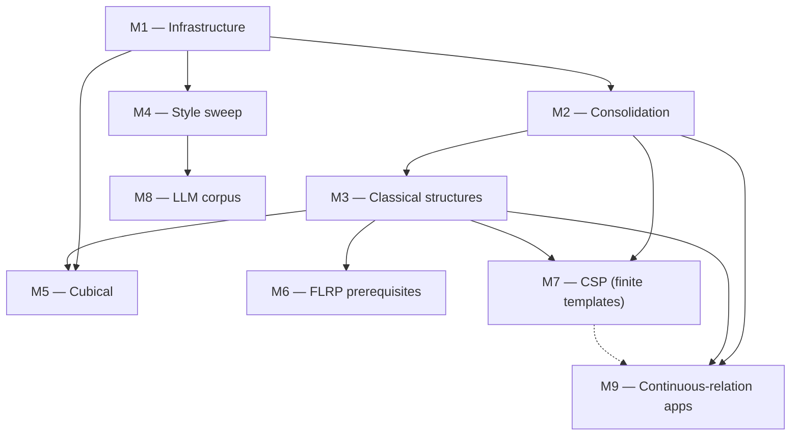
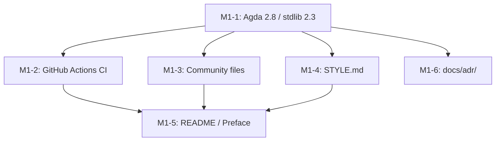
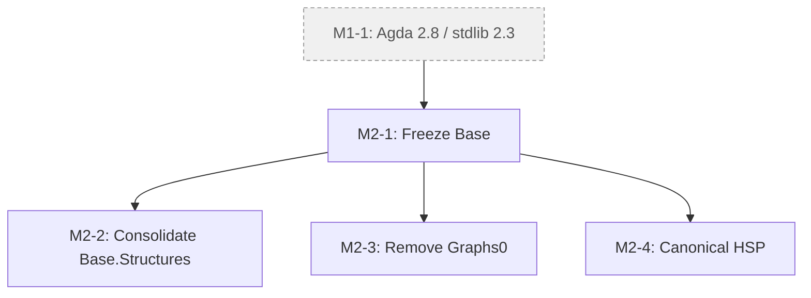
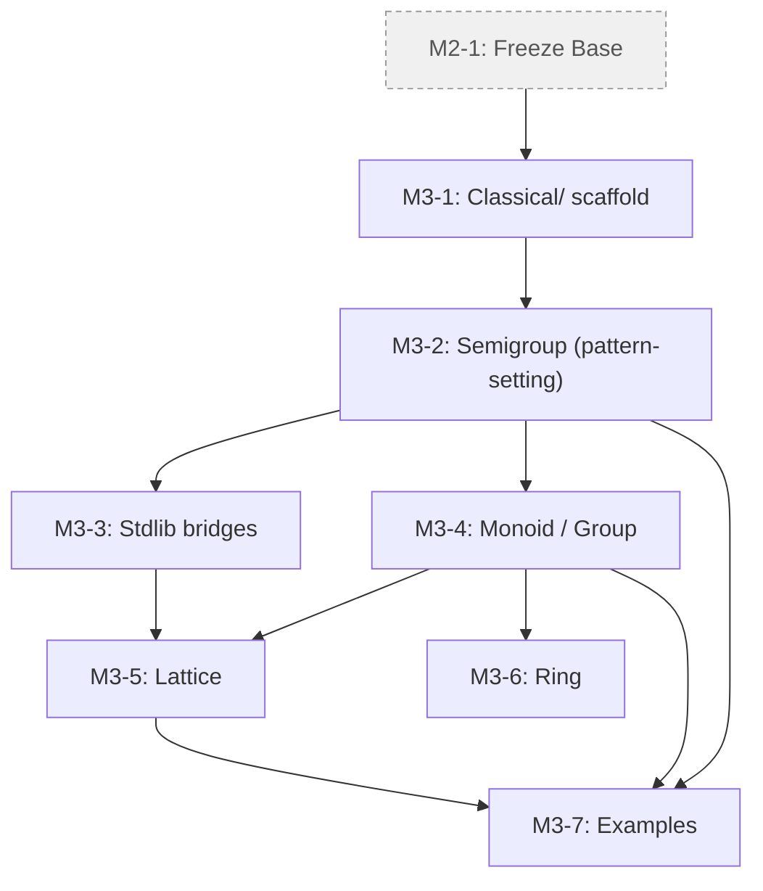
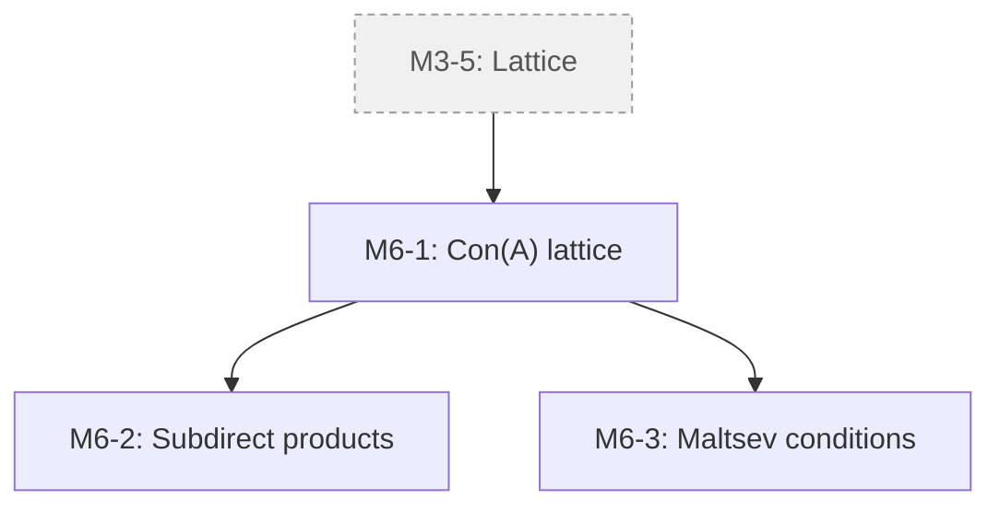
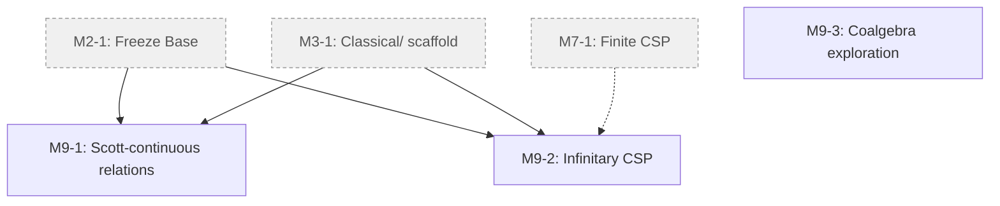
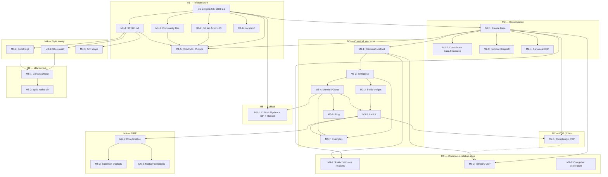

<!-- File: docs/GITHUB_PROJECT.md -->

# agda-algebras — GitHub Project Roadmap

**Project Title**:  agda-algebras 3.0 — Infrastructure, Consolidation, Classical Structures, Applications

**Repository**:  `ualib/agda-algebras`

**Date**:  2026-04-19

---

## Summary

Modernization of agda-algebras in 9 milestones: tooling upgrade/infra (M1), consolidate Base/Setoid (M2), classical structures (M3), style/naming uniformity (M4), Cubical Agda (M5), FLRP (M6), complexity/CSP module (M7), training corpus/LLM (M8), novel-research apps of `Continuous` relation API (M9).

---

## Description

A structured plan to modernize the agda-algebras library.  The work is organized into nine milestones: tooling upgrade and infrastructure (M1), consolidation of the Base/Setoid fork (M2), introduction of the long-missing classical structures layer (M3), style and naming uniformity (M4), a Cubical Agda proof-of-concept as the canonical long-term target (M5), prerequisites for work on the Finite Lattice Representation Problem (M6), an extension of the existing algebraic complexity / CSP module for finite templates (M7), publication of a training corpus for language-model work (M8), and novel-research applications of the `Continuous` relation API (M9).  After M1 lands, the remaining milestones run largely in parallel.

---

## Note on version numbering

agda-algebras was released as v2.0.1 in December 2021 ([Zenodo DOI 10.5281/zenodo.5765793](https://doi.org/10.5281/zenodo.5765793)) as an archival artifact for the TYPES 2021 submission.  The current reconstruction is a major version bump past that release and is planned as v3.0.  The planned Cubical-canonical successor, in which `src/Cubical/` becomes the default development tree, is planned as v4.0.

---

## Labels

- `milestone-1-infra` (0075ca) — Milestone 1: Infrastructure health.
- `milestone-2-consolidation` (0075ca) — Milestone 2: Consolidation.
- `milestone-3-classical` (0075ca) — Milestone 3: Classical structures layer.
- `milestone-4-style` (0075ca) — Milestone 4: Style and naming uniformity.
- `milestone-5-cubical` (5319e7) — Milestone 5: Cubical track.
- `milestone-6-flrp` (5319e7) — Milestone 6: FLRP prerequisites.
- `milestone-7-csp` (5319e7) — Milestone 7: Algebraic complexity / CSP.
- `milestone-8-llm` (5319e7) — Milestone 8: LLM readiness.
- `milestone-9-apps` (5319e7) — Milestone 9: Applications of continuous relations.
- `stdlib-bridge` (fbca04) — Bridges to the Agda standard library.
- `breaking-change` (d93f0b) — Breaking change to the public API.
- `good first issue` (7057ff) — Good for newcomers.
- `help-wanted` (0e8a16) — Community help wanted.
- `design-discussion` (c5def5) — Needs design discussion before implementation.
- `documentation` (0e8a16) — Documentation changes.

---

## Milestones

### Milestone 1 — Infrastructure health (BLOCKING)

**Description**.  Modernize the library's tooling, establish baseline project hygiene, and unblock every subsequent milestone.  The library is currently pinned to Agda 2.6.2 / stdlib 1.7; it must move to Agda 2.8.0 / stdlib v2.3 with `--cubical-compatible` replacing `--without-K`.  Standard community-health files (CONTRIBUTING, CHANGELOG, CODE_OF_CONDUCT, STYLE) must land.  GitHub Actions CI must stand up.  README and installation docs must be rewritten for the 3.0 line.

**Exit criterion**.  `make check` passes under GitHub Actions CI against Agda 2.8.0 / stdlib v2.3; CONTRIBUTING.md, docs/STYLE.md, ROADMAP.md, CHANGELOG.md are merged; README documents the new install path.

---

### Milestone 2 — Consolidation

**Description**.  Resolve the parallel Base/Setoid fork by freezing `Base/` and moving it to `Legacy/Base/`.  `Setoid/` is the canonical development tree for 3.0.  Within Legacy, consolidate redundant `Base.Structures` implementations and remove abandoned experimental modules.  Designate a single canonical proof of Birkhoff's HSP theorem while preserving the pedagogical demonstration variants.

**Exit criterion**.  `src/Base/` is in `src/Legacy/Base/` with a deprecation note; `Setoid.Varieties.HSP.Birkhoff` is designated canonical; ADR-001 (Setoid as canonical) is merged; no duplicate implementations of the same concept remain in `Setoid/` or `Legacy/Base/`.

---

### Milestone 3 — Classical structures layer

**Description**.  Introduce the long-missing tower of classical algebraic structures as Σ-typed specific theories over the universal-algebra framework, with record-typed bundle views matching the stdlib `Algebra.Bundles` idiom.  Each structure ships as a Signatures / Theories / Structures / Bundles / Small quintuple.  Designed so that the underlying equivalence used in the Setoid-based 3.0 line can be mechanically replaced by a Cubical path type when the 4.0 Cubical track becomes canonical.

Phase 1: Magma, Semigroup, CommutativeSemigroup, Monoid, CommutativeMonoid, Group, AbelianGroup, Semilattice, Lattice.

Phase 2: Ring, CommutativeRing, Field, Module, DistributiveLattice, BooleanAlgebra.

**Exit criterion**.  Phase 1 classical structures are implemented, documented, bridged to stdlib, and exercised by at least one worked example each (e.g. `(ℕ, +, 0)` as a CommutativeMonoid; `(ℤ, +, -, 0)` as an AbelianGroup).

---

### Milestone 4 — Style and naming uniformity sweep

**Description**.  Apply `docs/STYLE.md` consistently across `Setoid/` and `Classical/`.  Audit naming (one preferred name per concept; synonyms deprecated); audit notation (one canonical symbol table); audit module structure (one concept per module where feasible); ensure every user-facing definition has a prose comment block.

**Exit criterion**.  No undocumented public definitions remain in `Setoid/` or `Classical/`; no synonym pairs (e.g. `is-homomorphism` + `IsHom`) exist in the public API; the canonical symbol table in `docs/STYLE.md` matches the notation actually used in the library.

---

### Milestone 5 — Cubical track (canonical long-term target)

**Description**.  Prepare the path for `Cubical/` to become the canonical development tree in version 3.0.  Port `Algebra` to cubical Agda, prove the structure identity principle (SIP), prove equivalence of `≅` with path equality, and demonstrate end-to-end workflow by porting at least one classical structure (Monoid is the natural choice).

**Exit criterion**.  `Cubical/Algebras/Basic.agda` compiles; SIP is proven for the cubical Algebra record; Monoid has a working cubical port that is essentially a mechanical substitution from its Setoid analog; ADR-003 (Cubical as canonical target) is merged.

---

### Milestone 6 — Toward the Finite Lattice Representation Problem

**Description**.  Build the specialized universal-algebraic infrastructure needed to tackle the Finite Lattice Representation Problem: "Does every finite lattice occur as the congruence lattice of a finite algebra?"  Near-term prerequisites include `Con 𝑨` and `Sub 𝑨` as complete lattices, subdirect products, subdirectly irreducible algebras, and basic Maltsev conditions relevant to lattice representations.  *Medium-term*.  Jónsson's theorem, Day's theorem.  Long-term (out of scope for 3.0): tame congruence theory, commutator theory, explicit representations of small lattices.

**Exit criterion**.  `Con 𝑨` is a complete lattice; subdirect products and subdirectly irreducible algebras are defined with basic properties proven; at least one Maltsev condition (congruence permutability via the Maltsev term characterization) is proven.

---

### Milestone 7 — Algebraic complexity / CSP extensions (finite templates)

**Description**.  Extend the existing `Base.Complexity` / `Exercises.Complexity.FiniteCSP` work into a proper algebraic-complexity development of **finite-template** constraint satisfaction.  This is a separate research program from Milestone 6 (the FLRP is about lattice representation theory; finite CSP is about the complexity of constraint satisfaction with a fixed finite template over the algebraic approach of Bulatov, Zhuk, Barto, and others).  Candidate content includes polymorphism clones, the Jeavons Galois connection, Post's lattice, and a statement of the Bulatov–Zhuk algebraic dichotomy.  The infinite-template / ω-categorical extension is covered separately under Milestone 9.

**Exit criterion**.  At least one substantial algebraic-CSP theorem is formalized (e.g. the Jeavons Galois connection for a fixed finite domain); polymorphism clones are available as a first-class type.

---

### Milestone 8 — LLM readiness and corpus artifacts

**Description**.  Make the library maximally useful as a training and retrieval corpus for language models.  Extract (theorem statement, proof term) pairs with metadata; publish as a Hugging Face dataset; explore agda-native-air integration; publish a short paper or blog post describing the corpus and its intended uses.

**Exit criterion**.  Initial corpus artifact is published with at least 500 (theorem, proof) pairs; a CI job regenerates the corpus on each release; a public-facing write-up describing the dataset is available.

---

### Milestone 9 — Applications of continuous relations

**Description**.  Explore substantive mathematical applications of the `Continuous` relation API — the generalization of classical relations to arbitrary arity types, developed in `Base.Relations.Continuous` and carried forward into `Setoid/`.  Three directions are in scope, each intrinsically interesting and independent of the FLRP and finite-CSP programs.  M9-1 formalizes Scott-continuous relations on directed-complete partial orders (DCPOs), connecting to domain theory and Escardó's work on searchable sets in the constructive-mathematics tradition.  M9-2 formalizes infinitary CSP over ω-categorical templates in the Bodirsky–Pinsker program, where relations of countably infinite arity arise naturally.  M9-3 is exploratory rather than deliverable-oriented: a reading-and-writing investigation into whether coalgebraic bisimulation has an under-exploited angle at the intersection with universal algebra in the Birkhoff sense.

**Exit criterion**.  At least one of M9-1 or M9-2 produces a formalized non-trivial example accompanied by a short public write-up (blog post, arXiv note, or similar); M9-3 produces a design-discussion document summarizing what was learned from the reading, with a concrete verdict ("pursue" or "saturated") regardless of whether formalization work follows.

---

### Milestone Dependencies



---

## Issues

Below, each issue is tagged with its milestone (**M1**, **M2**, etc.), suggested labels, and a full issue body ready for GitHub.  Cross-milestone dependencies are noted in the body; see the Mermaid graph at the end of this file for a visual summary.

---
---

## Milestone 1 — Infrastructure health

---

### Issue M1-1: Upgrade to Agda 2.8.0 and stdlib v2.3; replace `--without-K` with `--cubical-compatible`

**Labels**:  `milestone-1-infra`, `breaking-change`

**Milestone**:  1 — Infrastructure health

## Description

The library is currently pinned to Agda 2.6.2 / stdlib 1.7.  The Agda ecosystem has moved on: the current stable is Agda 2.8.0 (July 2025) and stdlib v2.3.  `--without-K` has been superseded by `--cubical-compatible` since Agda 2.6.3.  This issue tracks the full upgrade.  Blocks essentially every other issue in this project.

## Tasks

- [ ] Update `agda-algebras.agda-lib` to `depend: standard-library-2.3` and document the minimum Agda version as 2.8.0.
- [ ] Replace every `{-# OPTIONS --without-K --exact-split --safe #-}` with `{-# OPTIONS --cubical-compatible --exact-split --safe #-}`.
- [ ] Fix any regressions from the flag change.
- [ ] Update import paths for anything that moved between stdlib 1.7 and 2.3 (expected hotspots: `Function.Bundles`, `Relation.Binary.*` renamings, `Data.*` reorganizations).
- [ ] Update CI config to test against Agda 2.8.0 / stdlib 2.3.
- [ ] Update `README.md` and `INSTALL.md` to reflect the new requirements.
- [ ] Update the Nix flake.

## Acceptance criteria

- [ ] Library type-checks under Agda 2.8.0 / stdlib v2.3.
- [ ] `make check` succeeds locally.
- [ ] No file still declares `--without-K`.
- [ ] Once 3.0 is stable, consider adding a CI job against Agda 2.9/dev to catch forward-compatibility issues early.

---

### Issue M1-2: Add GitHub Actions CI to type-check the library

**Labels**:  `milestone-1-infra`, `good first issue`

**Milestone**:  1 — Infrastructure health

## Description

The library has no CI.  Contributors can break type-checking without maintainers noticing.  Add a GitHub Actions workflow that type-checks the library on each push and pull request.  Reference workflows: `agda-categories` and the stdlib itself both have well-maintained CI that can be adapted.

## Tasks

- [ ] Add `.github/workflows/ci.yml`.
- [ ] Install Agda at the pinned version (Agda 2.8.0; see M1-1).
- [ ] Install stdlib v2.3.
- [ ] Run `make check` (or equivalent) on every push to `main` and on PRs.
- [ ] Cache the Agda binary and `.agdai` files between runs.
- [ ] Display a CI badge in the README.

## Acceptance criteria

- [ ] CI runs green on `main`.
- [ ] CI triggers on every pull request.
- [ ] Average job time < 10 min after caching.
- [ ] README shows a green CI badge.

---

### Issue M1-3: Add CONTRIBUTING.md, CHANGELOG.md, CODE_OF_CONDUCT.md

**Labels**:  `milestone-1-infra`, `documentation`, `good first issue`

**Milestone**:  1 — Infrastructure health

## Description

Standard community-health files are missing.  Drafts of CONTRIBUTING and STYLE exist from the 3.0 planning cycle and can be merged after review.

## Tasks

- [ ] Add `CONTRIBUTING.md` (draft from planning cycle).
- [ ] Add `CHANGELOG.md` seeded with the 3.0 milestone entry.
- [ ] Add `CODE_OF_CONDUCT.md` (Contributor Covenant 2.1).
- [ ] Add `.github/ISSUE_TEMPLATE/` with bug-report, feature-request, and design-discussion templates.
- [ ] Add `.github/PULL_REQUEST_TEMPLATE.md`.

## Acceptance criteria

- [ ] All four files exist at the repo root (or in `.github/`).
- [ ] GitHub recognizes the community-health files (green checkmarks on the "Insights → Community" page).

---

### Issue M1-4: Adopt docs/STYLE.md as the project style guide

**Labels**:  `milestone-1-infra`, `documentation`

**Milestone**:  1 — Infrastructure health

## Description

Create `docs/STYLE.md` documenting file format, module structure, naming conventions, notation, universe-polymorphism practices, record vs Σ guidance, proof style, and library-as-training-corpus considerations.  A draft from the planning cycle is ready for review.  Applying the style guide across `Setoid/` and `Classical/` is tracked in M4-1.

## Tasks

- [ ] Merge `docs/STYLE.md` (draft from planning cycle).
- [ ] Link `STYLE.md` from `README.md` and `CONTRIBUTING.md`.

## Acceptance criteria

- [ ] `docs/STYLE.md` is merged.
- [ ] Links from README and CONTRIBUTING work.

---

### Issue M1-5: Rewrite README and Preface for the 3.0 release

**Labels**:  `milestone-1-infra`, `documentation`

**Milestone**:  1 — Infrastructure health

## Description

The current `README.md` and `docs/lagda/Preface.lagda` are 1.x-era: wrong Agda versions, obsolete installation paths, pre-consolidation library structure.  They need a rewrite aligned with the 3.0 release.  Depends on M1-1 through M1-4 and M2-1.

## Tasks

- [ ] Pin Agda 2.8.0 / stdlib 2.3 in install instructions.
- [ ] Describe the Setoid-as-canonical structure and point to `Classical/`.
- [ ] Link `CONTRIBUTING.md`, `ROADMAP.md`, `docs/STYLE.md`.
- [ ] Concrete quickstart for new users (5-command install → `make check`).
- [ ] Add CI badge (from M1-2) and documentation site link.

## Acceptance criteria

- [ ] A reviewer can follow the README on a clean machine to a working `make check` without asking questions.
- [ ] All links resolve.
- [ ] No references to Agda 2.6.x or stdlib 1.x remain.

---

### Issue M1-6: Establish docs/adr/ for Architecture Decision Records

**Labels**:  `milestone-1-infra`, `documentation`, `good first issue`

**Milestone**:  1 — Infrastructure health

## Description

As the library evolves, design decisions (Setoid vs Base canonicality, record vs Σ for classical structures, Cubical track planning) should be recorded so future contributors understand the rationale.  Use Michael Nygard's lightweight ADR format (one page per decision).

## Tasks

- [ ] Create `docs/adr/` directory.
- [ ] Add `docs/adr/README.md` explaining the ADR format.
- [ ] Add `docs/adr/000-template.md`.
- [ ] Seed with decisions ratified in 3.0:
  - `001-setoid-as-canonical.md` (from M2-1);
  - `002-classical-layer-design.md` (from M3-1);
  - `003-cubical-canonical-target.md` (from M5-1).

## Acceptance criteria

- [ ] `docs/adr/` exists with README and template.
- [ ] All three seeded ADRs are drafted (full content can land with the associated implementation issues).

---

### Milestone 1 Dependencies

M1-5 is the integration node: the new README / Preface needs all the other M1 deliverables to exist before it can refer to them.  M1-6 (docs/adr/) is structurally independent but is gated on M1-1 because it references the 3.0 release.



---
---

## Milestone 2 — Consolidation

---

### Issue M2-1: Freeze Base/, adopt Setoid/ as canonical

**Labels**:  `milestone-2-consolidation`, `breaking-change`

**Milestone**:  2 — Consolidation

## Description

The decision is ratified: `Setoid/` is the canonical development tree for 3.0; `Base/` is frozen and moved to `Legacy/Base/`.  Rationale: `Setoid/` is fully constructive (no extensionality postulates); it matches the stdlib `Algebra.Bundles` idiom which simplifies bridges; maintaining two trees indefinitely doubles every theorem's cost; `Setoid/` already contains the definitive HSP proof.

Note: `Base/` remains in the repo — frozen, not deleted — for posterity and as a reference.  Parts may be ported back to `Setoid/` or `Cubical/` as needed.

This is a breaking change for downstream users of `Base/`.  Announce prominently in the 3.0 CHANGELOG.

## Tasks

- [ ] Move `src/Base/` → `src/Legacy/Base/`.
- [ ] Update `src/agda-algebras.agda` to re-export `Legacy.Base` with a deprecation note.
- [ ] Add `DEPRECATED.md` in `Legacy/Base/` explaining the status and pointing users to `Setoid/`.
- [ ] Write ADR `docs/adr/001-setoid-as-canonical.md`.
- [ ] Announce in CHANGELOG.

## Acceptance criteria

- [ ] `src/Base/` no longer exists at the old path.
- [ ] `src/Legacy/Base/` exists and type-checks.
- [ ] ADR-001 is merged.
- [ ] CHANGELOG entry documents the move prominently.

---

### Issue M2-2: Consolidate parallel implementations within Legacy/Base/Structures

**Labels**:  `milestone-2-consolidation`

**Milestone**:  2 — Consolidation

## Description

`Base.Structures.Basic` defines multi-sorted structures as records; `Base.Structures.Sigma.*` does the same thing as Σ-types.  They are parallel implementations of the same concept, each with its own `Products`, `Congruences`, `Homs`, `Isos`.  Since `Base/` is frozen (see M2-1), scope is limited to Legacy cleanup, but worth doing for clarity.

## Tasks

- [ ] Pick one formulation (record or Σ) as canonical within Legacy.
- [ ] Add conversion functions where they don't already exist.
- [ ] Update internal uses to the canonical form.
- [ ] Keep the non-canonical form under a distinct namespace with a deprecation note.

## Acceptance criteria

- [ ] `Legacy/Base/Structures/` has a single canonical implementation of each concept.
- [ ] The non-canonical namespace is clearly marked deprecated.

---

### Issue M2-3: Remove Base.Structures.Graphs0 (unused experimental duplicate)

**Labels**:  `milestone-2-consolidation`, `good first issue`

**Milestone**:  2 — Consolidation

## Description

`src/Base/Structures/Graphs0.agda` is not exported `public` from `Base/Structures.agda` and appears to be an abandoned experimental earlier version of `Base/Structures/Graphs.agda`.

## Tasks

- [ ] Investigate for any downstream dependency on `Graphs0`.
- [ ] If none, delete the file.
- [ ] If still referenced, rename to `Graphs.Alternative` with a comment explaining the distinction.

## Acceptance criteria

- [ ] `Graphs0` is either deleted or clearly renamed with documentation.
- [ ] Library still type-checks.

---

### Issue M2-4: Designate a canonical HSP proof; consolidate the others

**Labels**:  `milestone-2-consolidation`, `documentation`

**Milestone**:  2 — Consolidation

## Description

The library contains three proofs of Birkhoff's HSP theorem:

1. `Base.Varieties.FreeAlgebras.Birkhoff` (original Base-tree proof).
2. `Setoid.Varieties.HSP.Birkhoff` (definitive setoid proof).
3. `Demos.HSP.Birkhoff` (self-contained pedagogical version for TYPES 2021).

## Tasks

- [ ] Designate `Setoid.Varieties.HSP.Birkhoff` as canonical.
- [ ] Keep `Demos.HSP` as the self-contained pedagogical presentation (it was created for TYPES 2021 and remains valuable as a teaching artifact).
- [ ] Move `Base.Varieties.FreeAlgebras.Birkhoff` into Legacy (implicit via M2-1, but cross-reference explicitly).
- [ ] Add cross-references among the three so a reader starting at any of them can find the canonical statement.
- [ ] Update paper citations in `docs/papers/`.

## Acceptance criteria

- [ ] `Setoid.Varieties.HSP.Birkhoff` is marked canonical in its module header.
- [ ] `Demos.HSP` contains a reference to the canonical version.
- [ ] The paper citation table is up to date.

---

### Milestone 2 Dependencies

M2-1 (freeze Base/) is the fork point: everything else in this milestone is internal cleanup within what becomes `Legacy/Base/`, and all three depend on the move happening first.  M1-1 is shown dashed to indicate it's an upstream dependency from a different milestone.



---
---

## Milestone 3 — Classical structures layer

---

### Issue M3-1: Introduce the Classical/ tree — Signatures, Theories, Structures, Bundles, Small

**Labels**:  `milestone-3-classical`, `design-discussion`

**Milestone**:  3 — Classical structures layer

## Description

The library has no formalized classical algebraic structures despite this being a long-stated vision.  This issue creates the scaffold; subsequent issues add specific structures.

Ratified design decisions (to be recorded in `docs/adr/002-classical-layer.md`):

1. Each classical structure `X` is Σ-typed at the core: `X α ρ = Σ[ 𝑨 ∈ Algebra 𝑆ₓ α ρ ] 𝑨 ⊨ Eₓ`.  The mathematical reading "X *is* an algebra equipped with a proof it satisfies the X-theory" motivates Σ over record for classical structures.  The core `Algebra` type stays a record.
2. A parallel record-typed "bundle view" in `Classical/Bundles/X` matches the stdlib `Algebra.Bundles` idiom for interop.
3. Built on `Setoid/` (not `Base/`).  A helper `fromPropEq : Type α → ... → X α α` lets users build classical structures from propositional-equality-based definitions without explicit Setoid wrapping.
4. Designed for Cubical portability.  Equations stated purely in terms of `Algebra.Domain`'s equivalence — never reaching for Setoid-specific features without a Cubical analog.  When `Cubical/` becomes canonical in 4.0, the port should be mechanical.
5. Two levels of specificity per structure: polymorphic core (`Classical.Structures.X`) and level-fixed veneer (`Classical.Small.Structures.X`) for the common `ℓ₀` case.

## Tasks

- [ ] Create the directory skeleton:

   ```
   src/Classical/
     Classical.agda
     Signatures/
     Theories/
     Structures/
     Bundles/
     Small/Structures/
   ```

- [ ] Add placeholder modules that type-check.
- [ ] Write `Classical.agda` that re-exports everything.
- [ ] Write `docs/adr/002-classical-layer.md` recording the design decisions.

## Acceptance criteria

- [ ] Scaffold type-checks.
- [ ] `Classical.agda` re-exports the empty scaffold cleanly.
- [ ] ADR-002 is merged.

---

### Issue M3-2: Add Classical.Structures.Semigroup (pattern-setting first structure)

**Labels**:  `milestone-3-classical`

**Milestone**:  3 — Classical structures layer

## Description

After the M3-1 scaffold lands, add Semigroup as the pattern-setting first non-trivial classical structure.  Every subsequent classical structure will imitate this pattern, so getting it right is disproportionately important.

## Tasks

- [ ] `Classical/Signatures/Semigroup.agda`: one binary operation, `𝑆ₛ`.
- [ ] `Classical/Theories/Semigroup.agda`: associativity as the single equation in `Theory 𝑆ₛ`.
- [ ] `Classical/Structures/Semigroup.agda`: the Σ-typed definition `Semigroup α ρ = Σ[ 𝑨 ∈ Algebra 𝑆ₛ α ρ ] 𝑨 ⊨ Eₛ` with convenience projections.
- [ ] Basic lemmas: every semigroup is an `Algebra`; composition of semigroup morphisms is a semigroup morphism.
- [ ] `fromPropEq` helper for propositional-equality-based definitions.
- [ ] At least one worked example: `(ℕ, +)` as a `Semigroup`.
- [ ] `Classical/Bundles/Semigroup.agda` with stdlib bridge (see M3-3).
- [ ] `Classical/Small/Structures/Semigroup.agda` level-fixed veneer.

## Acceptance criteria

- [ ] All files type-check.
- [ ] The worked example `ℕ-semigroup` type-checks.
- [ ] The bridge to `Algebra.Bundles.Semigroup` round-trips on `ℕ`.
- [ ] Module header comment documents the pattern for future structures.

---

### Issue M3-3: Bridges between Classical.Structures and Algebra.Bundles

**Labels**:  `milestone-3-classical`, `stdlib-bridge`

**Milestone**:  3 — Classical structures layer

## Description

For each classical structure `X`, provide `Classical/Bundles/X.agda` with bidirectional conversion between the Σ-typed core and the stdlib's `Algebra.Bundles.X`.

## Tasks

Phase 1 (after M3-2):

- [ ] Magma.
- [ ] Semigroup.
- [ ] CommutativeSemigroup.
- [ ] Monoid.
- [ ] CommutativeMonoid.
- [ ] Group.
- [ ] AbelianGroup.

Phase 2:

- [ ] Semilattice.
- [ ] Lattice (bridges to both `Algebra.Bundles.Lattice` and `Algebra.Lattice.Bundles.Lattice`).
- [ ] Semiring.
- [ ] Ring.
- [ ] CommutativeRing.

## Acceptance criteria

- [ ] Each bundle file proves round-trip properties where applicable.
- [ ] A stdlib concrete instance (e.g. stdlib's `ℕ-+-commutativeMonoid`) round-trips through the bridge.

---

### Issue M3-4: Classical structures — Monoid, CommutativeMonoid, Group, AbelianGroup

**Labels**:  `milestone-3-classical`, `help-wanted`

**Milestone**:  3 — Classical structures layer

## Description

Follow the pattern established in M3-2 to add the monoid-and-group family, with corresponding signatures, theories, bundle views, and level-fixed veneers.

## Tasks

- [ ] `Classical/Structures/Monoid.agda`.
- [ ] `Classical/Structures/CommutativeMonoid.agda`.
- [ ] `Classical/Structures/Group.agda`.
- [ ] `Classical/Structures/AbelianGroup.agda`.
- [ ] Corresponding signatures, theories, bundles (per M3-3), Small veneers.
- [ ] Worked examples: `(ℕ, +, 0)` as CommutativeMonoid; `(ℤ, +, 0, -)` as AbelianGroup.

## Acceptance criteria

- [ ] All four structures type-check and round-trip through their bundles.
- [ ] Worked examples type-check.

---

### Issue M3-5: Classical.Semilattice and Classical.Lattice

**Labels**:  `milestone-3-classical`, `help-wanted`

**Milestone**:  3 — Classical structures layer

## Description

Lattices are centrally important because `Con 𝑨` and `Sub 𝑨` are naturally lattices, and the Finite Lattice Representation Problem (M6) is stated in terms of lattices.

## Tasks

- [ ] `Classical/Signatures/Lattice.agda`: two binary operations (`∧`, `∨`) or one (meet), depending on formulation.
- [ ] `Classical/Theories/Lattice.agda`: associativity, commutativity, idempotence, absorption.
- [ ] `Classical/Structures/Semilattice.agda`.
- [ ] `Classical/Structures/Lattice.agda`.
- [ ] Bridge to `Algebra.Lattice.Bundles`.
- [ ] Prove equivalence of algebraic (meet-join) and order-theoretic formulations.

## Acceptance criteria

- [ ] Both structures type-check.
- [ ] The meet-join / order-theoretic equivalence theorem is proved.
- [ ] Bridge to stdlib round-trips on `𝟚` as a Boolean lattice.

---

### Issue M3-6: Classical.Ring and Classical.CommutativeRing

**Labels**:  `milestone-3-classical`, `help-wanted`

**Milestone**:  3 — Classical structures layer

## Description

Rings depend on AbelianGroup for the additive structure, so this issue comes after M3-4.

## Tasks

- [ ] `Classical/Signatures/Ring.agda`.
- [ ] `Classical/Theories/Ring.agda`.
- [ ] `Classical/Structures/Ring.agda`.
- [ ] `Classical/Structures/CommutativeRing.agda`.
- [ ] Bridge to stdlib.
- [ ] Worked example: `(ℤ, +, *, 0, 1, -)` as CommutativeRing.

## Acceptance criteria

- [ ] Both structures type-check.
- [ ] The worked example `ℤ-ring` type-checks.
- [ ] Bridge to stdlib `CommutativeRing` round-trips on `ℤ`.

---

### Issue M3-7: Expand Examples/ with worked classical-structure instances

**Labels**:  `milestone-3-classical`, `documentation`, `good first issue`, `help-wanted`

**Milestone**:  3 — Classical structures layer

## Description

The `Examples/` directory is thin.  Add worked examples that exercise the Classical/ layer.

## Tasks

- [ ] `(ℕ, +, 0)` as a `CommutativeMonoid`, with HSP specialized to it.
- [ ] `(ℤ, +, 0, -)` as an `AbelianGroup`.
- [ ] `𝟚` with two operations as a `DistributiveLattice`.
- [ ] A small finite group (`ℤ/3ℤ`) with its congruence lattice computed.
- [ ] A finite Heyting algebra as a Lattice example.

## Acceptance criteria

- [ ] At least five new example files in `Examples/Classical/`.
- [ ] Each example type-checks and is documented in a prose header.

---

### Milestone 3 Dependencies

M3-2 (Semigroup) is the pattern-setter — the design choices made there propagate to every other structure.  M3-4 (Monoid/Group) and M3-5 (Lattice) are the mid-level hubs; M3-6 (Ring) needs M3-4 because rings are abelian groups with extra structure, and M3-7 (Examples) aggregates from several of the structure issues.



---
---

## Milestone 4 — Style and naming uniformity sweep

---

### Issue M4-1: Style uniformity sweep across Setoid/

**Labels**:  `milestone-4-style`, `documentation`

**Milestone**:  4 — Style and naming uniformity sweep

## Description

Apply `docs/STYLE.md` across the `Setoid/` tree.  This is a long-tail task that can be decomposed into per-submodule issues for parallel work.

## Tasks

- [ ] Audit naming: `IsHom` vs `is-homomorphism` vs `Hom` — pick one, deprecate others.
- [ ] Audit notation against the canonical symbol table in STYLE.md.
- [ ] Audit imports (tighten `using` clauses; remove unused).
- [ ] Ensure every public definition has a prose comment block.
- [ ] Rich comment headers on every module.

## Acceptance criteria

- [ ] No synonym pairs remain in the `Setoid/` public API.
- [ ] All notation in `Setoid/` matches the canonical table in STYLE.md.
- [ ] Every public definition in `Setoid/` has a docstring.

---

### Issue M4-2: Docstring pass for all user-facing definitions

**Labels**:  `milestone-4-style`, `documentation`, `help-wanted`

**Milestone**:  4 — Style and naming uniformity sweep

## Description

Every record, type family, and top-level function in the public API should have a prose comment block explaining what it is, when to use it, and cross-references to related definitions.  Long-tail task; pursue in small per-module PRs.

## Tasks

- [ ] Walk every public module in `Setoid/` and add missing docstrings.
- [ ] Walk every public module in `Classical/` and add missing docstrings.
- [ ] Enforce via a linter or review checklist.

## Acceptance criteria

- [ ] `grep`-based audit finds zero public definitions without a preceding comment block.

---

### Issue M4-3: Design discussion — scope of 𝓞 and 𝓥 universe variables

**Labels**:  `milestone-4-style`, `design-discussion`, `good first issue`

**Milestone**:  4 — Style and naming uniformity sweep

## Description

`Overture.Signatures` declares `variable 𝓞 𝓥 : Level` without `private`.  They leak through every downstream module, which is convenient but can be confusing for new contributors shadowing the names.

## Tasks

- [ ] Write up the three options in an ADR or design-discussion issue:
  1. Keep current behavior; document clearly.
  2. Make them `private` in `Overture.Signatures`; downstream modules re-declare.
  3. Move to a dedicated `Overture.UniverseLevels` module imported explicitly.
- [ ] Collect input; pick one.
- [ ] Document the decision in STYLE.md.
- [ ] Apply consistently.

## Acceptance criteria

- [ ] Decision is recorded (ADR or STYLE.md section).
- [ ] `𝓞` and `𝓥` are handled uniformly across the library.

---
---

## Milestone 5 — Cubical track

---

### Issue M5-1: Cubical track — Cubical/Algebras/Basic with SIP and Monoid port

**Labels**:  `milestone-5-cubical`

**Milestone**:  5 — Cubical track (canonical long-term target)

## Description

Cubical Agda is the canonical long-term target for this library.  This issue establishes the path: port the core algebra types, prove the structure identity principle (SIP), and demonstrate end-to-end workflow by porting Monoid from the Setoid-based Classical layer to a Cubical counterpart.  The ultimate goal is for Cubical to become the default development track in version 4.0.

Design implication for M3: the Classical layer must be designed so that the Setoid-to-Cubical port is mechanical — equations stated purely in terms of the `Algebra` record's Domain equivalence, no Setoid-specific gadgets in the definitions of classical structures themselves.

## Tasks

- [ ] `Cubical/Algebras/Basic.agda`: cubical counterpart of `Setoid.Algebras.Basic`.  Carrier is a Type; equality is the path type.
- [ ] `Cubical/Algebras/SIP.agda`: structure identity principle.  Port or adapt from the `cubical` or `1Lab` library.
- [ ] Prove: `≅` as defined for Cubical algebras is equivalent to path equality (the central "transport does what we want" result).
- [ ] End-to-end port: take `Classical/Structures/Monoid.agda` from the Setoid-based version (post M3-4) and produce the Cubical analog.  Verify that equations transport by substitution alone.
- [ ] Write `docs/adr/003-cubical-canonical-target.md` explicitly planning the 4.0 transition and the criteria for promoting Cubical from experimental to canonical.

## Acceptance criteria

- [ ] `Cubical/Algebras/Basic.agda` and `SIP.agda` compile under `--cubical`.
- [ ] The `≅`-is-path theorem is proved.
- [ ] `Cubical/Classical/Monoid.agda` compiles and is substitutionally derived from its Setoid analog.
- [ ] ADR-003 is merged.

---
---

## Milestone 6 — Toward the Finite Lattice Representation Problem

---

### Issue M6-1: Con(A) as a complete lattice

**Labels**:  `milestone-6-flrp`

**Milestone**:  6 — Toward the Finite Lattice Representation Problem

## Description

The current `Setoid.Algebras.Congruences` defines congruences but does not organize them as a lattice.  For the FLRP, commutator theory, and subdirect product theorems, `Con 𝑨` as a complete lattice is foundational infrastructure.  Likely requires a congruence-generation theorem as a subsidiary result.

## Tasks

- [ ] Define `Con 𝑨` as a type (may exist already; promote to a first-class lattice object).
- [ ] Define the partial order `_≤_` (containment).
- [ ] Define meet: `θ ∧ φ = θ ∩ φ`.
- [ ] Define join: `θ ∨ φ = Cg(θ ∪ φ)` (congruence generated by union).
- [ ] `Con-Lattice : (𝑨 : Algebra α ρ) → Lattice _ _`.
- [ ] `Con-CompleteLattice` with infinite meets and joins.
- [ ] Zero and total congruences as `⊥` and `⊤`.
- [ ] Subsidiary: congruence-generation theorem.

## Acceptance criteria

- [ ] `Con-Lattice 𝑨` type-checks and satisfies the Lattice axioms.
- [ ] Infinite meets and joins are proved.
- [ ] At least one small worked example (e.g. `Con` of a 2-element algebra).

---

### Issue M6-2: Subdirect products and subdirectly irreducible algebras

**Labels**:  `milestone-6-flrp`

**Milestone**:  6 — Toward the Finite Lattice Representation Problem

## Description

Subdirect products and subdirect irreducibility are foundational for both the FLRP and for general universal-algebraic theorems (e.g. Birkhoff's subdirect product theorem).

## Tasks

- [ ] `SubdirectProduct : (𝒜 : I → Algebra α ρ) → Algebra _ _` — embeds into `⨅ 𝒜` with each projection surjective.
- [ ] `IsSubdirectlyIrreducible : Algebra α ρ → Type _`.
- [ ] Birkhoff's subdirect product theorem: every algebra is a subdirect product of SI algebras.
- [ ] SI characterization via monolithic congruences.

## Acceptance criteria

- [ ] Subdirect product construction type-checks.
- [ ] Birkhoff's subdirect product theorem is proved.
- [ ] SI characterization is proved.

---

### Issue M6-3: Basic Maltsev conditions (CD, CM, CP)

**Labels**:  `milestone-6-flrp`, `design-discussion`

**Milestone**:  6 — Toward the Finite Lattice Representation Problem

## Description

Maltsev conditions characterize varieties by the existence of terms with specific properties.  The three most basic are congruence distributivity (CD), congruence modularity (CM), and congruence permutability (CP).  For the FLRP, congruence modularity is particularly relevant because modular congruence lattices are a natural testing ground for representation questions.

Design discussion: how to encode Maltsev conditions uniformly?  Options include (a) a record bundling a term and its identities; (b) an inductive type of schemes.  Lift from Taylor 1977 where possible.

## Tasks

- [ ] `HasMaltsevTerm : Variety → Term → Type`.
- [ ] Specific Maltsev terms: Jónsson terms (CD), Day terms (CM), Maltsev operation `p(x,y,y) = x = p(y,y,x)` (CP).
- [ ] Jónsson's theorem: a variety is CD iff Jónsson terms exist.
- [ ] CP iff a Maltsev term exists.
- [ ] Day's theorem for CM.

## Acceptance criteria

- [ ] At least CP's Maltsev-term characterization is proved.
- [ ] Jónsson's theorem and Day's theorem are either proved or have a clear stub indicating what remains.

---

### Milestone 6 Dependencies

M6-1 (Con(A) as a lattice) is the foundation: both subdirect products and Maltsev conditions need congruences-as-a-lattice to be phrasable in the form the classical proofs use.



---
---

## Milestone 7 — Algebraic complexity / CSP extensions (finite templates)

---

### Issue M7-1: Extend Complexity module beyond Basic and CSP

**Labels**:  `milestone-7-csp`, `help-wanted`, `design-discussion`

**Milestone**:  7 — Algebraic complexity / CSP extensions (finite templates)

## Description

The current `Base.Complexity` module has only two submodules (`Basic` and `CSP`).  The CSP module is little more than a bare definition with no theorems.  This is a separate research track from the FLRP (M6): the FLRP is about which lattices arise as congruence lattices of finite algebras, while finite-template algebraic CSP is about the complexity of constraint satisfaction problems as a function of the polymorphism clone of the underlying finite relational structure.  Both use universal algebra, but they are different questions.  Infinite-template extensions (ω-categorical, Bodirsky–Pinsker) are covered separately under M9-2.

This issue is research-flavored and best decomposed after discussion.

## Tasks

Candidate content, to be prioritized:

- [ ] Polymorphism clones: `Pol(A, Γ)` as a first-class type.
- [ ] The Jeavons Galois connection between invariant relations and polymorphism clones.
- [ ] Post's lattice (for Boolean clones).
- [ ] Specific CSP tractability classes as worked examples (Horn-SAT, 2-SAT, linear systems over finite fields).
- [ ] Statement (not necessarily proof) of the Bulatov–Zhuk algebraic dichotomy.

## Acceptance criteria

- [ ] Polymorphism clones available as a type with basic operations.
- [ ] Jeavons Galois connection is proved for a fixed finite domain, OR a clear research-plan issue is filed continuing the work.

---
---

## Milestone 8 — LLM readiness and corpus artifacts

---

### Issue M8-1: Publish (theorem, proof) corpus for LLM training

**Labels**:  `milestone-8-llm`, `documentation`

**Milestone**:  8 — LLM readiness and corpus artifacts

## Description

Once `Setoid/` and `Classical/` are stable post-M4, publish a training and retrieval corpus for language models.

## Tasks

- [ ] Design a schema for corpus records: module path, theorem statement, proof term, dependencies, prose summary, keywords.
- [ ] Implement an extractor that walks the library and emits records.
- [ ] Publish as a Hugging Face dataset.
- [ ] Add a CI job that regenerates the corpus on each release.
- [ ] Write a short paper or blog post describing the dataset.

## Acceptance criteria

- [ ] Dataset published with ≥ 500 (theorem, proof) records.
- [ ] CI regenerates on release.
- [ ] Write-up is public.

---

### Issue M8-2: Explore integration with agda-native-air

**Labels**:  `milestone-8-llm`, `design-discussion`

**Milestone**:  8 — LLM readiness and corpus artifacts

## Description

agda-native-air (the developer's parallel project on AI-assisted formal proof) is a natural consumer of the agda-algebras corpus.  This issue tracks the integration.  Exploratory; low-priority until agda-native-air stabilizes.

## Tasks

- [ ] Document what API / metadata / annotations agda-native-air needs from agda-algebras.
- [ ] Identify any agda-algebras design choices that help or hinder agda-native-air consumption.
- [ ] Write an integration report.

## Acceptance criteria

- [ ] Integration report exists in `docs/integration-agda-native-air.md`.
- [ ] Any design changes required are filed as separate issues.

---
---

## Milestone 9 — Applications of continuous relations

---

### Issue M9-1: Scott-continuous relations on DCPOs via the Continuous API

**Labels**:  `milestone-9-apps`, `design-discussion`

**Milestone**:  9 — Applications of continuous relations

## Description

The `Base.Relations.Continuous` formalization generalizes classical relations: the arity is an arbitrary type rather than a natural number, and compatibility with an operation is stated pointwise over that arity.  That shape turns out to be the right one for a notion with a distinguished mathematical pedigree: **Scott-continuous relations on directed-complete partial orders (DCPOs)**.

A relation `R ⊆ X × Y` between DCPOs is *Scott-continuous* when, for every directed family `{(xᵢ, yᵢ)}ᵢ∈I` in `R`, the supremum `(⊔ xᵢ, ⊔ yᵢ)` is again in `R`.  This is a statement about arbitrary-arity suprema — the index set `I` is genuinely arbitrary — and factors through the continuous-relation API naturally.

The broader context is *domain theory* in the Scott sense, which underlies the denotational semantics of typed lambda calculi, topologically-enriched model theory and partial-function spaces, and constructive analysis via Escardó's work on exhaustively searchable sets.  The Escardó connection is worth flagging: his LICS 2007 result "Infinite sets that admit fast exhaustive search" characterizes searchable sets via a topological continuity condition on their decision procedures, and provides a computability-flavored reason to care about Scott-continuous relations on specific DCPOs such as the Cantor space.

## Tasks

- [ ] `Classical/Order/DCPO.agda` (or `Setoid/Order/DCPO.agda` if it will be adapted for Cubical later): DCPO as a record bundle — a poset with directed suprema.
- [ ] `Classical/Order/ScottContinuous.agda`: a `ScottContinuous` predicate on pairs of a `Continuous` relation and a DCPO structure on its carriers.
- [ ] Basic closure properties: Scott-continuous relations are closed under composition, intersection, and directed unions of Scott-continuous families.
- [ ] At least one non-trivial example: the graph of a Scott-continuous function is Scott-continuous as a relation; conversely, a single-valued Scott-continuous relation is the graph of a Scott-continuous function.
- [ ] Optional stretch goal: a path to Escardó's characterization of searchable sets, formalized as far as tractable.  If `TypeTopology` is the cleanest source, import from there rather than re-derive.

## Acceptance criteria

- [ ] DCPO record and ScottContinuous predicate type-check.
- [ ] The graph-of-continuous-function ↔ single-valued-continuous-relation characterization is proved.
- [ ] At least one closure property (composition or directed union) is proved.
- [ ] A short public write-up (blog post or arXiv note) connects the formalization to domain theory.

## Why this belongs in agda-algebras

Universal algebra and order theory have a long shared history: every algebra with a compatible order gives an ordered algebra; Birkhoff's theorem has order-enriched variants; congruence lattices (the central FLRP object) are themselves DCPOs.  Housing the Scott-continuous-relation material in agda-algebras keeps related abstractions together and gives them a shared foundation in the continuous-relation API.

## Relation to other milestones

- Depends on: M2 (Setoid/ canonical), M3-1 (Classical/ scaffold).
- Independent of: M6 (FLRP), M7 (finite-template CSP).
- Informs: M5 (Cubical port) — Scott-continuous relations have a natural cubical-friendly statement using paths.

---

### Issue M9-2: Infinitary CSP over ω-categorical templates via continuous relations

**Labels**:  `milestone-9-apps`, `design-discussion`, `help-wanted`

**Milestone**:  9 — Applications of continuous relations

## Description

The CSP module under M7 targets finite-template CSPs with finite-arity relations.  A rich body of contemporary work — most visibly the Bodirsky–Pinsker program — studies CSPs whose template is an ω-categorical structure with a countable domain and potentially infinitary relations.  The central tools there include:

- **Polymorphism clones of ω-categorical structures**, which control CSP complexity via a topological-dynamical analog of the finite-domain algebraic approach.
- **Canonical functions** in a polymorphism clone: functions whose behavior on all "types" is determined by their behavior on finitely many representatives.  See Michael Pinsker's recent work (e.g. [arXiv:2502.06621](https://arxiv.org/abs/2502.06621)).
- **Birkhoff-style theorems for topological clones**, generalizing the classical HSP theorem from varieties to polymorphism clones with a topological structure.

The `Base.Relations.Continuous` formalization in agda-algebras happens to be exactly the right abstraction for this setting.  An ω-categorical template has relations whose natural arity is a countable index set; a continuous-in-our-sense relation drops in unchanged.

This is a design-discussion issue, not an implementation plan.

## Tasks

- [ ] Which definitions port over unchanged from `Setoid/Complexity/CSP` (post M7-1), and which need generalization?
- [ ] What is the minimal API for a "template" in the ω-categorical setting (base structure, automorphism group, topological structure)?
- [ ] Is there a natural "Birkhoff for topological clones" result whose formalization is tractable with current tooling?  Bodirsky, Pinsker, and collaborators have published multiple variants; select the one with the cleanest statement.
- [ ] Can a small but genuinely infinitary example be formalized end-to-end — e.g. the template `(ℚ, <)` for temporal constraint satisfaction, which is ω-categorical and has a well-understood polymorphism clone?

## Deliverables (if pursued)

- [ ] A new subtree `Classical/Complexity/Infinitary/` (or similar) with the generalized definitions.
- [ ] A single formalized example (suggestion: the template `(ℚ, <)`).
- [ ] A short write-up — blog post or arXiv note — connecting the formalization to the Bodirsky–Pinsker literature.

## Non-goals

- Formalizing the full Bodirsky–Pinsker dichotomy conjecture.
- Matching the generality of any existing implementation.
- Engaging with decidability or tractability results (those are downstream; the first task is having the definitions).

## Relation to other milestones

- Depends on: M2 (Setoid/ canonical), M3-1 (Classical/ scaffold).
- Benefits from: M7-1 (finite-template CSP infrastructure — polymorphism clones, Galois connection machinery).
- Independent of: M5 (Cubical), M6 (FLRP).

---

### Issue M9-3: Exploratory — coalgebraic bisimulation as a continuous relation

**Labels**:  `milestone-9-apps`, `design-discussion`, `help-wanted`

**Milestone**:  9 — Applications of continuous relations

## Description

An exploratory issue, not a deliverable.  The goal is to read, think, and write up findings about whether the `Continuous` relation API has novel applications in coalgebra, particularly for bisimulation of non-finitary coalgebras.

A bisimulation between F-coalgebras `(c : A → F A, d : B → F B)` is classically a relation `R ⊆ A × B` that lifts along `F`: if `(a, b) ∈ R` then there is a witness `(F R) (c a) (d b)`.  When `F` is a finitary polynomial functor (e.g. finite-branching trees), `R` is naturally a finite-arity relation.  When `F` is continuous — for example, the stream functor `F X = X × A`, or the unbounded-branching tree functor `F X = X ^ ℕ` — the natural witness type for a bisimilarity step is an arbitrary-arity relation.  This is where the `Continuous` API might fit.

The intersection of coalgebra and classical universal algebra has many smart people (Rutten, Jacobs, Kurz, Adámek, Pattinson, et al.), but most of that work targets theoretical-CS applications (automata, regular languages, process calculi).  It is much less developed on the universal-algebra-in-the-Birkhoff-sense side.  It is plausible that low-hanging fruit remains at the intersection, but finding it requires sustained reading, not speculation.

Progress on this issue is measured in paragraphs written, not in type-checked Agda.

## Tasks

- [ ] Read Rutten, "Universal coalgebra: a theory of systems," TCS 2000 (the standard introduction).
- [ ] Read one or two recent survey articles on coalgebraic bisimulation for continuous functors.
- [ ] Write up (in `docs/exploration/coalgebra.md`) what the natural coalgebra-with-continuous-arity examples look like, and whether the `Continuous` API fits them without modification.
- [ ] Identify at least one concrete formalization candidate, even if small (e.g. a bisimulation characterization of stream equality using the `Continuous` API).  If no such candidate emerges, document why.
- [ ] Optional: formalize the candidate, or file a follow-up M9-3a issue.

## Acceptance criteria

- [ ] `docs/exploration/coalgebra.md` exists and is at least 2000 words.
- [ ] The document contains a concrete verdict: either "there is a formalization project worth pursuing" (in which case a follow-up issue is filed) or "the area is saturated / the fit is not natural" (in which case this issue is closed).

## Non-goals

- Producing a polished, publishable result.  This is scoping work.
- Committing to a specific subarea of coalgebra.  The reading should be broad enough to spot the low-hanging fruit, whatever it turns out to be.

## Relation to other milestones

- Completely independent of every other milestone.  This is a long-tail exploratory investigation.

---

### Milestone 9 Dependencies

M9-1 and M9-2 depend on M2 (Setoid/ canonical) and M3-1 (Classical/ scaffold).  M9-2 additionally benefits from M7-1's CSP infrastructure but does not strictly require it — the infinitary definitions can be developed in parallel and harmonized later.  M9-3 is independent of every other milestone.



---
---

## Summary: Issue Index by Milestone

### M1 — Infrastructure health (6 issues)

| ID   | Title                                                     | Labels                              |
|------|-----------------------------------------------------------|-------------------------------------|
| M1-1 | Upgrade to Agda 2.8.0 / stdlib 2.3                        | milestone-1-infra, breaking-change  |
| M1-2 | Add GitHub Actions CI                                     | milestone-1-infra, good first issue |
| M1-3 | Add CONTRIBUTING, CHANGELOG, CoC                          | milestone-1-infra, documentation    |
| M1-4 | Adopt docs/STYLE.md                                       | milestone-1-infra, documentation    |
| M1-5 | Rewrite README and Preface                                | milestone-1-infra, documentation    |
| M1-6 | Establish docs/adr/                                       | milestone-1-infra, documentation    |

### M2 — Consolidation (4 issues)

| ID   | Title                                                     | Labels                                       |
|------|-----------------------------------------------------------|----------------------------------------------|
| M2-1 | Freeze Base/, adopt Setoid/ as canonical                  | milestone-2-consolidation, breaking-change   |
| M2-2 | Consolidate Base.Structures implementations               | milestone-2-consolidation                    |
| M2-3 | Remove Base.Structures.Graphs0                            | milestone-2-consolidation, good first issue  |
| M2-4 | Designate canonical HSP proof                             | milestone-2-consolidation, documentation     |

### M3 — Classical structures layer (7 issues)

| ID   | Title                                                     | Labels                                          |
|------|-----------------------------------------------------------|-------------------------------------------------|
| M3-1 | Classical/ tree scaffold                                  | milestone-3-classical, design-discussion        |
| M3-2 | Classical.Semigroup (pattern-setting)                     | milestone-3-classical                           |
| M3-3 | Stdlib bundle bridges                                     | milestone-3-classical, stdlib-bridge            |
| M3-4 | Monoid, CommutativeMonoid, Group, AbelianGroup            | milestone-3-classical, help-wanted              |
| M3-5 | Semilattice, Lattice                                      | milestone-3-classical, help-wanted              |
| M3-6 | Ring, CommutativeRing                                     | milestone-3-classical, help-wanted              |
| M3-7 | Examples/ expansion                                       | milestone-3-classical, documentation            |

### M4 — Style and naming uniformity (3 issues)

| ID   | Title                                                     | Labels                                           |
|------|-----------------------------------------------------------|--------------------------------------------------|
| M4-1 | Style sweep across Setoid/                                | milestone-4-style, documentation                 |
| M4-2 | Docstring pass                                            | milestone-4-style, documentation, help-wanted    |
| M4-3 | Scope of 𝓞 and 𝓥                                          | milestone-4-style, design-discussion             |

### M5 — Cubical track (1 issue)

| ID   | Title                                                     | Labels                |
|------|-----------------------------------------------------------|-----------------------|
| M5-1 | Cubical/Algebras/Basic + SIP + Monoid port                | milestone-5-cubical   |

### M6 — FLRP prerequisites (3 issues)

| ID   | Title                                                     | Labels                                        |
|------|-----------------------------------------------------------|-----------------------------------------------|
| M6-1 | Con(A) as complete lattice                                | milestone-6-flrp                              |
| M6-2 | Subdirect products; SI algebras                           | milestone-6-flrp                              |
| M6-3 | Basic Maltsev conditions                                  | milestone-6-flrp, design-discussion           |

### M7 — Algebraic complexity / CSP, finite templates (1 issue)

| ID   | Title                                                     | Labels                                                              |
|------|-----------------------------------------------------------|---------------------------------------------------------------------|
| M7-1 | Extend Complexity / CSP module                            | milestone-7-csp, help-wanted, design-discussion                     |

### M8 — LLM readiness (2 issues)

| ID   | Title                                                     | Labels                                    |
|------|-----------------------------------------------------------|-------------------------------------------|
| M8-1 | Publish (theorem, proof) corpus                           | milestone-8-llm, documentation            |
| M8-2 | Explore agda-native-air integration                       | milestone-8-llm, design-discussion        |

### M9 — Applications of continuous relations (3 issues)

| ID   | Title                                                     | Labels                                                  |
|------|-----------------------------------------------------------|---------------------------------------------------------|
| M9-1 | Scott-continuous relations on DCPOs                       | milestone-9-apps, design-discussion                     |
| M9-2 | Infinitary CSP over ω-categorical templates               | milestone-9-apps, design-discussion, help-wanted        |
| M9-3 | Exploratory — coalgebraic bisimulation                    | milestone-9-apps, design-discussion, help-wanted        |

**Total: 30 issues across 9 milestones.**

---

## Dependency Graph (Mermaid)



---

## How to Create This Project on GitHub

Use the companion script `gh_project_populate.py` (patched as described in the project planning notes to read labels from the `## Labels` section above).

### Prerequisites

- Python 3.8+.
- `gh` CLI installed and authenticated.
- The `ualib/agda-algebras` repo must already exist.

### Quick start

```zsh
# 1. Dry run — see what would be created:
python3 scripts/python/gh_project_populate.py docs/GITHUB_PROJECT.md --repo ualib/agda-algebras --dry-run

# 2. Create everything (will prompt for confirmation):
python3 scripts/python/gh_project_populate.py docs/GITHUB_PROJECT.md --repo ualib/agda-algebras

# 3. Or create in stages:
python3 scripts/python/gh_project_populate.py docs/GITHUB_PROJECT.md --repo ualib/agda-algebras --labels-only
python3 scripts/python/gh_project_populate.py docs/GITHUB_PROJECT.md --repo ualib/agda-algebras --milestones-only
python3 scripts/python/gh_project_populate.py docs/GITHUB_PROJECT.md --repo ualib/agda-algebras --issues-only

# 4. Resume if interrupted (e.g. start from M3-2):
python3 scripts/python/gh_project_populate.py docs/GITHUB_PROJECT.md --repo ualib/agda-algebras --issues-only --start-from M3-2
```

### Notes

- The patched `_parse_labels` reads from the `## Labels` section of this file.  See the companion patch file for the small diff.
- Labels and milestones are idempotent — re-running skips existing ones.
- Issue titles are prefixed with `[M1-1]`, `[M2-3]`, etc. for easy identification and ordering.
- A 1.5-second delay between API calls avoids GitHub rate limiting (adjustable with `--delay`).

